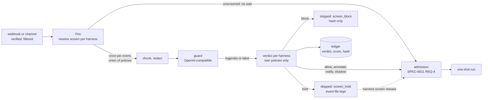
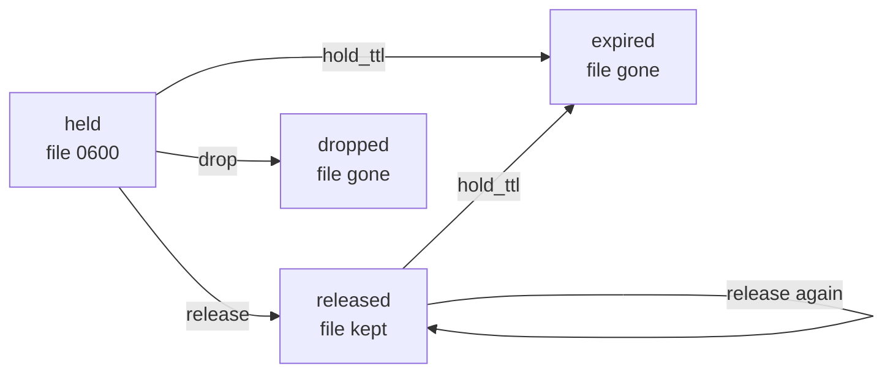
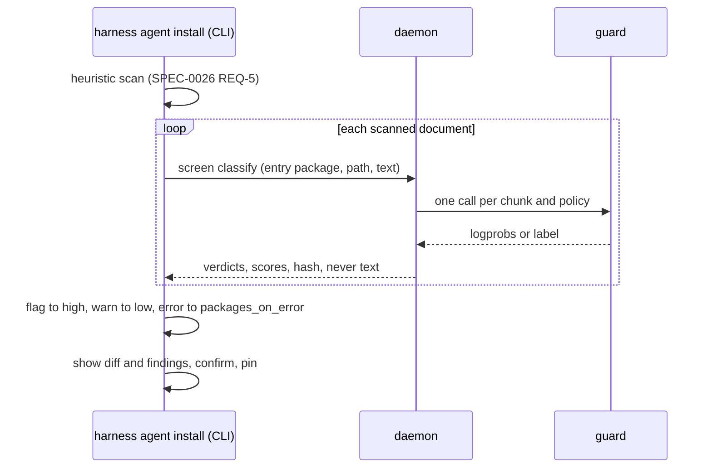

# Design: Input Screening

## Context

Harness defends against prompt injection structurally. ADR-0021 keeps an event
payload out of prompt text and argv: the agent gets a `0600` file named by
`HARNESS_EVENT_FILE`. ADR-0023 fences untrusted free text behind a global-only
opt-in. ADR-0044 runs a heuristic scan over a stable's bundled text and makes
the operator read a diff before every install and upgrade. Each of these tells
the agent where untrusted text starts. None stops the agent from obeying it.

The two inputs that matter most are event payloads from public forges, which an
unattended one-shot reads minutes after anyone opens an issue, and third-party
stables, whose skills become always-visible context. Small classifiers such as
Shieldstral answer "does this text try to instruct an AI agent?" in one forward
pass, with a calibrated probability, on the same OpenAI-compatible endpoint
vLLM, llama.cpp and SGLang serve. ADR-0036 ruled that a daemon model call is
data that never triggers anything and that triggering never waits on a model.
ADR-0042 relaxes that rule in the one direction that cannot hurt: a verdict may
take work away, never add it.

This design explains how SPEC-0031 makes that testable. The code it touches
today:

* `source.Manager.Fire` (`internal/trigger/source/manager.go`) is the one
  funnel every verified webhook delivery and channel notification passes. It
  already fans out sequentially, in config order, and already decides
  operating hours per harness before it asks a harness to run.
* `Supervisor.SkipRun` (`internal/supervisor/firing_hours.go`) records a
  skipped firing without consulting overlap. `onRenderFailure`
  (`internal/supervisor/render.go`) is the other skip-with-reason precedent.
  Both go through `recordSkip` (`internal/supervisor/runs.go`), which
  coalesces by trigger, source and reason, and `decisionRecord` writes no event
  file. A hold needs a skip that does neither.
* agent-trace's `redact` is the credential redactor every gate call's input passes.

Related: SPEC-0014 (firing, event files, manual trigger), SPEC-0017 REQ-9 and
REQ-10 (trusted actors, untrusted fields), SPEC-0021 REQ-4 (admission),
SPEC-0022 (ledger), SPEC-0026 REQ-5 (content scan), SPEC-0029 REQ-9 and REQ-10
(shadow and cumulative levels, whose shape this follows), SPEC-0003 REQ
"Operator Notification", SPEC-0013, ADR-0008, ADR-0009, ADR-0011, ADR-0026,
ADR-0027, ADR-0033, ADR-0036, ADR-0038.

## Goals / Non-Goals

### Goals

* One classification per event, however many harnesses receive it.
* A verdict only withholds. The worst a fooled or failing classifier can do is
  hold a good event, and a release recovers it with the original bytes.
* Fail closed by default, and let the operator say, per source and per
  harness, what failing closed costs.
* No byte of screened text in the ledger, a notification, a metric, a log line
  or a protocol frame. A verdict is auditable by hash against the kept file.
* A threshold only ever applies to the model it was tuned on.
* The process that reads a stable and writes config never holds the guard's
  key.
* Nothing changes for an operator who configures no policy.
* Shadow mode measures a policy on real deliveries before it acts.

### Non-Goals

* **Serving a model.** The operator runs the classifier under the init system
  (ADR-0033). The binary stays cgo-free (ADR-0037).
* **Screening what an agent reads after it starts**: tool results, fetched
  pages, files, MCP servers inside the agent, and the forge object an event
  points at. ADR-0042 lists the future entry points that would reach some of
  these, each needing its own amendment.
* **Sanitizing.** Classifiers score documents, not spans, so there is nothing
  reliable to cut, and rewriting would make a model author text an agent reads.
* **Screening the operator's own input**: prompts, `prompt_file`, project
  prompts, attach keystrokes, `harness trigger --event`.
* **A queue of held events.** Harness is a trigger, not a queue (ADR-0021). A
  held event is a ledger record plus a file.
* **Replacing the structural boundary.** The event file and SPEC-0017's fence
  stay the primary defense; an `allow` verdict does not make text trusted.
* **The `narrow` level and task loadouts** (SPEC-0032), and the Switchboard
  dispatcher (#541).

## Decisions

### Screen once, at Fire, before fan-out

**Choice**: the daemon classifies an event in `source.Manager.Fire`, after
verification, filtering, de-duplication and the rate limit, and before any
harness is asked to run.

**Rationale**: `Fire` already runs exactly once per event and sees every event
however it arrived, so one call per chunk and policy covers any fan-out.
Screening before the run entry point keeps held firings out of admission
entirely, so a hold spends no budget unit, no concurrency slot and no cost
headroom, and keeps every gate call outside SPEC-0021 REQ-4's lock. Screening
after verification means forged traffic costs no guard capacity.

**Alternatives considered**: screening per harness in the supervisor would
classify one event once per receiver and put a network wait on the actor loop.
Screening in Switchboard (ADR-0010's guardrail layer) would miss direct webhook
sources and stable installs, and its verdict could not join Harness's run
record. A client hook inside each agent is per client, and its verdict is
enforced by the process that was just shown the text.

### One classification, per-harness verdicts

**Choice**: `policies` resolves per harness like every other screen key. The
event is classified once against the union of the screened receivers'
policies, and each harness computes its verdict from its own policies' results.

**Rationale**: a public source can run a stricter policy than a private one,
and a harness that only labels issues need not inherit a policy written for a
harness that pushes code. The union keeps the call count at one per chunk and
distinct policy, which the acceptance test counts at the fake server. Each
harness reading only its own results means one harness's extra policy can
never hold another harness's work.

**Alternatives considered**: one global policy list is simpler, but forces
every source to pay for the strictest policy. One
classification per harness would multiply calls by fan-out.

### Who waits, and for how long

**Choice**: nothing at the front door waits. `Fire` fires unscreened harnesses,
reports screened ones as `screening`, and returns. Classification runs in the
background, and each screened harness fires, holds or blocks when its own
verdict is ready. A screened harness, in `enforce` or `shadow`, is delayed at
most the largest `timeout` among its own policies' guards (default 10 s,
capped at 60 s). Each call's `timeout` covers its wait for a concurrency slot,
and a screen issues its calls together, so a screen can never outlast that
bound. A screen interrupted by shutdown becomes a hold, never a lost event.

**Rationale**: forges time out webhook deliveries quickly: Gitea's
`[webhook] DELIVER_TIMEOUT` defaults to 5 seconds, and GitHub gives up after
10. A response that waited on a guard would turn a slow classifier into failed
deliveries on the sender's side. A channel
session handles notifications in order, so a synchronous screen would stall
every doorbell behind it. Answering first also means the response never
depends on a verdict, which removes the probing oracle by construction rather
than by redaction. Counting the slot wait against `timeout` keeps "bounded
delay" one number an operator can reason about. Shadow waits like enforce,
because shadow exists to measure the path enforce will run, latency included.
Turning an interrupted screen into a hold keeps ADR-0021's rule that a missed
event is visible, never silent.

**Alternatives considered**: screening synchronously with a short timeout
would bound the response but force a tiny `timeout`, turning every GPU hiccup
into an `error` verdict. A separate slot-wait bound doubles the worst case and
adds a key. Letting shadow harnesses proceed at once and patch the verdict onto
the record later would need a second write path for records that may already
be coalesced or pruned.

### A closed set of kinds, scored from logprobs, attested by model

**Choice**: two kinds, `yesno-logprob` and `labels`, each with a request shape
and parser compiled into the binary and pinned by golden tests. A
`yesno-logprob` score comes only from `top_logprobs`: tokens are trimmed and
case-folded, variants of the same answer are summed, and the two sums go
through a two-way softmax. When only one answer is listed, the other is given
the smallest listed probability, an upper bound on anything the list omits.
No logprobs means `no_logprobs`. A response whose `model` differs from the
configured one is `model_mismatch`.

**Rationale**: a calibrated probability is what makes a threshold, and so shadow
tuning, meaningful. Reading the text token would let a proxy that strips
logprobs silently turn every call into a coin with no calibration. The model
check applies ADR-0026's attestation to a classifier: a threshold tuned on
Shieldstral means nothing on whatever a gateway alias resolves to next week.
The one-sided rule keeps the score finite and deterministic without pretending
the absent answer had probability zero.

**Alternatives considered**: a generic chat prompt to `utility_model` asking
for JSON can be steered by the text it judges and returns no calibrated score.
An operator-supplied system prompt per guard would let one kind serve other
yes/no judges, at the cost of an untested request shape; it is an open
question rather than a key.

### `labels` fails closed on unknown output

**Choice**: a `labels` policy declares `safe_label` beside `unsafe_label`, and a
first line that is neither is a `parse` error. Empty `flag_categories` means
any category flags.

**Rationale**: scoring anything other than the unsafe label as `0.0` would read
a refusal, a truncated reply or a changed template as safe. Naming the safe
label turns those into errors that `on_error` governs.
Thresholds are refused on `labels` policies because the score is only 0 or 1.

### Chunk by bytes, with a fixed overlap and a hard cap

**Choice**: chunk size is `3 × max_input_tokens` bytes, cut on UTF-8
boundaries, with a 1,024-byte overlap (a quarter of the chunk when smaller).
Text that needs more than `max_chunks` chunks makes no call and yields
`too_large`. `max_input_tokens` defaults to 16,384, half of Shieldstral's
32,768-token window, and the load checks that every policy's prompt fits
beside a full chunk inside `context_tokens`.

**Rationale**: a tokenizer per model would tie the daemon to model internals.
Three bytes per token is conservative for English and code and close for CJK.
The chunk shares the window with the judge prompt, the policy's `instruct` (up
to 16 KiB) and the query, so the full window is never available to the chunk.
Checking the fit at load turns an overflow into a named config error instead of
an `http_status` at 3 a.m. Half the window is also a hedge on quality: Mistral
lists long-document robustness among Shieldstral's open work, and a short
instruction inside a long benign document scores lower than the same
instruction alone. An operator who measures otherwise, in shadow, can raise
`max_input_tokens` up to what fits. The overlap guarantees that any instruction up to 1 KiB
appears whole in some chunk. The hard cap means padding can only turn a
payload into an error, never push an instruction into an unscreened tail.

**Alternatives considered**: screening only the first N bytes invites exactly
the padding attack. Unlimited chunks let one delivery consume a guard's
capacity for every other event.

### Operating hours first, then screening

**Choice**: a harness whose firing SPEC-0014 records `outside_hours` is not
screened, and does not count toward "some receiver is screened".

**Rationale**: `Fire` already decides hours before it asks a harness to run.
An out-of-hours firing never runs and carries no event into its catch-up run,
so classifying it spends guard capacity for nothing, and holding it would
invent a way to run later what hours refused now.

### Screened text comes from the envelope; the hash precedes redaction

**Choice**: the screened text is a deterministic function of the event
envelope. For a JSON body it is every string value, in lexical order of its
path, each distinct value once, minus values that are wholly a URL, a hex id, a
UUID or a timestamp. A body that is not JSON is screened whole, and a channel
notification contributes its content plus its meta values. Invalid UTF-8
becomes U+FFFD. The hash is SHA-256 of that text before the redactor runs.

**Rationale**: an auditor holding a kept event file can recompute the hash and
confirm which bytes the verdict was about, without the ledger ever holding
them. Every string, not SPEC-0017 REQ-10's four untrusted fields, because on a
public forge the sender also writes review bodies, commit messages, branch
names, labels and a fork's repository description, and the agent reads all of
them in the event file. The exclusions remove only values with no prose in
them. Falling back to the whole body when a forge delivery is not JSON (GitHub
can send form-encoded payloads) avoids screening nothing and reporting
`allow`. Hashing before redaction keeps the hash stable across redactor
changes.

**Alternatives considered**: a per-event-type field list is smaller but must
track every forge's schema, and any field it misses is an unscreened channel.
Screening the raw JSON wastes most of the guard's window on URLs and ids.

### A hold is a skipped record plus a kept file

**Choice**: a hold is a `decided` `skipped` record with reason `screen_hold`
and its own run id, plus the envelope written to that run id's usual event-file
path. It never coalesces. Release is `harness trigger` with that envelope, so
the released run adds `replayed_at`, carries `released_from`, and passes
admission like any manual trigger. Release does not delete the file. Drop and
`hold_ttl` expiry do, and each confirms the path is gone before recording it.
`keep_runs` leaves held files alone, and `hold_ttl` may not exceed the ledger's
retention.

**Rationale**: every piece already exists: a skip record, an event file, a
manual trigger that replays one. Nothing new needs to survive a restart except
the ledger and the file, which already do. Coalescing would fold many held
events into one record with one file, losing all but one. Keeping the file
after release means a release that is later lost (a queued firing when the
daemon restarts) can be repeated; the operator could replay the file with
`harness trigger --event` anyway, so refusing a second release would protect
nothing. The `keep_runs` exemption and the retention bound keep the evidence
and its record alive for exactly `hold_ttl`.

**Alternatives considered**: an in-memory queue of held firings would be lost
on restart and contradicts ADR-0021. A separate hold store would duplicate the
ledger.

### The webhook response never depends on the verdict

**Choice**: a screened harness appears in the webhook response as `screening`,
with no `run_id`, before any verdict exists. The response carries no verdict,
score or policy.

**Rationale**: whoever can read webhook responses could otherwise tune an
injection against the classifier one delivery at a time. Because the response
is sent before the screen finishes, there is nothing in it to leak. The
operator sees the verdict in the run record, the notification and
`harness screen report`.

### The credential split for stables, and a local-only oracle

**Choice**: the CLI sends each scanned document to the daemon's `screen` op;
the daemon calls the guard and returns verdicts, never text. `classify` and
`probe` are refused to any caller not on the local socket, whatever its tier.

**Rationale**: this is the condition ADR-0044's design set for a model pass:
the process that reads attacker-reachable text and writes config holds no
model key, and the process that holds the key writes no config and fetches
nothing. `classify` over TCP would hand any authenticated remote client an
oracle for crafting text that scores low, and a way to spend the guard's
capacity.

### Where screening may be configured

**Choice**: `[guard.*]` and `[screen]` live only in the main global
`harness.toml`. A `screen` key on a source or harness is also accepted in
`harness_d` drop-ins, and rejected in project files, on the project-up wire and
in package manifests. `skip_trusted_actors` exists only on forge-preset sources
that declare `trusted_actors`.

**Rationale**: a cloned repository or a third-party package must never choose,
weaken or re-point its own screening (ADR-0009, ADR-0044). Drop-ins hold source
and harness tables today, so a `screen` key beside them follows the table it
modifies. Drop-ins may loosen as well as tighten: `mode = "off"`, an empty
`policies` or a lower level. The operator writes drop-ins as they write the
main file, and decided that trust follows the author, not the file. The guard
and default tables stay in the main file, as other global-only enforcement
tables do (SPEC-0029's enforce list). Trust follows who can write, and only forge presets carry a verified
sender (SPEC-0017 REQ-9).

## Architecture

An event, from a verified delivery to a run:

A held event's file, from hold to deletion:

A stable install, with the credential split:

## Risks / Trade-offs

* **Latency on screened events.** Every screened firing waits for a forward
  pass: tens of milliseconds on a GPU, seconds on a CPU, up to the guard's
  `timeout` when it is down. → Screening runs behind the front door, so the
  webhook response, the channel session and unscreened harnesses never wait;
  `timeout` is capped at 60 seconds; the duration histogram shows it.
* **False positives hold good work.** → Holds are releasable with the original
  bytes; `on_flag`, `on_warn` and `on_error` are per source and per harness;
  shadow measures a policy first.
* **A flood of flagged deliveries.** Holds never coalesce, so each is a record
  and a file. → The source's rate limit bounds the rate, the notify cooldown
  pages once per harness and policy, and `hold_ttl` bounds the files.
* **Offline probing.** An attacker can tune text against a public model until
  it scores low. → Screening raises the attacker's cost; it does not make an
  agent safe to point at hostile text. The webhook response is sent before
  any verdict exists, and remote callers cannot reach `classify`.
* **The screened text is a proxy.** The agent re-reads the forge object, which
  can be edited after delivery, and follows links the payload only names. →
  Stated plainly in the docs; an open question below.
* **Every string costs capacity.** A large push or pull-request payload may
  need several chunks, and a very large one exceeds `max_chunks` and errors. →
  The exclusions drop URLs, ids and timestamps, which are most of a forge
  payload's bytes; `too_large` fails closed and `on_error` governs it.
* **The byte estimate can overflow a window.** Dense tokenization may exceed
  the model's context. → The server's refusal becomes `http_status`, which
  fails closed; `max_input_tokens` should leave headroom.
* **Redaction changes what the guard sees.** A credential-shaped string inside
  an injection is replaced before classification. → The hash covers the
  unredacted text, and the replaced span carries no instruction.
* **Gateway attestation depends on the server.** A gateway that reports the
  alias it was asked for, not the model it routed to, passes the model check.
  → The spec requires a concrete id; `harness doctor` shows the served model.
* **One more invariant.** ADR-0036's "never waited on" rule gains a closed list
  of exceptions reviewers must keep closed. → REQ-8 names the list, and a new
  entry point needs an amendment.

## Migration Plan

Nothing changes for a configuration without `policies`. Screening depends on
ADR-0036's model API client for its HTTP plumbing. After that, in order:

1. **Guards.** `[guard.*]`, policies, both kinds, attestation, chunking, the
   `probe` action and the doctor rows. No event is screened yet.
2. **Event screening in shadow.** The `Fire` hook, union classification, the
   `screen` record object, metrics, `harness screen report` and `explain`.
   Until step 3 lands, an effective `mode = "enforce"` fails the load with a
   "not yet supported" error, so no operator believes a hold protects them.
3. **Enforcement.** Levels, the non-coalescing skip with its event file,
   `screen_flagged`, release, drop, expiry, the `keep_runs` exemption, and the
   webhook response rule.
4. **Stable screening**, once SPEC-0026's installer and content scan exist:
   the `classify` action and the model pass.
5. **SPEC-0032** inserts `narrow` into the level list.

## Open Questions

* **Shieldstral's exact prompt bytes.** The judge system prompt and user-message
  layout must match the model card byte for byte. The golden test should be
  checked against a recorded exchange with a real vLLM 0.26 or later, and the
  `top_logprobs` token strings compared across vLLM, llama.cpp and SGLang,
  whose token rendering may differ.
* **A `score` kind.** Prompt Guard-style sequence classifiers return class
  probabilities from a classification endpoint, not chat logprobs. Supporting
  them is a third kind and an amendment.
* **TOCTOU with the forge.** The agent re-reads the pull request, which can be
  edited after the screened delivery. Options: tell agents to treat the event
  file as authoritative, carry an `updated_at` in typed metadata, or rely on
  the MCP-gateway entry point ADR-0042 lists as future work.
* **Switchboard hints.** A routing rule could attach a screening hint to a
  todo. Harness would honor it only to tighten, since a doorbell is untrusted;
  loosening would need the harness to name the rule id it accepts.
* **The utility ceiling.** Whether gate calls share ADR-0036's utility rate
  limit and daily cost ceiling. Refusing a gate call for cost turns it into an
  `error` verdict, which holds by default.
* **A per-guard system prompt.** Other yes/no judges have their own layouts. A
  `system_prompt` key would open the kind to them at the cost of an untested
  request shape.
* **The dispatcher (#541).** A claimed todo whose verdict holds is failed with
  `refused: screen_hold <policy> <score>`; its amendment decides how that maps
  onto this spec's record.
