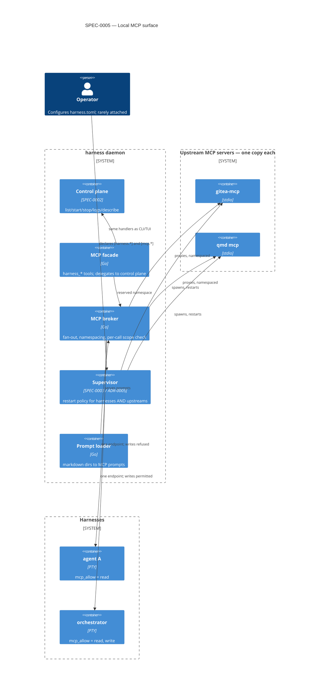

# Design: Local MCP Surface (facade, broker, prompts)

> **Not yet implemented.** Design-stage; nothing in this spec is built today (the `[mcp.*]` tables are a config parse error). See harness issue #3.

## Context

Harness supervises agent CLIs but is invisible to them: an agent inside a
harness cannot list its siblings, read their state, or restart a flapping one.
Separately, every harness spawns its own copy of every stdio MCP server it is
configured with — twelve harnesses times twenty servers is 240 processes serving
twelve consumers, configured in twelve places.

**ADR-0010** decided to solve both with one surface: a *facade* that mirrors the
SPEC-0002 control operations as MCP tools, and a *broker* that supervises
upstream servers centrally and fans one endpoint into every harness. Prompts
declared once are served to all.

This spec (SPEC-0005) formalizes that behavior. It requires SPEC-0002 (whose
control operations the facade delegates to) and leans on SPEC-0003 (whose
lifecycle machinery supervises upstream servers exactly as it supervises
harnesses). It is consumed by SPEC-0006 (trajectory read tools) and SPEC-0007
(the search tools that deliver learned skills).

## Goals / Non-Goals

### Goals

- Expose the existing control plane to agents without a second implementation of
  it.
- Collapse N×M upstream MCP server processes (N harnesses × M servers) to M,
  and N config sites to one.
- Make prompts a fleet-wide artifact using an existing MCP primitive.
- Answer the write-authorization question ADR-0008 deferred, in config.

### Non-Goals

- **Remote MCP.** The broker endpoint is local only, inside the ADR-0004 Unix
  socket trust boundary. Exposing MCP over the network is a separate decision.
- **Skill distribution.** MCP has no skill primitive and agent CLIs discover
  skills from the filesystem, so skills travel by projection (SPEC-0006), not
  here. Only prompts side-load.
- **Replacing per-harness MCP config.** The broker is additive; a harness may
  still declare private servers.
- **Teaching the daemon what an agent is.** The facade is a client; the broker
  supervises opaque processes. Neither inspects harness contents.

## Decisions

### Facade delegates rather than reimplements

**Choice**: Facade tools call the same handlers the CLI and TUI invoke.

**Rationale**: SPEC-0002 is already the single source of truth for what an
operation means. A parallel implementation would drift, and the drift would be
silent — two surfaces disagreeing about harness state is precisely the
reconciliation problem ADR-0002 was written to avoid.

**Alternatives considered**:

- *Reimplement over the socket as an external client*: would make the facade a
  separate process with its own version skew against the daemon it ships with.

### Broker lives in the daemon, not a sidecar

**Choice**: The daemon supervises upstream MCP servers directly.

**Rationale**: Supervising a process with a restart policy is the daemon's
existing competence; stdio instead of a PTY is a different pipe, not a different
job. A sidecar would split one user-visible feature across two config files and
two lifecycles, and would need to proxy the daemon socket to serve the facade.

**Alternatives considered**:

- *`harness-mcp` sidecar supervised as an ordinary harness*: keeps the daemon
  PTY-only, but erodes the "one binary, two roles" property the README states
  and adds a hop plus a version-skew surface.

### Namespacing by config key

**Choice**: Proxied tools are exposed under a name derived from their `[mcp.*]`
key; the facade holds a reserved namespace that upstreams cannot shadow.

**Rationale**: Collisions between independently-developed upstreams are
inevitable, and the config key is already unique, already user-chosen, and
already meaningful. Reserving the facade namespace prevents an upstream from
impersonating `harness_stop`, which would be an authority escalation rather than
a naming annoyance.

### Write scoping is per harness, evaluated per call

**Choice**: `mcp_allow` defaults to `["read"]`; write tools check it on every
call rather than at handshake.

**Rationale**: Per-call evaluation makes `harness reload` sufficient to change
authority, so tightening a scope does not require restarting a long-running
agent. Defaulting to read means the dangerous capability is opt-in and visible
in config review.

**Alternatives considered**:

- *Global on/off for write tools*: too coarse — the useful configuration is one
  orchestrator with write and everything else read-only.
- *Per-tool allowlists*: more precise, but the read/write split matches the
  actual risk boundary and keeps config legible.

### Accepting the injection risk explicitly

**Choice**: Grant write authority without a confirmation gate.

**Rationale**: The product goal is removing a human from loops they add no value
to. A confirmation prompt re-adds them to the tightest loop. Because harnesses
are background agents, no human is watching when an injected instruction reaches
one — this is a real exposure, recorded here rather than mitigated. Guardrails
belong at the work-routing layer, not in the fleet's own control path.

## Architecture

## Risks / Trade-offs

- **Concentrated failure.** One broker serves every harness, where per-harness
  servers failed independently. → Upstream crashes are isolated by requirement:
  the endpoint survives, only that upstream's tools error, and the ADR-0005
  policy restores it. Blast radius is the acknowledged price of deduplication.
- **Write authority is fleet-wide.** A misconfigured `mcp_allow` is not a local
  mistake. → Default is read; `write` must be typed deliberately; scope is
  visible in `harness describe` output and re-evaluated on reload.
- **Prompt injection reaches the control plane.** Any harness output can carry
  an instruction, and a `write`-scoped agent can act on it unwatched. → Accepted
  deliberately (see Decisions). Recorded as a known exposure, not solved here.
- **Second supervised process class.** The registry must distinguish PTY
  harnesses from stdio upstreams. → Both flow through one supervisor with a
  provenance field, following the pattern ADR-0009 already established for
  project-registered harnesses.
- **Secrets in upstream env.** Upstream servers take `env_file` like harnesses.
  → Same ADR-0008 fence: values reach the child environment and nothing the
  daemon persists.
- **Harvested trajectories are readable fleet-wide.** Trajectory tools are
  read-class, and read tools reach every harness — so one harness opting into
  harvesting (SPEC-0006) exposes its full transcript, secrets included, to
  every default-scope caller, not just the distiller. The accepted-injection
  analysis above covers writes only; scoping trajectory reads to a consumer is
  an open question below.

## Migration Plan

Additive throughout. A daemon with no `[mcp.*]` tables serves a facade-only
endpoint — the required read tools, with no upstreams and no prompts — and
existing harness behavior is otherwise unchanged. Existing per-harness MCP
configuration continues to work untouched; adopting the broker is per-server
and reversible by deleting a table. The facade rides existing control
operations, and the trajectory reads it adds (SPEC-0006) are additive and
read-only — so `ProtoMinor` moves and `ProtoMajor` does not.

## Open Questions

- Should the broker expose upstream *resources* as well as tools and prompts?
  Deferred until a concrete consumer needs it.
- Should `mcp_allow` grow finer classes than read/write (e.g. a `lifecycle`
  scope distinct from a `config` scope, or a `trajectory` read scope distinct
  from plain `read`) as the facade surface widens?
- How is a caller attributed to a harness for per-call `mcp_allow` evaluation
  (per-harness socket path, token, injected env), and which component wires
  the endpoint into each tool's MCP client configuration? Neither this spec
  nor SPEC-0006's three adapter questions currently answers it.
- Should a project's `[mcp.*]` tables be able to *override* a global upstream of
  the same key, or only add new ones? Currently additive-only.
