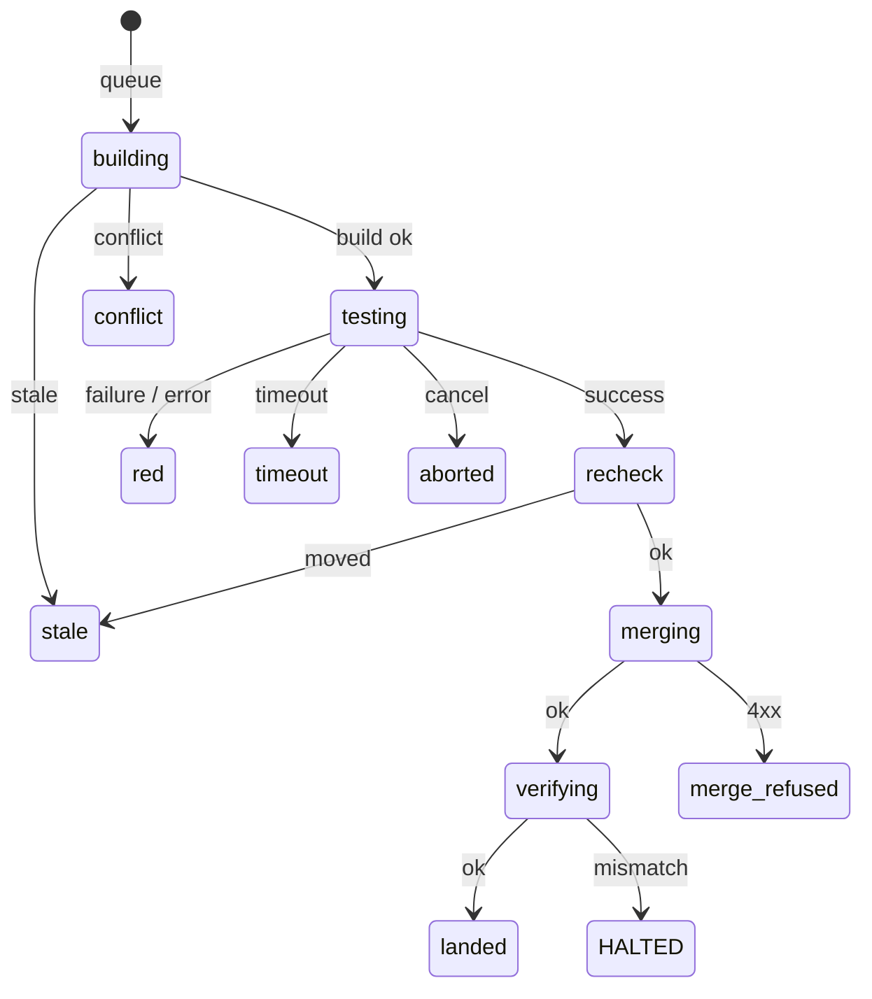

# SPEC-0025: Merge Train

## Overview

A **merge train** is a deterministic loop inside the Harness daemon that lands
approved pull requests on one repository, one at a time, so that the tree CI
tested is the tree that reaches `main`. ADR-0032 records the decision and the
options; this spec is the behaviour, and the [design notes](./design.md) beside it
cover the package layout and the `Forge` interface.

Terms:

- **repo** — `owner/name` on the forge.
- **base branch** — the branch the train lands on (`main`).
- **head** — the SHA a PR's head branch points at.
- **base** — the SHA the base branch points at when a train is built.
- **train branch** — `train/<pr>`, a branch the train creates for one attempt.
- **train commit** — the one commit on the train branch: `base` + a squash of
  `head`, parent `base`.
- **attempt** — one pass of the state machine for one `(pr, head, base)`.
- **tick** — one iteration of the driver loop; at most one attempt per tick.
- **qualifying approval** — a review with state `APPROVED`, by an author other
  than the PR's, left on the PR's current head.

## Requirements

### Requirement: REQ-1 Off by default, two modes

The merge train SHALL NOT run unless `[mergetrain] enabled = true` and `repos`
is non-empty. It SHALL support two modes: `report`, which builds and tests
trains exactly as `merge` does but writes nothing to any pull request — no
merge, no comment — and logs `would merge` and `would comment` instead; and
`merge`. The default mode SHALL be `report`. When enabled, the daemon SHALL log one line at startup
naming the mode and every repo it will act on.

#### Scenario: No section

- **WHEN** `harness.toml` has no `[mergetrain]` section
- **THEN** no driver starts and daemon behaviour is unchanged

#### Scenario: Enabled with no repos

- **WHEN** `enabled = true` and `repos = []`
- **THEN** config validation fails and the daemon refuses to start

#### Scenario: Report mode

- **WHEN** the mode is `report` and a train goes green
- **THEN** the driver logs `would merge` for the PR and calls no merge or
  comment endpoint

### Requirement: REQ-2 Eligibility

A PR SHALL enter the train only when all of these hold, evaluated in this
order, and the first that fails SHALL be the reason reported:

1. it is not a draft — reason `draft`;
2. the combined CI status of its head is `success` — `ci not green`;
3. the forge reports it mergeable — `not mergeable`;
4. it has at least one qualifying approval — `no approval on current head`;
5. no review with state `REQUEST_CHANGES` was left on its current head —
   `changes requested`.

#### Scenario: A stale approval

- **WHEN** the only approval was left on an earlier head
- **THEN** the PR is ineligible with `no approval on current head`

#### Scenario: Self-approval

- **WHEN** the only approval is by the PR's author
- **THEN** the PR is ineligible with `no approval on current head`

### Requirement: REQ-3 Ordering

Eligible PRs SHALL be ordered by the `SubmittedAt` of their earliest
qualifying approval, ascending, then by PR number, ascending. The order SHALL
be a function of the set of PRs alone, independent of input order.

#### Scenario: A tie

- **WHEN** two PRs have identical earliest-qualifying-approval times
- **THEN** the lower PR number goes first

### Requirement: REQ-4 Building the train

For an attempt, the driver SHALL read the base branch's head as `base`, then
create `train/<pr>` pointing at a new commit whose parent is `base` and whose
tree is the three-way merge of `base` and the PR's `head`. It SHALL NOT push
to, rewrite or delete any branch other than `train/<pr>`. If the PR's head on
the forge is no longer `head`, the build SHALL fail as **stale**. If the merge
has conflicts, the build SHALL fail as **conflict** without creating a branch
and without polling CI.

#### Scenario: A conflict

- **WHEN** `head` and `base` both change the same lines of a file
- **THEN** the attempt ends `conflict`, no `train/<pr>` exists, and
  `CombinedStatus` is never called

### Requirement: REQ-5 Waiting for CI on the train commit

The driver SHALL poll the combined status of the **train commit** (not the PR
head) with exponential backoff from `poll_interval / 4` (minimum 5 s) capped at
`poll_interval`, until it is `success`, `failure` or `error`, or until
`ci_timeout` has elapsed since the branch was created. A commit with no
statuses SHALL be treated as `pending`. The outcomes SHALL be **green**
(`success`), **red** (`failure` or `error`) and **timeout**.

#### Scenario: CI never starts

- **WHEN** no workflow reports a status on the train commit
- **THEN** the status stays `pending` and the attempt ends `timeout` at
  `ci_timeout`

### Requirement: REQ-6 The train branch is always deleted

`train/<pr>` SHALL be deleted when the attempt leaves the testing state, on
every path: green, red, timeout, forge error, panic and context cancellation.
Deletion SHALL use a context not derived from the attempt's, bounded to 30 s,
so that cancellation does not prevent cleanup. A failed deletion SHALL be
logged at warn and SHALL NOT change the attempt's outcome.

#### Scenario: Shutdown mid-poll

- **WHEN** the daemon stops while the driver is polling CI
- **THEN** `train/<pr>` is deleted before the driver returns

### Requirement: REQ-7 Merge preconditions

On green, and only in `merge` mode, the driver SHALL, immediately before
merging, re-list the open PRs and re-read the base branch's head, and SHALL
merge only if the PR is still open, still eligible, still at `head`, and the
base branch is still at `base`. Otherwise the attempt ends **stale** with no
comment. The merge SHALL be a squash merge with `head` passed as the expected
head commit, so the forge refuses it if the head moved after the re-read.

#### Scenario: The author pushes during CI

- **WHEN** the PR's head changes while its train is being tested
- **THEN** it is not merged, no comment is posted, and the next tick evaluates
  it afresh

### Requirement: REQ-8 Verification after the merge

After every merge the driver SHALL verify, before it starts another attempt:

1. the base branch's head equals the merge commit the forge returned;
2. the merge commit's git tree id equals the train commit's tree id, compared
   with real tree ids from git, never from the forge's REST API;
3. `VerifyLanded` against the base branch succeeds for every path the train
   commit adds or modifies, with the bytes read from the train commit.

If any check fails, or cannot be performed, the driver SHALL log at error,
comment on the PR with cause `verify-failed`, and **halt**: it starts no
further attempt until the daemon restarts. The `merged` flag on the PR SHALL
NOT be used as evidence of anything.

#### Scenario: The forge merged a different tree

- **WHEN** the merge commit's tree differs from the train tree
- **THEN** the driver halts and says which PR and which two trees

### Requirement: REQ-9 One comment per failure per head

On `conflict`, `red`, `timeout`, `merge-refused` and `verify-failed`, the
driver SHALL post exactly one comment on the PR that @mentions the PR's author,
states the cause and the train commit or head, and ends with the marker

```text
<!-- harness-mergetrain v1 pr=<n> head=<head> cause=<cause> -->
```

Before posting it SHALL list the PR's comments and SHALL NOT post if any
comment already carries a marker with the same `pr` and `head`. `stale` and
forge errors SHALL NOT produce a comment.

#### Scenario: The same failure on the next tick

- **WHEN** a PR's train is red, and a later attempt on the same head is red
  again after `main` moved
- **THEN** there is still exactly one merge-train comment for that head

### Requirement: REQ-10 Attempt memory

The driver SHALL remember, in memory, every `(pr, head, base)` whose attempt
ended `conflict`, `red`, `timeout` or `merge-refused`, and SHALL NOT start an
attempt for the same triple again. A change to the PR's head or to the base
branch's head SHALL make the PR attemptable again. On `stale` the triple SHALL
NOT be remembered.

#### Scenario: A red flake

- **WHEN** a train is red, then another PR lands
- **THEN** the red PR is attempted again on the new base

### Requirement: REQ-11 Per-repo singleton

A driver SHALL hold an exclusive, non-blocking lock for its repo for its whole
lifetime, on `$XDG_STATE_HOME/harness/mergetrain/<owner>_<name>.lock`. A second
driver for the same repo SHALL fail to start with an error naming the repo; it
SHALL NOT wait for the lock.

#### Scenario: Two drivers

- **WHEN** a driver for `stump.wtf/harness` is running and a second is started
- **THEN** the second returns an error and performs no forge call

### Requirement: REQ-12 Forge access and credentials

Every forge interaction SHALL go through the `forge.Forge` interface
(see the [design notes](./design.md)). The forge token SHALL be read from the environment variable
named by `forge_token_env` and SHALL NOT appear in `harness.toml`, in any log
line, in any error string, or in any process argv; git SHALL receive it through
the environment. A non-2xx response SHALL become an error naming the method,
the status code and the repo, and SHALL NOT include the response body.

### Requirement: REQ-13 No replays, no PR-branch writes

No code path in the merge train SHALL open, close or edit a pull request, or
push to a PR's head branch. The only writes are: creating and deleting
`train/<pr>`, the squash merge, and comments.

### Requirement: REQ-14 Observable transitions

Every transition SHALL produce one structured log line whose message is
`mergetrain <event>` with keys `repo` and, where they apply, `pr`, `head`,
`base`, `train`, `tree`, `cause`, `err`. Events: `started`, `queue`,
`building`, `built`, `ci`, `green`, `red`, `conflict`, `timeout`, `stale`,
`deleted`, `delete failed`, `would merge`, `would comment`, `merged`, `verified`,
`merge refused`, `commented`, `tick failed`, `bypass detected`, `halted`,
`stopped`.

### Requirement: REQ-15 Shutdown

On daemon stop the driver's context SHALL be cancelled; the driver SHALL
finish or abandon the current attempt, delete its train branch (REQ-6),
release its lock and return. The daemon SHALL wait for it.

### Requirement: REQ-16 Bypass audit

At the start of each tick, if the base branch's head is not the last head the
driver observed or produced, the driver SHALL log `bypass detected` at warn
with the previous and current heads, unless the change is explained by a merge
this driver performed.

## State machine (one attempt)



`report` mode ends at `recheck` with `would merge`. The train branch is deleted
on every exit from `testing`.

## Forge calls per transition

| Transition | Call | Gitea endpoint (see the [design notes](./design.md)) |
|---|---|---|
| queue | `ListOpenPRs` | `GET /repos/{r}/pulls?state=open`, `GET …/pulls/{n}/reviews`, `GET …/commits/{head}/status` |
| queue → building | `BranchHead` | `GET /repos/{r}/branches/{base}` |
| building → testing | `CreateTrainBranch` | git: fetch, `merge-tree --write-tree`, `commit-tree`, push `refs/heads/train/<pr>` |
| testing | `CombinedStatus` (repeated) | `GET /repos/{r}/commits/{train}/status` |
| testing → green | `FileContentAtRef` per changed path | `GET /repos/{r}/raw/{path}?ref={train}` |
| leave testing | `DeleteBranch` | `DELETE /repos/{r}/branches/train%2F<pr>` |
| recheck | `ListOpenPRs`, `BranchHead` | as above |
| merging | `SquashMerge` | `POST /repos/{r}/pulls/{n}/merge` `{"Do":"squash","head_commit_id":…}` |
| verifying | `BranchHead`, `TreeOf`, `FileContentAtRef` | branch read; git fetch + `rev-parse <sha>^{tree}`; raw reads at the base branch |
| any failure | `ListComments`, `Comment` | `GET`/`POST /repos/{r}/issues/{n}/comments` |

## Open Questions

- **Required contexts.** v1 requires the combined status to be `success` over
  whatever ran on the train commit. Pinning the list to branch protection's
  `status_check_contexts` would catch a workflow that silently stopped
  triggering on `train/**`.
- **Batching.** Several PRs per train commit, bisecting on red, if one CI run
  per PR limits throughput.
