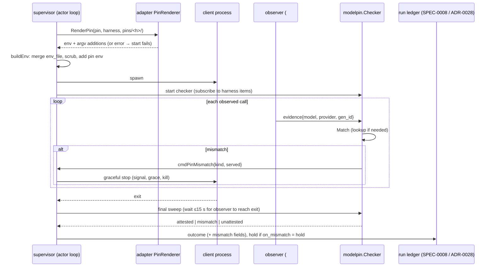
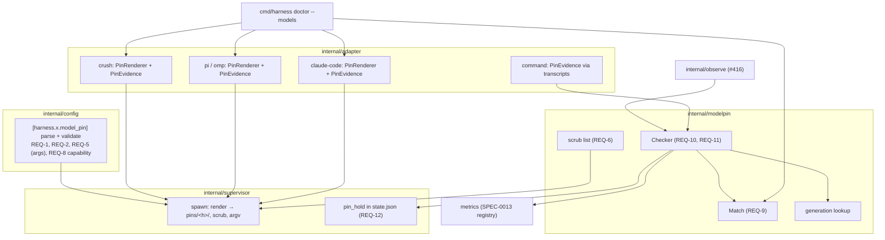

# Design: Fail-Closed Model Pinning

## Context

`model` is a string passed as `--model` on a synthesized one-shot argv
(`AgentOpts.Model`, `internal/adapter/adapter.go`). Nothing expresses a
provider or a data policy. Nothing checks what served a call. The daemon
observer (`internal/observe`, #416) delivers every agent-trace event and mark
for every harness. agent-trace's `SessionMeta.Model` is session-level, and it
exposes no provider. stump.wtf/agent-trace#105 adds per-message usage items
carrying model, provider, generation ID, tokens and cost.

ADR-0026 chooses per-client rendering plus transcript attestation, a hold on
mismatch, and a `doctor --models` canary. Governing spec: SPEC-0020.

Related specs: SPEC-0006 (adapters), SPEC-0013 (metrics; PR #407 implements
it), SPEC-0008 (run records), SPEC-0003 (state machine), SPEC-0002 (protocol).
Records accepted with this one on 2026-09-22: ADR-0023/SPEC-0017 (the
`command` kind, `transcripts`, and the `pi`/`omp` adapters), ADR-0028/SPEC-0022
(the run ledger), ADR-0027 (budgets, which share the observer's usage items),
and ADR-0025 (supervisor-held leases).

## Goals / Non-Goals

### Goals

- One declaration per harness, rendered correctly for each supported client.
- Enforcement at the request and detection at the response, independent of
  each other.
- Load-time refusal for anything the client cannot express or evidence.
- A canary that proves the negative case.

### Non-Goals

- Managing a LiteLLM gateway. Harness renders an entry and verifies it; it
  does not own the gateway.
- Proving data retention per call. It is requested and canaried, not attested.
- Codex pinning in v1.
- A Harness egress proxy (ADR-0026 option 1C). It is the fallback if
  transcripts prove insufficient.
- Budget and cost enforcement. ADR-0027 owns that, from the same usage items.

## Decisions

### A `internal/modelpin` package: types, matching, checker

**Choice**: `internal/modelpin` holds:

- `Pin` (the parsed table) and `Validate`.
- `Evidence{Model, Provider, GenerationID string; At time.Time}`.
- `Match(pin, evidence) (ok bool, kind MismatchKind)`, which implements
  SPEC-0020 REQ-9.
- `Checker`: one per pinned harness per run. It receives evidence through a
  buffered channel fed by an observer subscription, and reports the first
  mismatch to the supervisor.

Renderers live on the adapters (`adapter.PinRenderer`), beside
`PromptCommand`, because they are client knowledge.

**Rationale**: matching and checking are pure and heavily table-tested.
Rendering is client-specific and golden-tested per adapter.

### The adapter interface grows two optional capabilities

```go
// PinRenderer is implemented by adapters that can express a model pin.
type PinRenderer interface {
    // Routes this adapter can render.
    PinRoutes() []modelpin.Route
    // Render writes the client config under dir and returns the env vars
    // and adapter-owned argv additions that point the client at it.
    RenderPin(p modelpin.Pin, h core.Harness, dir string) (PinRender, error)
    // Overrides returns the higher-precedence config sources to check for
    // pinned keys (SPEC-0020 REQ-4).
    Overrides(h core.Harness) []OverrideSource
}

// PinEvidence declares what this adapter's transcripts can evidence.
type PinEvidence interface {
    Evidence(route modelpin.Route) modelpin.Capability // model | model+provider
}
```

An adapter that implements neither offers no routes, which gives SPEC-0020
REQ-2 for free: `codex` and `generic` fail at load. `command` implements
`PinEvidence` by delegating to its `transcripts` adapter, and implements no
renderer.

### Per-client rendering

| Client | Mechanism | What is written | Precedence caveat (REQ-4 check) |
| --- | --- | --- | --- |
| Crush, `openrouter` | Set `CRUSH_GLOBAL_DATA` to `pins/<h>/crush/`, whose `crush.json` is Crush's "data" config layer. It is merged from the user's existing data-layer file, if any, with the pin applied. | `providers.openrouter.extra_body.provider = {only, order, allow_fallbacks: false, data_collection?, zdr?}`; `models.large = {provider: "openrouter", model: <model>}`; for a one-shot, also `--model` in adapter argv | Project configs (`crush.json`, `.crush.json`, `crushrc` from the workdir up to the project root) outrank the data layer. The renderer reads them and rejects any that set `providers.openrouter` or `models` |
| Crush, `litellm` | Same overlay | An OpenAI-compatible provider `harness-pin` with `base_url = gateway_url`, the API key by variable name, and `models.large` = `gateway_model` | Same |
| Pi / OMP, `openrouter` | Set the CLI's agent-dir variable (`PI_CODING_AGENT_DIR` for Pi; the OMP equivalent) to `pins/<h>/agent/` | A models config with a custom OpenRouter provider carrying the provider preferences, and settings selecting it and the model. The `sessions/` directory lives here, so trajectory discovery follows the same variable | The agent dir is the whole config root. Pi's project-local overrides in the workdir are checked. **If Pi's models configuration cannot carry `provider` preferences on the pinned version, the renderer offers `litellm` only** |
| Pi / OMP, `litellm` | Same | An OpenAI-compatible provider aimed at `gateway_url` | Same |
| Claude Code, `anthropic` | Adapter-owned argv | `--model <model>`. The documented small/fast and subagent model variables are set to the pinned model, so background and subagent calls stay on the pin unless `accept_served` lists alternatives | `args` carrying `--model`/`--fallback-model` is rejected at load. `ANTHROPIC_BASE_URL` in the composed env is rejected at spawn |
| Claude Code, `litellm` | Adapter-owned argv and env | `--model <gateway_model>`, and `ANTHROPIC_BASE_URL = gateway_url` | Same argument guard |

Every exact key name and variable in this table is verified against the pinned
client version in its implementation story, and recorded in the renderer's
governing comment. The golden tests are the contract. A stand-in route that
records request bodies proves the client actually sent what was rendered.

An OpenRouter request produced by a correct rendering looks like this:

```json
{
  "model": "z-ai/glm-5.3-flash",
  "messages": ["…"],
  "provider": {
    "only": ["deepinfra", "novita"],
    "order": ["deepinfra", "novita"],
    "allow_fallbacks": false,
    "data_collection": "deny",
    "zdr": true
  }
}
```

It carries no `models` array and no `route` field, and `model` has no `:`
suffix.

### Scrub list

The child environment of a pinned harness drops these variables, except those
the route needs:

| Family | Variables |
| --- | --- |
| Anthropic | `ANTHROPIC_API_KEY`, `ANTHROPIC_AUTH_TOKEN`, `ANTHROPIC_BASE_URL`, `CLAUDE_CODE_OAUTH_TOKEN`, `CLAUDE_CODE_USE_BEDROCK`, `CLAUDE_CODE_USE_VERTEX` |
| OpenAI and compatible | `OPENAI_API_KEY`, `OPENAI_BASE_URL`, `OPENAI_API_BASE`, `AZURE_OPENAI_API_KEY`, `AZURE_OPENAI_ENDPOINT` |
| OpenRouter | `OPENROUTER_API_KEY` |
| Google | `GEMINI_API_KEY`, `GOOGLE_API_KEY`, `GOOGLE_APPLICATION_CREDENTIALS`, `VERTEXAI_PROJECT` |
| Others | `GROQ_API_KEY`, `MISTRAL_API_KEY`, `XAI_API_KEY`, `DEEPSEEK_API_KEY`, `TOGETHER_API_KEY`, `FIREWORKS_API_KEY`, `CEREBRAS_API_KEY` |
| AWS | `AWS_ACCESS_KEY_ID`, `AWS_SECRET_ACCESS_KEY`, `AWS_SESSION_TOKEN`, `AWS_PROFILE`, `AWS_BEARER_TOKEN_BEDROCK` |
| Gateways | `LITELLM_API_KEY`, `LITELLM_BASE_URL` |

Route needs: `openrouter` keeps `OPENROUTER_API_KEY`. `anthropic` keeps
`ANTHROPIC_API_KEY` or `CLAUDE_CODE_OAUTH_TOKEN`, whichever is set; if both are
set, `CLAUDE_CODE_OAUTH_TOKEN` is kept, because a Max subscription is the
operator's usual intent. `litellm` keeps the one variable the pin's renderer
references. The list is a Go table with a test asserting its contents, so a
removal is a reviewed change. Scrubbing happens in `buildEnv` after the
`env_file` merge, so it covers both sources.

### Evidence capability

| Adapter | Transcript records (with agent-trace#105) | `openrouter` | `anthropic` | `litellm` |
| --- | --- | --- | --- | --- |
| Claude Code | per-message `message.model` | n/a | `model+provider` (first party by construction) | `model` |
| Crush | message `model`; its own provider ID, not the upstream one | `model`, or `model+provider` via generation lookup if a generation ID is recorded | n/a | `model` |
| Pi / OMP | assistant message `model` and `provider` (Pi records the API provider, e.g. `openrouter`) | `model`, or `model+provider` via generation lookup | n/a | `model` |
| `command` | its `transcripts` adapter's row | same | same | same |

The table is data (`PinEvidence`), updated as agent-trace and the clients
record more. Until #105 lands, every row is `model` at best, taken from
`SessionMeta.Model`, which is session-level only. That makes `attest = "full"`
a load error everywhere except Claude Code on `anthropic`. The capability check
states that plainly, rather than pretending.

### Generation lookup

For `openrouter`, when an evidence item carries a generation ID and no
provider, the daemon issues
`GET https://openrouter.ai/api/v1/generation?id=<id>` with the harness's route
credential (read from its `env_file` at lookup time, never cached in memory
beyond the request). It reads the provider name and model from the response
and discards the rest. Lookups are rate-limited per harness, retried with
backoff for up to 60 s (generation metadata lands with a short delay), and
cancelled when the harness stops. A lookup that never succeeds leaves the call
unattested. The endpoint and field names are verified in the story.

### Where the checker sits in the run lifecycle



The mismatch is delivered to the supervisor as a command on its actor loop, the
same path every stop takes, so it cannot race a restart or an operator action.
The restart policy consults a `stoppedFor = model_mismatch` flag and does not
restart.

### The hold is persisted intent

**Choice**: `state.json` gains `pin_hold: {harness: {since, run_id, kind}}`,
written before the outcome event is emitted. `StartRun` checks it first and
records a `skipped` / `model_hold` decision, which SPEC-0014's coalescing
covers. The `harness start` and `harness trigger` control ops clear it and log
at WARN with the client identity (local socket or SSH key fingerprint). `harness
stop` does not clear it, because stopping is not an assertion that the route is
fixed.

### Canary implementation

`cmd/harness/doctor_models.go` runs in the CLI, not the daemon. It loads the
config, resolves each pinned harness's `env_file` itself (it is the operator's
own file), and builds requests from the same `modelpin` and renderer code the
daemon uses, so the canary tests the real rendering.

| Case | Request / action | Pass |
| --- | --- | --- |
| `approved` | POST `/chat/completions` with the rendered body, `max_tokens: 1`, and the prompt `Reply with the single word OK.` | 2xx, a completion, model matches, provider (response `provider` field) matches |
| `unavailable` | Same, with `provider.only = [<canary provider>]` (default `harness-canary-unavailable`, overridable) | non-2xx or an error object, and no `choices[].message` |
| `data-policy` | Asserted on `approved`: the body carried the policy fields and the route did not reject them | as stated |
| `gateway` | `approved` and `unavailable` through `gateway_url` / `gateway_model` | as above |
| `client-approved` | The client's one-shot mode (`crush run`, `omp --print`, `claude -p`) with the rendered overlay and scrubbed env, in a temp workdir | exit 0, and its transcript attests via `modelpin.Checker` |
| `client-unavailable` | Same, rendered with the canary provider | non-zero exit, or no completion in the transcript |
| `client-no-credential` | Same, with the route variable removed | non-zero exit, and no completion |

For a resident harness, the client cases use the client's one-shot mode with
the same rendering. That proves the rendering, not the resident process. Case
results print in the doctor table style, and as `--json`. Credentials appear as
`NAME sha256:abcdef012345`. A 60 s default timeout applies per case.

A scheduled `command` harness running `harness doctor --models --json` gives a
recurring canary with run records and no new daemon feature.

### Visibility details

- **`harness list` STATE**: `held` (a pin hold) and `failed!` (a resident
  harness failed with `model_mismatch`). Both fit the existing column width.
  The exact glyph follows the SPEC-0001 state vocabulary and is settled in the
  story.
- **Protocol**: a `pin` block on the harness projection
  (`{route, model, capability, held, last_attested_at, mismatch?}`), and the
  events `model_mismatch`, `model_hold` and `model_hold_released`. `ProtoMinor`
  is bumped once for all of them.

## Architecture



## Risks / Trade-offs

- **Client config formats change.** → Per-version golden tests, a stand-in route
  that captures request bodies in CI, the REQ-4 override check, and attestation
  as the backstop. A renderer that silently stops applying is caught at the
  first call.
- **Evidence gaps until agent-trace#105.** → A load-time capability error makes
  the gap explicit. `attest = "model"` is available and doctor warns about it.
  The generation lookup closes the provider gap for OpenRouter wherever a
  generation ID is recorded.
- **Mid-turn stops leave partial work.** → Rendering is the prevention and the
  stop limits the damage. The ADR says so. Pair pins with ADR-0023's run records
  so partial runs are visible.
- **Held harnesses surprise operators.** → A doctor fail row, a distinct STATE,
  an event, a metric, and a WARN on release. `on_mismatch = "fail-run"` exists
  for operators who prefer to keep firing.
- **The canary costs tokens and needs keys.** → It is opt-in, uses one output
  token per direct case, never prints credentials, and times out.
- **The canary provider slug could someday exist.** → The default is
  deliberately implausible, it can be overridden, and a completion on
  `unavailable` fails loudly either way.

## Migration Plan

1. Land the `model_pin` table, validation and REQ-2 capability errors behind
   no runtime change. A pin that validates but has no renderer yet fails at
   load, as "not offered".
2. The Claude Code `anthropic` renderer and argument guard. This is the only
   `attest = "full"` path available before agent-trace#105.
3. Scrubbing.
4. The checker with `SessionMeta.Model` evidence (`attest = "model"`), the hold,
   run outcomes, visibility and metrics.
5. Crush, then Pi/OMP renderers. Pi/OMP depend on SPEC-0017's adapters.
6. The generation lookup and per-message evidence, once agent-trace#105 lands.
   This turns `attest = "full"` on.
7. `doctor --models` direct cases, then `--through-client`.
8. Docs: the fail-closed section in `docs/usage/configuration.md` beside the
   failover advice, sequenced after PR #408, which also edits that page.

Rollback: remove `model_pin` from a harness. The pins directory is removed at
its next spawn.

## Open Questions

- Does the pinned Pi/OMP version's models configuration carry OpenRouter
  `provider` preferences natively? If not, Pi/OMP pins are `litellm`-only until
  it does, or until a Pi extension is shipped. The customer's OMP setup suggests
  that OMP can.
- What does a LiteLLM gateway report as the served model: the upstream ID or
  the alias? That decides whether `litellm` attestation can be better than
  `model` on the alias. The canary's `gateway` case measures it.
- Should `accept_served` accept a pattern for dated suffixes beyond the
  eight-digit rule? Deferred until a real route needs it.
