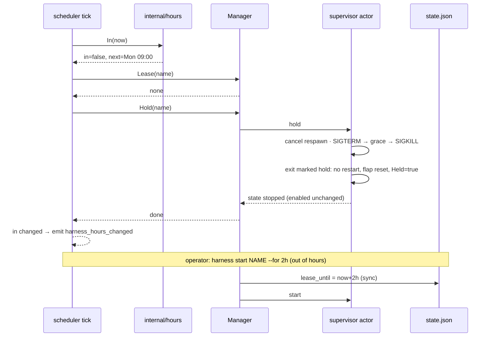

# Design: Operating Hours

## Context

Resident harnesses run 24/7 (ADR-0005, SPEC-0003), and a running agent can
spend tokens on anything that reaches it. ADR-0019 adds `operating_hours`: a
weekly time gate that holds a resident harness down outside its windows without
touching `enabled`. Governing spec: SPEC-0012. Related: SPEC-0003 (the
lifecycle it amends), SPEC-0008 and ADR-0013 (the tick, clock seam and zones it
reuses), SPEC-0002 (projection, `start` op and events), ADR-0007 (`state.json`),
ADR-0014 (reload intent for new harnesses).

## Goals / Non-Goals

### Goals

- An agent that works four hours a day costs nothing for the other twenty, with
  one config line.
- Two kinds of down, "the operator stopped it" and "it is off hours", are
  stored separately and rendered separately.
- Suspend, daemon outages, clock steps and DST are handled by the evaluation
  model itself, not by special cases.
- A late-night override is one command and ends by itself.

### Non-Goals

- Seeing or metering tokens.
- Knowing whether an agent is mid-turn.
- Queueing, holding or replaying work that arrives while a harness is held.
- Project-scoped hours, holidays, per-profile or daemon-wide defaults.

## Decisions

### A pure `internal/hours` package

The grammar and the membership test live in a new `internal/hours` package with
no clock and no I/O:

```go
type Expr struct { /* zone + windows, parsed */ }

func Parse(s string) (Expr, error)
// In reports whether t is inside a window, and the next instant that answer
// changes. ok is false when the expression covers the whole week.
func (e Expr) In(t time.Time) (in bool, next time.Time, ok bool)
```

`Parse` resolves zones through the same helper SPEC-0008 uses for `CRON_TZ=`, so
the embedded tzdata import in `cmd/harness/tzdata.go` covers both. `In` converts
`t` to the zone and checks today's windows plus yesterday's overnight windows.
It finds `next` by walking candidate boundaries (each window start and end over
the next eight local days) and returning the first where membership flips. The
walk is bounded because every valid expression repeats weekly.

Keeping it pure means every grammar case, DST day and overnight wrap is a table
test in microseconds, and the scheduler's source-scan test ("only `clock.go`
reads time") keeps holding.

### Evaluate on the existing scheduler tick

The scheduler already owns the one-second wall-clock ticker with the monotonic
component stripped. A second ticker would double the daemon's wakeups for no
gain. The scheduler gains a gate pass per tick:

```
for each gated supervisor:
    in, next, _ := expr.In(now)
    lease := manager.Lease(name)            // zero if none
    switch {
    case in && lease.Valid():               manager.EndLease(name)        // hours opened first
    case !in && lease.Valid(now):           // covered, nothing to do
    case !in && snap.Up():                  manager.Hold(name)
    case in && snap.Held:                   manager.Release(name)
    }
    if in != lastIn[name] { emit harness_hours_changed }
```

`lastIn` is in-memory only and exists to emit the event. No decision reads it,
so enforcement stays level-triggered and a daemon restart cannot lose a
transition.

### `Hold` and `Release` on the Manager

`Manager.Stop` clears intent and `Manager.StartTransient` exists for scheduled
firings (#159). Operating hours needs a third pair:

- **`Hold(name)`** sends a `hold` request to the supervisor's actor loop. The
  loop cancels a pending respawn, runs the graceful-stop sequence, marks the
  exit as a hold (so the exit handler skips the restart policy and resets flap
  bookkeeping), sets `Held = true`, and leaves `Enabled` alone.
- **`Release(name)`** asks the actor loop to clear `Held` and start the
  harness, again without writing `Enabled`.

Both go through the actor loop because it is the one goroutine that sees spawn,
exit, stop and shutdown in order. Doing the check and the action there makes
"still up? then hold" atomic, the same reason ADR-0013 moved `on_overlap` onto
the loop.

`Held` is derived state and is not persisted. On boot `Autostart` computes it:
an enabled gated harness that is out of hours and has no valid lease starts
held.

### Leases in `state.json`

The persisted harness record gains `lease_until` (RFC 3339, omitted when
unset). The `start` control op handler, when the target is gated and out of
hours:

1. computes `until = now + for` (default `1h`);
2. writes `lease_until` synchronously;
3. calls `Manager.Start` (which persists `enabled = true`, as a manual start
   always has).

Writing before starting means a crash between the two leaves a lease with a
stopped harness, which boot resolves by starting it, never an unbounded
run. `stop` on a leased harness clears `lease_until` and calls `Hold` rather
than `Stop`.

### Presentation reuses the schedule machinery

`internal/schedfmt` already renders armed/next for scheduled harnesses, and
#331 moved the cadence into the SCHEDULE/NEXT columns. Operating hours adds:

- a state label `off-hours` for `Held`, styled like `armed`;
- NEXT: `opens Mon 09:00` / `closes 13:00` / `lease until 21:00`;
- SCHEDULE: the expression, with the zone prefix trimmed when it equals the
  daemon's zone.

No new column (#343).

## Architecture



## Risks / Trade-offs

- **A turn in flight at the close is killed.** Accepted for v1. Agent CLIs
  persist sessions, and `--continue` in `args` resumes them. Drain on idle
  waits for an adapter idle signal.
- **The hold exit races a real crash.** A process that dies of its own accord
  in the instant the hold starts must not be counted as a crash and then
  respawned. Mitigated by deciding on the actor loop: once `hold` is accepted,
  every exit that follows is a hold exit.
- **Grammar surface.** A new mini-language is a new parser to fuzz. Mitigated
  by keeping it small (days, `HH:MM`, `;`) and adding a `FuzzParse` target
  that round-trips `Parse` → `String` → `Parse`.
- **Doorbells while held.** An agent that is held misses push notifications.
  Harness can't fix this and shouldn't try. An agent should reconcile its queue
  at startup, and holding doorbells for an off-shift agent is a sender feature.
- **More listing branches.** Held versus stopped is one more case in every
  renderer, on top of `Schedule != ""`. `schedfmt` keeps the wording in one
  place.

## Migration Plan

Additive. A config without `operating_hours` behaves exactly as before, and an
old `state.json` has no `lease_until`. A daemon that doesn't know the key
rejects it as unknown, so rolling back requires removing the key.

## Open Questions

- Should the default lease length be configurable per harness
  (`after_hours_lease = "2h"`), or is `--for` enough?
- Should a hold send a softer signal first (for example SIGINT, which many agent
  TUIs treat as "finish up") before the SIGTERM sequence?
