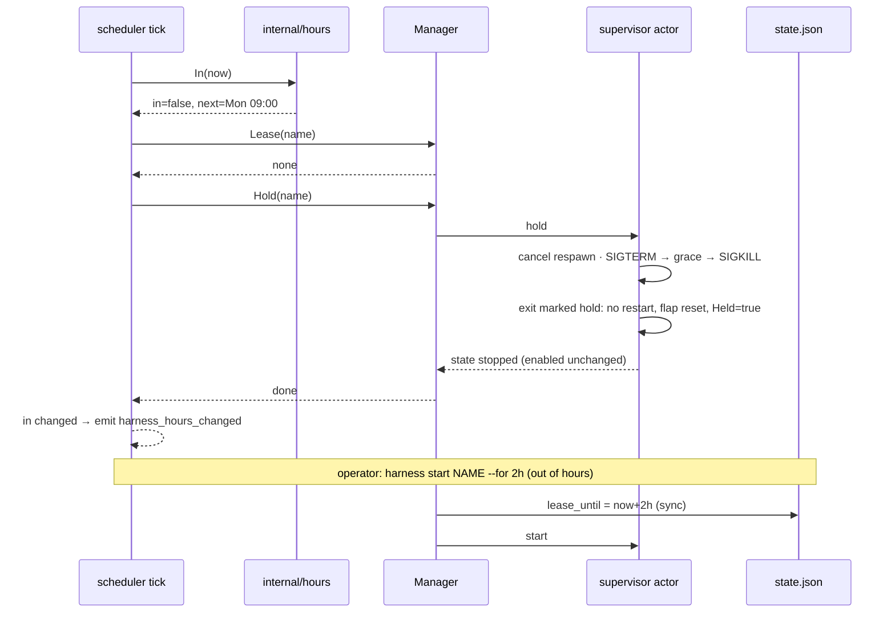

# Design: Operating Hours

## Context

Resident harnesses run 24/7 (ADR-0005, SPEC-0003), and a running agent can
spend tokens on anything that reaches it. ADR-0019 adds `operating_hours`: a
weekly time gate that holds a resident harness down outside its windows without
touching `enabled`. Governing spec: SPEC-0012. Related: SPEC-0003 (the
lifecycle it amends), SPEC-0008 and ADR-0013 (the tick, clock seam and zones it
reuses), SPEC-0002 (projection, `start` op and events), ADR-0007 (`state.json`),
ADR-0014 (reload intent for new harnesses).

## Goals / Non-Goals

### Goals

- An agent that works four hours a day costs nothing for the other twenty, with
  one config line.
- Two kinds of down, "the operator stopped it" and "it is off hours", are
  stored separately and rendered separately.
- Suspend, daemon outages, clock steps and DST are handled by the evaluation
  model itself, not by special cases.
- A late-night override is one command and ends by itself.
- By default a close lets the agent finish its turn, and it is always bounded.

### Non-Goals

- Seeing or metering tokens.
- Detecting turns without agent-trace (PTY heuristics).
- Queueing, holding or replaying work that arrives while a harness is held.
- Project-scoped hours, holidays, per-profile or daemon-wide defaults.

## Decisions

### A pure `internal/hours` package

The grammar and the membership test live in a new `internal/hours` package with
no clock and no I/O:

```go
type Expr struct { /* zone + windows, parsed */ }

func Parse(s string) (Expr, error)
// In reports whether t is inside a window, and the next instant that answer
// changes. ok is false when the expression covers the whole week.
func (e Expr) In(t time.Time) (in bool, next time.Time, ok bool)
// PrevEnd reports the most recent instant at or before t at which a window
// closed: the anchor of a graceful close's deadline. ok is false in hours, or
// when the expression covers the whole week.
func (e Expr) PrevEnd(t time.Time) (end time.Time, ok bool)
```

`Parse` resolves zones through the same helper SPEC-0008 uses for `CRON_TZ=`, so
the embedded tzdata import in `cmd/harness/tzdata.go` covers both. `In` converts
`t` to the zone and checks today's windows plus yesterday's overnight windows.
It finds `next` by walking candidate boundaries (each window start and end over
the next eight local days) and returning the first where membership flips. The
walk is bounded because every valid expression repeats weekly. `PrevEnd` runs
the same scan backwards and bisects to the second, so a close that began
during a DST transition is anchored to the instant membership actually
flipped, not to a wall-clock label.

Keeping it pure means every grammar case, DST day and overnight wrap is a table
test in microseconds, and the scheduler's clock seam stays the only time source:
the gate calls `In(now)` with the tick's own reading rather than asking for the
time itself. Note that `TestNoWallClockReadsOutsideClock`
(`internal/scheduler/scheduler_test.go:1000`) globs `*.go` in its own package,
so it does not reach `internal/hours`; that package must carry the same guard
(an identical scan, and no `time.Now`) for the invariant to hold there.

### Evaluate on the existing scheduler tick

The scheduler already owns the one-second wall-clock ticker with the monotonic
component stripped. A second ticker would double the daemon's wakeups for no
gain. The scheduler gains a gate pass per tick:

```
for each gated harness (skipping one whose last decision is still in flight):
    in, next, _ := expr.In(now)
    up, held, closing := gate.Status(name)
    until, leased := gate.Lease(name, now)  // asked every tick, on the tick's clock;
                                            // the asking retires a spent lease and
                                            // discards one whose hours opened
    switch {
    case !in && leased:                     // covered; warm the watch if until is within armLead
    case !in && closing:                    gate.CloseStep(name, now)
    case !in && up:                         gate.Hold(name, mode, gate.CloseAt(name, now))
                                            // graceful: CloseStep(name, now) on the same tick
    case in && held:                        gate.Release(name)
    case in && next-now <= armLead:         gate.Arm(name, next)   // warm the watch
    }
    if in != lastIn[name] { emit harness_hours_changed }
```

Each decision runs on its own goroutine, tracked so `Close` waits for it, so a
hold waiting out a stop grace cannot delay the tick. A reload that removes
`operating_hours` from a held harness queues one release for the next tick.
`armLead` is one minute. Every time value the pass hands the Gate is the tick's
own `now`. A Gate that read the wall clock for a lease could see a lease the
pass had already judged spent (a suspend stops the monotonic clock, and a tick
is read a moment before the Gate is asked), so the lease is judged on the tick
too.

`lastIn` is in-memory only and exists to emit the event. No decision reads it,
so enforcement stays level-triggered and a daemon restart cannot lose a
transition.

### `Hold` and `Release` on the Manager

`Manager.Stop` clears intent and `Manager.StartTransient` exists for scheduled
firings (#159). Operating hours needs a third pair:

- **`Hold(name)`** sends a `hold` request to the supervisor's actor loop. The
  loop cancels a pending respawn, runs the graceful-stop sequence, marks the
  exit as a hold (so the exit handler skips the restart policy and resets flap
  bookkeeping), sets `Held = true`, and leaves `Enabled` alone.
- **`Release(name)`** asks the actor loop to clear `Held` and start the
  harness, again without writing `Enabled`.

A `cmdHold` case in `handleCommand` is the shape. It does **not** reuse
`gracefulStopKeepEnabled`, the manual-restart path. That path clears
`s.enabled` for the length of the stop, and the debounced persist loop can
write that to `state.json`, where nothing heals it after a hold because no
start follows. Instead `gracefulStop` takes the exit off the exit channel
itself, so the restart policy never sees a hold exit, and `s.enabled` is never
written. An exit that arrives on its own while the harness is held (the
process ending during a graceful close) is consumed by the gate the same way:
held, no restart, no restart-count increment.

`Hold` takes the close's mode and deadline. Under `graceful` the actor loop
marks the supervisor `Closing` with the deadline and returns. The scheduler
tick then calls `Manager.CloseStep(name, now)`, which asks the loop to stop the
harness once the turn state (below) says so, or the deadline passes. `Release`
and a lease clear `Closing`. `Manager.Stop` clears it too, and stops at once.

Both go through the actor loop because it is the one goroutine that sees spawn,
exit, stop and shutdown in order. Doing the check and the action there makes
"still up? then hold" atomic, the same reason ADR-0013 moved `on_overlap` onto
the loop.

`Held` is derived state and is not persisted. On boot `Autostart` starts an
enabled gated harness at once only if a restored lease covers it. Every other
enabled gated harness begins held, and the scheduler's first evaluation, which
runs as soon as it starts, releases the ones that are in hours. That keeps the
in-hours decision on the clock seam instead of a wall-clock read in
`Autostart`. The same mechanism serves every path that sets enabled intent on
a gated harness that is down: `startOrHold` records the intent and begins it
held (`EnableHeld`) for a reload that introduces the harness (ADR-0014) and for
`harness use-profile`. A gated harness that is already up just gains the
intent and closes at its window's end, and a `failed` one is started as before,
because `Release` never starts a failed harness.

`Release`, an operator `start` (a lease out of hours), `restart` and `stop`
all clear `Closing`. After a restart the gate decides the harness again on the
next tick, and if it is still out of hours it closes it against the same
boundary.

### Turn state from a daemon-side watcher

Today only the TUI follows agent-trace live (`internal/tui/watcher.go`), and
`internal/runtrace` answers on demand for `harness logs`. Graceful shutdown adds
a daemon-owned watcher in `internal/runtrace`:

```go
type TurnState struct {
    LastEventAt time.Time
    TurnMarkers bool // the reader reports turn boundaries for this agent
    TurnEnded   bool // meaningful only when TurnMarkers
}

// Turn returns the live turn state of name's current run, or ok=false when no
// session is attributed to it.
func (w *Watcher) Turn(name string) (TurnState, bool)
```

The watcher follows only harnesses that are closing, or about to close within a
minute, so the daemon does no trace I/O the rest of the day. It applies the
same `Attribute` rule as `harness logs`, extended to resumed sessions
(SPEC-0006 REQ "Run Correlation"), so turn state can never come from a session
`logs` would refuse to show.

The Manager reaches it through a `TurnBridge` seam (`Follow`, `Unfollow`,
`Turn`, `Unavailable`). Production wires the watcher, and tests inject a
counting stub, which is how the no-trace-I/O property is asserted. `Follow`
takes one synchronous sample so the first close step has something to read,
then polls every two seconds. Every path that ends or cancels a close
unfollows, and as a backstop a follower retires itself five minutes past the
close it was armed for. An attributed run with no in-window event yet reports
a zero `LastEventAt`, which the close reads as quiet.

It needs three things from agent-trace
([github.com/stump-wtf/agent-trace](https://github.com/stump-wtf/agent-trace)):

- **claude-code:** turn-end events from `stop_reason`, which the transcripts
  already carry on every assistant record;
- **codex:** turn-end events from `task_complete`;
- **crush:** turn-end events from the finish part it writes at every turn end,
  not only failed ones.

Until a reader ships its markers, it reports `TurnMarkers = false` and closes
fall back to the quiet period. None of the three does yet; the request is
tracked upstream in agent-trace.

### Leases in `state.json`

The persisted harness record gains `lease_until` (RFC 3339, omitted when
unset). The `start` control op routes an explicit `for` to
`Manager.StartFor(name, for)`, a `for`-less start on a gated, out-of-hours
harness (`Manager.LeaseApplies`) to `StartFor(name, DefaultLease)` (one hour),
and anything else to `Manager.Start`. `StartFor` refuses an ungated or
in-hours harness with `ErrNoLease` ("no lease applies"), and otherwise:

1. computes `until = now + for`, wall clock only (no monotonic reading, which
   a suspend would stall);
2. writes `lease_until` synchronously (`Manager.Save`);
3. calls `Manager.Start` (which persists `enabled = true`, as a manual start
   always has, and cancels a graceful close in progress).

Writing before starting means a crash between the two leaves a bounded lease on
disk. Boot starts the harness under it if the recorded intent is `enabled`,
and otherwise the lease expires unused. It is never an unbounded run. `Restore`
drops a lease on a harness that is no longer gated. A lease is spent at its
end instant. Its end is remembered until the hold consumes it, so the close is
anchored to the lease's end rather than the window's. `stop` on any gated
harness clears `lease_until` and calls `Manager.Stop`, which clears `enabled`
exactly as it does for an ungated harness.

### Presentation reuses the schedule machinery

`internal/schedfmt` already renders armed/next for scheduled harnesses, and
#331 moved the cadence into the SCHEDULE/NEXT columns. Operating hours adds:

- a state label `off-hours` for `Held`, styled like `armed`, and `closing`
  for a close in progress, in the transient-state styling;
- NEXT: `opens Mon 09:00` / `closes 13:00` / `lease until 21:00` /
  `stops by 13:15`;
- SCHEDULE: the expression, with the zone prefix trimmed when it equals the
  daemon's zone.

No new column (#343).

## Architecture



## Risks / Trade-offs

- **Graceful shutdown depends on unbuilt agent-trace markers.** Until they ship,
  every close is a quiet-period or immediate close. The decision table in
  SPEC-0012 REQ "Graceful Shutdown" makes that degradation explicit and logged,
  never silent.
- **The quiet period is a heuristic.** A long model call or tool run writes
  nothing until it finishes, so a quiet agent may be mid-turn. The cap bounds
  the cost of being wrong in either direction.
- **A close can overrun the window.** By up to `hours_shutdown_timeout` (15
  minutes by default), and a doorbell arriving during the close can use all of
  it. The sender-side fix is Switchboard endpoint presence.
- **The hold exit races a real crash.** A process that dies of its own accord
  in the instant the hold starts must not be counted as a crash and then
  respawned. Mitigated by deciding on the actor loop: once `hold` is accepted,
  every exit that follows is a hold exit.
- **Grammar surface.** A new mini-language is a new parser to fuzz. Mitigated
  by keeping it small (days, `HH:MM`, `;`) and adding a `FuzzParse` target
  that round-trips `Parse` → `String` → `Parse`.
- **Doorbells while held.** An agent that is held misses push notifications.
  Harness can't fix this and shouldn't try. An agent should reconcile its queue
  at startup, and holding doorbells for an off-shift agent is a sender feature.
  A triggered harness (SPEC-0014) is the exception that proves the rule. There
  the daemon holds the channel, so it hears an out-of-hours doorbell and records
  it `skipped`, and `catch_up` runs once at opening. It still holds nothing.
- **More listing branches.** Held versus stopped is one more case in every
  renderer, on top of `Schedule != ""`. `schedfmt` keeps the wording in one
  place.

## Migration Plan

Additive. A config without `operating_hours` behaves exactly as before, and an
old `state.json` has no `lease_until`. A daemon that doesn't know the key
rejects it as unknown, so rolling back requires removing the key.

## Open Questions

- Should the default lease length be configurable per harness
  (`after_hours_lease = "2h"`), or is `--for` enough? It shipped as a
  constant (`supervisor.DefaultLease`, one hour).
- Should the settle (10s) and quiet (2m) periods be configurable, or stay
  constants until a real agent proves them wrong? They shipped as constants.
- Should the watcher follow a closing harness's sessions only, or keep turn state
  warm for every adapter-backed harness so `harness describe` can show it? It
  shipped following closing harnesses and those within a minute of a close.
