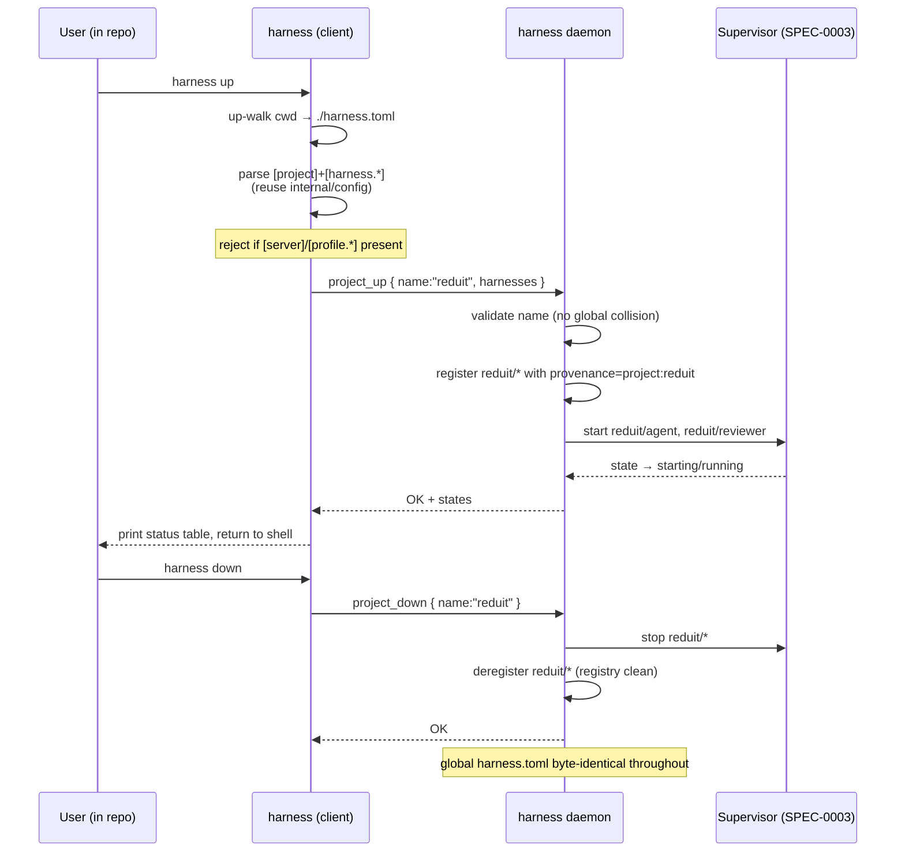

# Design: Project Compose (`harness up` / `down`)

## Context

Harness today has exactly one place harnesses are defined: the global
`~/.config/harness/harness.toml` the daemon owns as its config-of-record
(ADR-0006), plus `[profile.*]` tables as durable, switchable *views* over that
global set. There is no repo-local way to say "these are the agents this project
needs — bring them up." **ADR-0009** decided to add that as an *ephemeral
project* concept modeled on `docker compose`: a repo-root `harness.toml`,
discovered by walking up from `cwd`, whose harnesses are registered with the
running daemon under a `<project>/<harness>` namespace on `up` and forgotten on
`down`, with the global config left untouched.

This spec (SPEC-0004) formalizes that behavior. It leans on SPEC-0002 (the
control-plane protocol it extends with two ops) and SPEC-0003 (the lifecycle
state machine that supervises project harnesses exactly like global ones). It
reuses the existing `internal/config` parser and `core` domain types rather than
introducing a second config dialect.

## Goals / Non-Goals

### Goals

- `cd repo && harness up` brings the repo's agents up under the daemon, detached,
  with a printed status table.
- The project file is repo-local, git-committable, and speaks the existing
  `[harness.*]` schema.
- Multiple projects (and the global config) coexist without name collisions via
  `<project>/` namespacing.
- The global config-of-record is never mutated by `up`/`down`.
- `down` is a clean stop-and-forget that leaves no daemon residue.

### Non-Goals

- **Project autostart-on-restart.** Whether the daemon should persist which
  projects were `up` and re-`up` them after a restart is explicitly deferred to a
  follow-up ADR. The initial cut is runtime-only, matching Compose's "compose up
  doesn't survive a dockerd restart."
- **Foreground/attached `up`.** A `docker compose up` (no `-d`) style interleaved
  log stream is out of scope; Harness is daemon-centric and viewing is the TUI /
  `attach`. A future `--attach`/`--tui` flag is possible but unspecified here.
- **Merging project files into global config.** Rejected in ADR-0009 (Option 3).
- **Cross-project dependency ordering / healthchecks** (Compose `depends_on`).
  Not in this cut.

## Decisions

### Discovery by up-walk from `cwd`, global config excluded

**Choice**: Locate the project file by walking upward from `cwd` to the first
`harness.toml`, stopping at filesystem root / home, and explicitly skipping
`config.DefaultPath()`.
**Rationale**: Matches the muscle memory of `git` (`.git`) and `docker compose`
(compose file), so any subdirectory of a repo "just works." The global-config
exclusion defuses the one real footgun: the daemon's own config shares the
`harness.toml` basename (see below).
**Alternatives considered**:
- *Only look in `cwd`*: too rigid — breaks when you're in a subpackage.
- *A distinct filename (`harness.project.toml`)*: avoids the basename clash but
  loses the "it's just a harness.toml" familiarity ADR-0009 wanted; the
  location-based rule is cheap enough to keep the shared name.

### Location, not filename, discriminates project vs. global

**Choice**: The daemon's config is *always* `config.DefaultPath()`; a *project*
file is *whatever `up` discovers by up-walk*. They may share the basename
`harness.toml`; they are told apart by role and location, and a project file is
forbidden from carrying `[server]`/`[profile.*]`.
**Rationale**: Keeps ADR-0009's "it's just a harness.toml in my repo" property
without ambiguity. The table-level prohibition makes "this is a project file, not
a global one" a parse-time invariant, not a convention.

### `<project>/<harness>` namespacing

**Choice**: Fully-qualified daemon name is `<project>/<harness>`; project name
defaults to the sanitized project-root basename, overridable via `[project].name`.
**Rationale**: Compose's container-naming trick, adapted. Makes simultaneous
multi-repo use collision-free by construction while keeping bare global names
un-prefixed and unchanged. The `/` separator reads naturally in the TUI list and
in `attach reduit/agent`.
**Alternatives considered**:
- *Flat names, error on collision*: simpler names but forbids two repos both
  running an `agent` — the exact scenario multi-project users hit first.
- *`<project>-<harness>`*: works, but `/` groups better visually and mirrors the
  "path-like" mental model.

### Ephemeral registration via two new control ops

**Choice**: Add `project_up { name, harnesses }` and `project_down { name }` to
the SPEC-0002 control plane; reuse `list`/`logs`/`start`/`stop`/`restart` for the
project-scoped verbs by filtering on the namespace. The daemon registry tracks
per-harness **provenance** (global vs. which project) so `down` removes exactly
the right set.
**Rationale**: Keeps `up`/`down` as thin client gestures over the existing
protocol (ADR-0002) — no second execution engine. `project_up`'s reconcile
semantics reuse the SPEC-0003 "config changes apply on next restart" rule so a
re-`up` never silently bounces a running process.
**Alternatives considered**:
- *Reuse `use_profile`* (ADR-0009 Option 2): profiles are non-destructive, which
  contradicts `down`; rejected.
- *Persist projects into global config* (Option 3): mutates the user's
  dotfiles-tracked file; rejected.

### `up` is detached and idempotent

**Choice**: `up` registers + starts + prints a status table + returns; running it
again reconciles (add new, remove gone, flag changed).
**Rationale**: Fits the daemon-centric model — the daemon is the thing that keeps
processes alive, so the terminal shouldn't be held hostage. Idempotency makes
`up` safe to re-run after editing the project file, which is the common loop.

## Architecture

## Risks / Trade-offs

- **Shared `harness.toml` basename confuses users** → Location-based
  discrimination + the `[server]`/`[profile.*]` prohibition make it a parse-time
  invariant; documentation and error messages name the distinction explicitly.
- **Registry now has two definition sources (global + N projects)** → Track
  explicit provenance per harness so `down` and `ps` scope correctly; a global
  harness and a project harness can never be conflated because their names
  (bare vs. `project/`) differ.
- **Runtime-only registrations vanish on daemon restart** → Accepted and
  documented as a non-goal; a rebooted daemon restores global config but not
  previously-`up` projects. Project-autostart persistence is a deferred ADR.
- **Partial `project_up` failure** → Registration is validated up front (name
  collision, forbidden tables) and applied atomically enough that a mid-way
  failure reports a structured error without leaving a half-registered project;
  no silent swallowing (see Error Handling Standards).
- **Reconcile removing a harness stops a running process** → Treated as an
  explicit intent of re-`up` (the harness left the project file); surfaced in the
  printed status table rather than done silently.

## Migration Plan

Greenfield capability — the project is in the design phase (no `up` today), so
there is nothing to migrate. Rollout order:

1. Extend `internal/config` to parse a project file: accept `[project]`, reject
   `[server]`/`[profile.*]`, resolve relative `workdir` against project root.
2. Add discovery (up-walk, global-config exclusion) in the client.
3. Add `project_up`/`project_down` to the protocol + daemon registry provenance.
4. Wire the `up`/`down`/`ps` client verbs; route `logs`/`start`/`stop`/`restart`
   through namespace filtering.

No rollback concerns — the feature is additive and touches no existing global
config path.

## Open Questions

- Should a project name auto-sanitize (e.g. `my.repo` → `my-repo`) or reject
  non-`[A-Za-z0-9_-]` basenames and require `[project].name`? (Leaning:
  sanitize + document the mapping.)
- Should `down` without a discoverable project file (e.g. run after the file was
  deleted) accept an explicit `--project <name>` to still tear down a registered
  project? (Likely yes — a small convenience for the "I deleted the file first"
  case.)
- Does `up` need a `--tui`/`--attach` flag in a later cut to drop into a
  project-filtered dashboard, per the alternative the user weighed? (Deferred,
  but the detached-default leaves room for it.)
