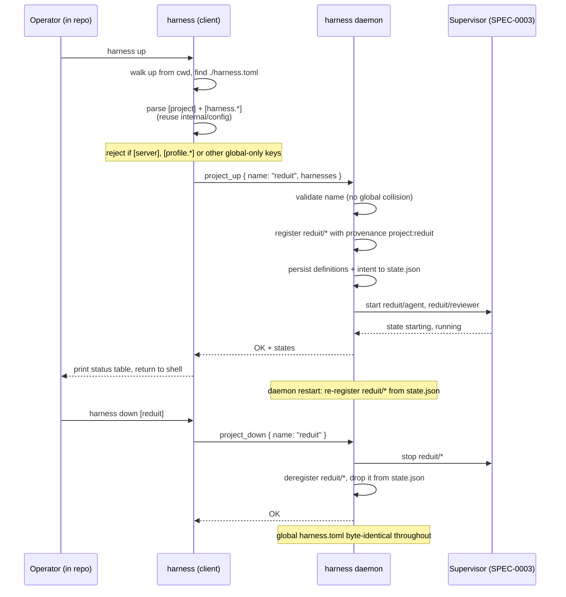

# Design: Project Compose (`harness up` / `down`)

## Context

Without projects, Harness defines harnesses in one place: the global
`~/.config/harness/harness.toml` the daemon owns as its config of record
(ADR-0006), plus `[profile.*]` tables as durable, switchable *views* over that
global set. There is no repo-local way to say "these are the agents this
project needs; bring them up." **ADR-0009** adds that as a *daemon-managed
project* concept modeled on `docker compose`: a repo-root `harness.toml`,
discovered by walking up from `cwd`, whose harnesses are registered with the
running daemon under a `<project>/<harness>` namespace on `up`, persisted, and
kept up across daemon restarts until `down` (whole project) or `rm` (one member)
tears them down. The global config is never touched.

This spec (SPEC-0004) formalizes that behavior. It leans on SPEC-0002 (the
control-plane protocol it extends) and SPEC-0003 (the lifecycle state machine
that supervises project harnesses exactly like global ones). It reuses the
existing `internal/config` parser and `core` domain types rather than
introducing a second config dialect.

## Goals / Non-Goals

### Goals

- `cd repo && harness up` brings the repo's agents up under the daemon,
  detached, with a printed status table.
- The project file is repo-local, git-committable, and speaks the existing
  `[harness.*]` schema.
- Multiple projects (and the global config) coexist without name collisions
  through `<project>/` namespacing.
- A project that is up stays up across daemon restarts until an explicit
  teardown.
- The global config of record is never mutated by `up` or `down`.
- `down` is a clean stop-and-forget that leaves no daemon residue.

### Non-Goals

- **Ad-hoc, ephemeral scratchpad harnesses.** Projects are the *durable*
  Compose-style concept. Throwaway sessions that die with `harness rm` and never
  persist are a separate mechanism (ADR-0017, SPEC-0011).
- **Foreground, attached `up`.** A `docker compose up` (no `-d`) style
  interleaved log stream is out of scope; Harness is daemon-centric, and viewing
  is the TUI or `attach`.
- **Merging project files into global config.** Rejected in ADR-0009 (Option 3).
- **Cross-project dependency ordering and health checks** (Compose
  `depends_on`).
- **Daemon-owned keys in a project file.** Schedules, operating hours, trigger
  sources and other global-only keys are rejected in project files; they belong
  to the daemon's config of record.

## Decisions

### Discovery by walking up from `cwd`, global config excluded

**Choice**: Locate the project file by walking upward from `cwd` to the first
`harness.toml`, stopping at the filesystem root or home, and explicitly skipping
`config.DefaultPath()`.

**Rationale**: Matches the muscle memory of `git` (`.git`) and `docker compose`
(its compose file), so any subdirectory of a repo works. The global-config
exclusion defuses the one real footgun: the daemon's own config shares the
`harness.toml` basename (see below).

**Alternatives considered**:
- *Only look in `cwd`*: too rigid; breaks from a subpackage.
- *A distinct filename (`harness.project.toml`)*: avoids the basename clash but
  loses the "it's just a harness.toml" familiarity ADR-0009 wanted; the
  location-based rule is cheap enough to keep the shared name.

### Location, not filename, tells project from global

**Choice**: The daemon's config is *always* `config.DefaultPath()`; a *project*
file is *whatever `up` discovers by walking up*. They may share the basename
`harness.toml`; they are told apart by role and location, and a project file is
forbidden from carrying `[server]`, `[profile.*]` or any other global-only table
or key.

**Rationale**: Keeps ADR-0009's "it's just a harness.toml in my repo" property
without ambiguity. The table-level prohibition makes "this is a project file,
not a global one" a parse-time invariant, not a convention.

### `<project>/<harness>` namespacing, sanitized project names

**Choice**: The fully qualified daemon name is `<project>/<harness>`. The
project name defaults to the project-root basename, sanitized: lowercased, each
run of other characters replaced by one `-`, and leading or trailing `-` trimmed
(`My-Cool Project!` becomes `my-cool-project`). `[project].name` overrides it.

**Rationale**: Compose's container-naming trick, adapted. It makes simultaneous
multi-repo use collision-free by construction while keeping bare global names
unprefixed and unchanged. The `/` separator reads naturally in the TUI list and
in `attach reduit/agent`. Sanitizing rather than rejecting awkward basenames
means `up` works in any directory without first requiring `[project].name`.

**Alternatives considered**:
- *Flat names, error on collision*: simpler names, but forbids two repos both
  running an `agent`, the scenario multi-project users hit first.
- *`<project>-<harness>`*: works, but `/` groups better visually and mirrors a
  path-like mental model.
- *Reject non-`[A-Za-z0-9_-]` basenames*: forces a config edit before a first
  `up` for no benefit.

### Registration through control ops, tracked by provenance

**Choice**: `project_up { name, harnesses }` and `project_down { name }` on the
SPEC-0002 control plane, plus `remove` for a single member. The project-scoped
`ps`, `logs`, `start`, `stop` and `restart` reuse the existing ops, filtered by
namespace. The daemon registry tracks per-harness **provenance** (global, or
which project) so `down` removes exactly the right set.

**Rationale**: Keeps `up` and `down` thin client gestures over the existing
protocol (ADR-0002); there is no second execution engine. `project_up`'s
reconcile reuses the SPEC-0003 "config changes apply on next restart" rule, so
a re-`up` never silently bounces a running process.

**Alternatives considered**:
- *Reuse `use_profile`* (ADR-0009 Option 2): profiles are non-destructive, which
  contradicts `down`; rejected.
- *Persist projects into global config* (ADR-0009 Option 3): mutates the
  operator's dotfiles-tracked file; rejected.

### Registrations persist in `state.json`

**Choice**: The daemon persists each registered project's definitions and its
harnesses' runtime intent in `state.json` (ADR-0007) and re-registers them at
daemon start. Project harnesses restore through the same path as global ones: a
member that was running comes back running, and a stopped member stays stopped.
Only `down` and `rm` end a registration.

**Rationale**: `up` is a Compose gesture, and Compose containers with a restart
policy come back under a restarted Docker daemon. A registration that vanished
on every daemon restart would make `up` something to re-run by hand after each
upgrade, reboot or crash.

### `up` is detached and idempotent

**Choice**: `up` registers, starts, prints a status table and returns; running
it again reconciles (adds new, removes gone, flags changed).

**Rationale**: Fits the daemon-centric model: the daemon keeps processes alive,
so the terminal is not held. Idempotency makes `up` safe to re-run after editing
the project file, which is the common loop.

### `down` takes an optional project name

**Choice**: `harness down` discovers the project the same way `up` does;
`harness down PROJECT` skips discovery and tears down the named registration. An
explicit name that matches no project is retried in its sanitized form.

**Rationale**: A registration outlives its file. Without an explicit name, a
project whose file was deleted or moved first could not be torn down from the
command line.

## Architecture

```mermaid
sequenceDiagram
    participant U as Operator (in repo)
    participant C as harness (client)
    participant D as harness daemon
    participant S as Supervisor (SPEC-0003)

    U->>C: harness up
    C->>C: walk up from cwd, find ./harness.toml
    C->>C: parse [project] + [harness.*]<br/>(reuse internal/config)
    Note over C: reject if [server], [profile.*] or other global-only keys
    C->>D: project_up { name: "reduit", harnesses }
    D->>D: validate name (no global collision)
    D->>D: register reduit/* with provenance project:reduit
    D->>D: persist definitions + intent to state.json
    D->>S: start reduit/agent, reduit/reviewer
    S-->>D: state starting, running
    D-->>C: OK + states
    C-->>U: print status table, return to shell

    Note over D: daemon restart: re-register reduit/* from state.json

    U->>C: harness down [reduit]
    C->>D: project_down { name: "reduit" }
    D->>S: stop reduit/*
    D->>D: deregister reduit/*, drop it from state.json
    D-->>C: OK
    Note over D: global harness.toml byte-identical throughout
```

## Risks / Trade-offs

- **Shared `harness.toml` basename confuses users.** Location-based
  discrimination and the global-only table prohibition make it a parse-time
  invariant; documentation and error messages name the distinction explicitly.
- **Two definition sources (global + N projects).** Explicit per-harness
  provenance lets `down` and `ps` scope correctly; a global harness and a project
  harness cannot be conflated, because their names (bare or `project/`) differ.
- **A registration outlives its file.** Deleting or moving the project file does
  not tear the project down, and the daemon keeps restoring it. `harness down
  PROJECT` and `harness rm NAME` end it without the file.
- **Partial `project_up` failure.** Registration is validated up front (name
  collision, forbidden tables) and applied so that a mid-way failure reports a
  structured error without leaving a half-registered project (see REQ "Error
  Handling Standards").
- **Reconcile removing a harness stops a running process.** Treated as the
  explicit intent of a re-`up` (the harness left the project file), and surfaced
  in the printed status table rather than done silently.

## Migration Plan

None needed. The capability is additive: it adds `project_up`, `project_down`
and `remove` to the protocol and a `projects` key to `state.json`, and an
existing global config and state file load and behave identically.

## Open Questions

- Should `up` gain a `--tui` or `--attach` flag in a later cut, dropping into a
  project-filtered dashboard? The detached default leaves room for it.
