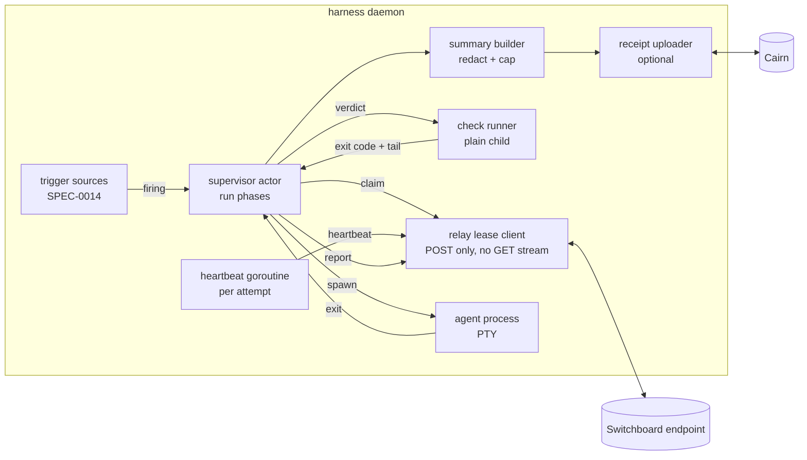
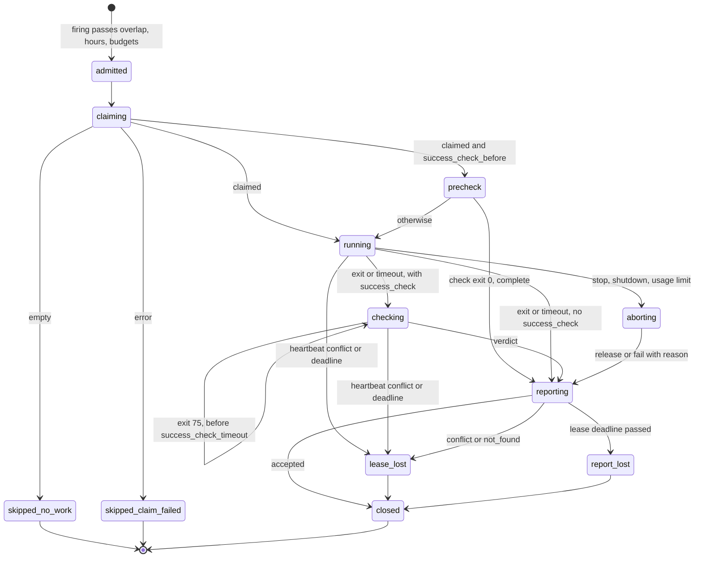

# Design: Relay Attempts With Supervisor-Held Leases

## Context

SPEC-0014 lets an event fire a one-shot through SPEC-0008's run machinery. When
Switchboard is in front, the one-shot drains the queue itself, and the model
owns the lease: it must claim, heartbeat more often than the TTL, and complete
or fail. ADR-0025 moves that job into the daemon for harnesses that opt in with
`lease`, and adds an operator-authored success check as the verdict. Governing
spec: SPEC-0019.

What exists on `main` today:

* `internal/supervisor/runs.go` owns the run lifecycle: `startRun` →
  `beginRun` → the process → `finishRun`, with overlap, timeout and a
  `RunJournal` for records. A run is one process.
* SPEC-0014 is designed but not yet built: `[channel.*]`, `[webhook.*]`,
  `triggers`, the event file and a purpose-built, listen-only MCP Streamable
  HTTP client.
* `internal/redact` masks credentials in agent activity and logs.
  `internal/cairnexport` can POST to Cairn, but nothing calls it.
* Switchboard's drain verbs (`claim`, `claim_next`, `heartbeat`, `complete`,
  `fail`, `list_todos`) exist in every release. Their input schemas forbid
  unknown properties. Switchboard SPEC-0034 (in flight) adds attempt history, a
  lease-token fence, `summary`/`artifact` on the reporting verbs, `get_todo` and
  `release`.

Related specs: SPEC-0008 (runs), SPEC-0014 (triggers), SPEC-0002 (protocol),
SPEC-0006 (prompt and argv), SPEC-0012 (hours), SPEC-0013 (metrics).

Related ADRs: ADR-0021 (partly reversed), ADR-0013, ADR-0008, ADR-0019. Records
in flight, by number: Harness ADR-0022, ADR-0023, ADR-0027 and ADR-0028;
Switchboard ADR-0039 / SPEC-0034; Cairn ADR-0027 / SPEC-0021.

## Goals / Non-Goals

### Goals

- The daemon claims, heartbeats and reports for a leased harness, so no prompt
  has to carry the heartbeat rule.
- A fresh process per attempt, with the todo and earlier attempts passed as a
  private file.
- A verdict from an operator-authored check, including "wait, CI is still
  running".
- Admission before claim, so an attempt is never burned on a run that will not
  start.
- Honest degradation against a Switchboard without attempt history.
- One run machinery: an attempt is a SPEC-0008 run with extra phases, not a
  second lifecycle.

### Non-Goals

- A durable queue in the daemon. Switchboard is the ledger, and a crash loses the
  attempt, not the todo.
- Choosing which todo to claim. `claim_next` decides, in FIFO order.
- Retrying locally. Switchboard's backoff and cap drive the next attempt.
- Notifying humans about dead letters. Switchboard ADR-0034 owns that.
- Concurrent runs of one harness. That arrives with Harness ADR-0027's
  `max_concurrent`, and this design keeps one lease per run so it composes.

## Decisions

### A run gains phases; the actor loop owns them

**Choice**: a leased run moves through `claiming → running → checking →
reporting → closed`. The actor loop in `supervisor.go` owns the phase. Every
network or child-process step runs in a goroutine that posts its result back to
the actor as a message: `claimResult`, `heartbeatResult`, `checkResult`,
`reportResult`.

**Rationale**: SPEC-0008 already serializes run state on the actor, and
`on_overlap` must see a leased run as in flight from the first claim byte to the
last report byte. Posting results keeps every state transition on one
goroutine, which is what makes overlap, timeout and lease loss race-free.

**Alternatives considered**:
- *A relay wrapper around `StartRun`* (claim first, then call `StartRun`):
  rejected because overlap would be decided after the claim, burning attempts,
  and because lease loss could not stop the process without reaching into the
  supervisor anyway.
- *A second lifecycle beside runs*: rejected by ADR-0021's "one run machinery"
  driver.

### Claim is the last admission step

**Choice**: `startRun` evaluates overlap, then hours, then (when Harness
ADR-0027 lands) budgets. Only a request that would start a process enters
`claiming`. A held firing claims when it is released, not when it is held.

**Rationale**: each committed claim consumes one of the todo's attempts and, with
Switchboard ADR-0035, one unit of the queue's admission budget. Neither is
refunded.

### A separate lease client session, schema-driven arguments

**Choice**: `internal/relay/client.go` reuses SPEC-0014's narrow Streamable
HTTP client for `initialize` and `notifications/initialized`, then issues
`tools/list` and `tools/call` over POST. It never opens the GET stream. At
initialize (and on every re-initialize) it records each drain verb's input
schema, and it sends an optional argument only when the schema declares it.

**Rationale**: an open GET stream makes a session a doorbell target, so the
lease client must not have one. The schema check is needed because
Switchboard's tool inputs are inferred with `additionalProperties: false`, so an
undeclared argument fails the call; reading the schema detects the feature
directly, where a version string would only suggest it.

**Alternatives considered**:
- *Reuse the channel listener's session for tool calls*: rejected. It couples
  the listener's health to the lease, and it would put tool traffic on the one
  session ADR-0021 promised calls no tools.
- *The official Go MCP SDK client*: rejected for the reasons SPEC-0014's design
  gives for the listener. It adds weight for five calls.

### Heartbeats are ticks, deadlines are local

**Choice**: each attempt runs one heartbeat goroutine with a ticker at
`heartbeat_interval`. The actor keeps `leaseDeadline = lastOK + lease_ttl` and
arms a timer for it. Transport failures retry with jitter inside the interval.
When the deadline timer fires before a successful heartbeat moves it, the actor
treats the lease as lost.

**Rationale**: the server's clock decides expiry, but the daemon cannot see it.
Using the daemon's own "last successful response" is conservative: it can only
kill early relative to the server, never late, as long as the request's own
latency is shorter than the lease.

### The verdict runner is a plain child, not a PTY

**Choice**: `internal/relay/check.go` runs `success_check` with
`exec.CommandContext` in the harness's workdir, with the harness's `env_file`
and the relay variables. stdout and stderr are teed into the run log under a
delimiter and into a 4 KiB ring buffer for the summary. Exit 75 schedules a
re-run on the actor.

**Rationale**: a check is a script, not an agent, so it needs no terminal, and
a PTY would add screen noise to its tail.

### The summary is composed, redacted and capped by the daemon

**Choice**: `internal/relay/summary.go` builds the three-part summary (REQ-11),
runs `internal/redact` over it, and caps it at 2048 bytes on a rune boundary.
Parts 3 and then 2 are trimmed first. The daemon-authored first line always
survives.

**Rationale**: the first line is the only part the daemon observed itself, so it
is the most trustworthy part and should always reach the next attempt. 2048
bytes matches the cap Switchboard SPEC-0034 stores.

### No persistence of lease state

**Choice**: lease tokens, pending verdicts and todo payloads never reach
`state.json`. A restart reconciles the run as `interrupted` and makes no call.

**Rationale**: ADR-0008. The lease lapses within `lease_ttl`, and Switchboard
records the attempt as having died, which is the truth.

### Receipts are optional and bounded

**Choice**: `[cairn.*]` plus `attempt_receipt` creates one Markdown artifact per
attempt through `internal/relay/receipt.go`, which reuses `cairnexport`'s HTTP
plumbing, with a 30-second cap. It uses the receipt metadata of Cairn SPEC-0021
when the server advertises it, and falls back to tags.

**Rationale**: a Cairn handle is worth having when the agent crashed before
writing its own, but it must never hold up the report that keeps the lease
story honest.

## Architecture

### Where the pieces live

| Package | New or changed | Role |
| --- | --- | --- |
| `internal/config` | changed | `[queue.*]`, `[cairn.*]`, `lease`, `success_check*`, `attempt_receipt`; validation (REQ-1–3) |
| `internal/relay` | new | lease client, heartbeat loop, check runner, summary, receipt, context file |
| `internal/supervisor` | changed | run phases, admission-before-claim, lease-loss stop, record fields |
| `internal/protocol` | changed | record fields, `relay_*` events, `ProtoMinor` bump |
| `internal/daemon` | changed | lease source reconciliation on reload; `describe` and `doctor` |
| `internal/redact` | reused | summary and receipt redaction |

### Config shapes

```toml
[queue.ci]
url = "https://switchboard.example.com/mcp/ci-fixer"
env_file = "~/.config/harness/env/ci-fixer.env"
headers = { Authorization = "Bearer ${SWITCHBOARD_TOKEN}" }
queue = "ci-failures"
lease_ttl = "5m"
heartbeat_interval = "1m"

[cairn.main]
url = "https://cairn.example.com"
env_file = "~/.config/harness/env/cairn.env"
headers = { Authorization = "Bearer ${CAIRN_TOKEN}" }
ttl = "7d"

[harness.ci-fixer]
harness = "claude-code"
prompt_file = "~/agents/ci-fixer.md"
triggers = ["channel.switchboard"]
schedule = "@every 30m"
lease = "queue.ci"
success_check = ["./scripts/required-checks-green.sh"]
success_check_timeout = "15m"
success_check_interval = "30s"
success_check_before = true
attempt_receipt = "cairn.main"
timeout = "45m"
```

```go
// internal/config
type LeaseSource struct {
    Name              string
    URL               string
    Headers           map[string]string // ${NAME} resolved from EnvFile at load
    EnvFile           string
    Queue             string
    LeaseTTL          time.Duration // default 5m; 1m..1h
    HeartbeatInterval time.Duration // default LeaseTTL/3; <= LeaseTTL/2
    Enabled           bool
}

type HarnessRelay struct { // on HarnessConfig, nil when lease is unset
    Lease                string        // "queue.<name>"
    SuccessCheck         []string
    SuccessCheckTimeout  time.Duration // default 10m
    SuccessCheckInterval time.Duration // default 30s
    SuccessCheckBefore   bool
    AttemptReceipt       string        // "cairn.<name>" or ""
}
```

### The Switchboard contract relay uses

| Verb | Arguments sent | Response fields read |
| --- | --- | --- |
| `tools/list` | none | each drain verb's `inputSchema.properties` |
| `claim_next` | `queue?`, `lease_ttl_seconds`, `require_fence`†, `claimant`† | `empty`, `todo.{id,queue,title,kind,source,payload,work_order,attempt,max_attempts,created_at}`, `attempt_seq`†, `lease_token`†, `prior_attempts`† |
| `heartbeat` | `id`, `lease_ttl_seconds`, `lease_token`† | success, or error code `conflict` / `not_found` |
| `complete` | `id`, `result`, `summary`†, `artifact`†, `lease_token`† | success or error code |
| `fail` | `id`, `result`, `summary`†, `artifact`†, `lease_token`† | `state`, `attempt`, `max_attempts`, `dead_letter`†, `next_retry_at`† |
| `release` | `id`, `summary`†, `lease_token`† | success or error code; optional verb |

† Defined by Switchboard SPEC-0034. Sent only when the verb's schema declares
it, and read only when present.

### Component view



### Run phase state machine



### Relay context file

```json
{
  "version": 1,
  "todo": {
    "id": "td_8f2c", "queue": "ci-failures", "title": "CI red on PR #482",
    "kind": "check_suite", "source": "gitea", "payload": {"…": "…"},
    "work_order": null, "created_at": "2026-09-22T14:03:11Z"
  },
  "attempt": {"seq": 7, "number": 3, "max": 5,
              "claimed_at": "2026-09-22T15:10:02Z", "lease_ttl_seconds": 300},
  "prior_attempts": [
    {"seq": 6, "number": 2, "outcome": "failed", "died": false,
     "claimant": "harness/buildbox/ci-fixer/run-41",
     "claimed_at": "2026-09-22T14:40:00Z", "ended_at": "2026-09-22T14:58:12Z",
     "summary": "attempt 2/5 · agent success (exit 0) after 16m · check exit 1 after 2m\nbumped the fixture; TestFlakyThing still fails",
     "artifact": "mcp://cairn/Ab12Cd34"},
    {"seq": 5, "number": 1, "outcome": "reaped", "died": true,
     "claimant": "harness/buildbox/ci-fixer/run-38",
     "claimed_at": "2026-09-22T14:05:00Z", "ended_at": "2026-09-22T14:21:30Z",
     "summary": null, "artifact": null}
  ],
  "attempt_history": "supported",
  "untrusted": ["todo.title", "todo.payload", "todo.work_order", "prior_attempts[].summary"],
  "summary_file": "/home/u/.local/state/harness/jobs/ci-fixer/43.summary"
}
```

## Risks / Trade-offs

- **Switchboard outage kills attempts** → deliberate. Lease loss at the
  deadline is the only way to guarantee no duplicate work. `lease_ttl` is the
  operator's lever: a longer lease tolerates longer outages and recovers a
  crashed attempt more slowly.
- **A report lost after the work landed** → the next attempt's
  `success_check_before` finds the world already green and completes without
  spawning. Without it, the next agent redoes a no-op. The docs recommend
  `success_check_before` wherever the check is cheap.
- **A flaky check burns the attempt budget** → exit 75 exists for slow
  evidence. Genuinely flaky checks are an operator problem that the per-attempt
  record makes visible.
- **Prompt injection between attempts** → the file boundary, the `untrusted`
  list, the 2048-byte cap and redaction bound it. The operator's prompt must
  still say that prior summaries are data.
- **The agent completes its own attempt** → prevented by `require_fence` when the
  server supports it. Against an older server it is prevented only by giving the
  agent no drain verbs, and `harness doctor` cannot see what the agent holds.
- **Contract drift with Switchboard** → schema-driven arguments, and a contract
  test against a fake that implements both the pre- and post-SPEC-0034 schemas.

## Migration Plan

Purely additive. A config without `[queue.*]` or `lease` behaves exactly as it
does today, and the protocol change is additive (one `ProtoMinor` bump). The
feature depends on SPEC-0014's trigger sources being built first. Its lease
client can be built in parallel, and its relay behaviour lands once firings
exist. Rolling back means removing `lease` from config; in-flight attempts are
stopped and their leases lapse.

## Open Questions

- Should `harness trigger <name>` on a leased harness accept `--todo <id>` to
  claim a specific todo for debugging? That is the one place option 4B has a
  real use.
- Should a relay record which model served the attempt (Harness ADR-0026, model
  pinning) in `result.harness`? It is cheap once that lands.
- Should `success_check` also be allowed on an unleased triggered harness, to
  turn its exit code into a better run outcome? It is out of scope here, and it
  would be a small follow-up.
