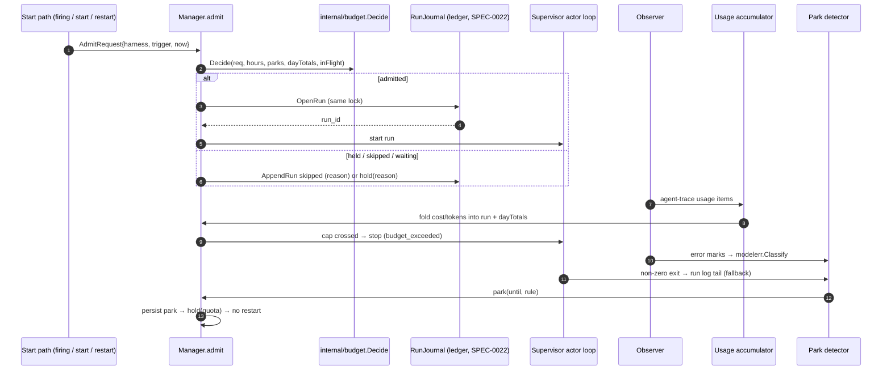
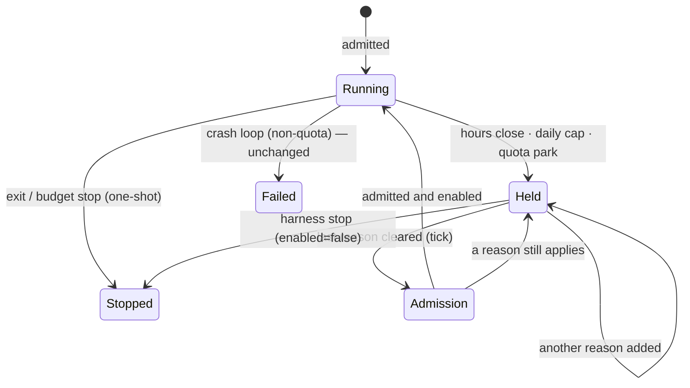

# Design: Run Budgets and Usage-Limit Backoff

## Context

ADR-0027 decides that the daemon enforces budgets at admission and during a run,
and parks a harness whose provider refuses it for exhausted quota. SPEC-0021
states the requirements. This document says where the pieces live, what they
store, and how they compose with the machinery that already exists:

* the **operating-hours gate** (SPEC-0012, `internal/scheduler/gate.go`,
  `internal/supervisor/hours.go`, `manager_hours.go`), whose tick, clock seam,
  hold/release path and graceful close this design reuses;
* the **run machinery** (SPEC-0008, `internal/supervisor/runs.go`,
  `manager_runs.go`), whose `StartRun`, timeout kill and `RunJournal` are the
  enforcement and recording points;
* the **observer** (`internal/observe`), the only source of
  agent activity in the daemon;
* the **error classifier** (SPEC-0013 REQ-3, `internal/metrics/classify.go`),
  which already maps error text to `quota|auth|timeout|transport|other`;
* the **run ledger** (SPEC-0022, ADR-0028, accepted with this spec on
  2026-09-22 and not yet built), which stores every run record and hosts the
  usage accumulator.

## Goals / Non-Goals

### Goals

- One admission function in front of every start path, evaluated in a fixed
  order, atomic with the run's ledger record.
- Budget counters with exactly one store: the ledger.
- Parking that replaces crash-loop handling for quota exhaustion, survives a
  restart, and releases on the existing gate tick.
- Every hold visible with its reason and its release time.

### Non-Goals

- Billing accuracy. The meter reports what agents record, priced by the
  operator where they record none.
- Calling any provider API.
- Budgets on project harnesses (deferred, as ADR-0019 deferred project hours).

## Decisions

### A new `internal/budget` package owns admission and counters

**Choice**: `internal/budget` holds the pure pieces: the budget-day arithmetic
(`Day(now, spec) (start, next time.Time)`), the admission decision
(`Decide(req AdmitRequest, st State) Decision`), cost resolution, and the reset
time parser. The Manager owns the mutable state (counters, the concurrency
queue, parks) under its existing lock and calls `Decide` inside
`Manager.admit`, which every start path funnels through.

**Rationale**: the operating-hours work proved the pattern: a pure,
time-free `internal/hours` package with fuzz and table tests, and a Manager that
applies its answers. Admission is a pure function of (request, config, counters,
parks, hours state, now), so it can be tested exhaustively without a supervisor.

**Alternatives considered**:
- Admission inside each start path: rejected. There are nine start paths
  (SPEC-0021 REQ-4), and a check added to eight of them is the bug.
- A separate admission goroutine with a channel: rejected. The decision must be
  atomic with the ledger append, which already happens under the Manager lock
  (`OpenRun`).

### Admission is a funnel on the Manager

```go
// internal/budget
type AdmitRequest struct {
    Harness   string
    Resident  bool          // no prompt: a process lifetime, not a run
    Trigger   string        // schedule|catch_up|channel|webhook|manual|autostart|restart|release|lease
    Override  bool          // --over-budget, control socket only
    Now       time.Time     // the tick's clock, never time.Now()
}

type Reason string // "", hours, quota_parked, budget, concurrency, ledger_unavailable

type Decision struct {
    Verdict Verdict  // Admit | Hold | Skip | Wait
    Reason  Reason
    Detail  string   // "40/40 runs today", "parked until 15:00 by crush/litellm.ratelimiterror"
    Next    time.Time // when the reason clears, zero if unknown
}
```

`Manager.admit(req)` takes the lock, asks `hours` (unchanged), consults parks,
daily cost, run count and concurrency, and on `Admit` calls the journal's
`OpenRun` while still holding it. The run count increments at that moment, so a
racing second firing sees the new count. `Hold` and `Skip` are applied by the
caller exactly as the hours gate applies them today: a resident is held via
the generalized `hold(reasons)`, a firing is recorded `skipped` through
`AppendRun` with the reason and the SPEC-0014 coalescing rule.

The supervisor's restart path calls `admit` with trigger `restart` before it
respawns. That is how `max_runs_per_day` bounds a crash loop, and how a park
lands before the restart policy counts the exit.

### Counters are running totals rebuilt from the ledger

**Choice**: the Manager keeps `map[harness]dayTotals{runs int, costUSD
float64}` plus a daemon total, for the current budget day only. At boot, after
the ledger is opened (SPEC-0022) and before Autostart, it folds today's ledger
records into those totals. After that, `OpenRun` increments runs and each
accumulator fold adds cost. A rollover on the tick zeroes them.

**Rationale**: SPEC-0021 REQ-7 requires one store. Reading the ledger on every
admission would put a file scan on the start path; a running total rebuilt from
the ledger at boot is exact and cheap, and it cannot drift, because the only
increments are the same events the ledger records.

**Alternatives considered**:
- Counters in `state.json`: rejected. A second store that can disagree with the
  ledger, and `state.json` saves are debounced (ADR-0007).
- SQLite: rejected here; the ledger's storage is SPEC-0022's decision.

### The budget day reuses the gate's clock

`day_starts` parses through the same zone-prefix code as `operating_hours`
(`internal/hours` exports the prefix parser) and yields a daily instant. The
rollover is evaluated in the gate pass (`internal/scheduler/gate.go`), on the
tick's `now`, beside hours and park expiry, so there is one time source (the
scheduler's clock seam) and one pass. A rollover emits `harness_hold_changed`
for every harness whose `budget` reason clears.

### Holds become a reason set

**Choice**: `Supervisor.held bool` becomes `holds HoldSet` (a small bitset of
`hours|quota|budget`). `hold(reason)` adds a reason and, if the harness is up,
stops it (graceful for hours and budget per the harness's close mode, immediate
for quota). `release(reason)` removes one; when the set becomes empty, the
Manager re-runs admission and starts the harness if it passes and `enabled` is
true. `held` in projections becomes `hold_reasons`.

**Rationale**: every rule SPEC-0012 established for a hold (it is not a crash,
`enabled` survives, backoff resets, a `failed` harness stays failed, `stop`
clears it) is correct for quota and budget too. One path means one set of
tests, and the operating-hours display machinery (`off-hours`) extends to `parked` and
`over-budget` rather than growing a parallel branch.

**Migration**: `hold()` today logs `reason=operating_hours`; the log line keeps
that wording for hours and gains `quota` and `budget`. The projection's `held`
boolean (SPEC-0012 REQ "Operating Hours Visibility") is removed in the same
change and replaced by `hold_reasons`. No derived `held` is kept for older
clients: Harness is pre-1.0, and the client and daemon ship in one binary.

### One classifier, moved to `internal/modelerr`

**Choice**: once the metrics implementation merges, `internal/metrics/classify.go` moves to
`internal/modelerr` (the tables, `Classify`, the classes), and gains
`ResetAfter(adapter, note string, now time.Time) (time.Time, bool)`.
`internal/metrics` and the park detector both import it.

**Rationale**: SPEC-0013's design already says classification happens once,
where the error is observed. Two tables would drift the first time a provider
rewords a message, and the unclassified counter would only watch one of them.

### Reset-time formats

`ResetAfter` recognises, in order, and returns the earliest future instant:

| Shape | Example | Source |
| --- | --- | --- |
| `\|<unix epoch>` suffix | `Claude AI usage limit reached\|1790000000` | Claude Code `-p` result text |
| `resets <h>[:mm](am\|pm)` with optional `(<IANA zone>)` | `5-hour limit reached ∙ resets 3pm (America/Los_Angeles)` | Claude Code interactive and newer `-p` |
| `try again in <duration>` / `retry after <n> seconds` | `Please try again in 2h13m` | OpenAI, codex, litellm |
| `Retry-After: <seconds>` or an HTTP date | relayed headers in error details | gateways |
| `reset(s)? at <RFC 3339>` | `quota resets at 2026-09-23T00:00:00Z` | generic |
| `x-ratelimit-reset(-requests\|-tokens)?: <epoch or duration>` | relayed headers | OpenAI-compatible |

A clock time with no zone is read in the daemon's zone and, if already past
today, tomorrow. Results under 1 minute away or in the past are "no reset";
results beyond 8 days are clamped to 8 days and flagged `clamped`. Each shape
has a table test with a real message, and a fuzz test asserts the parser never
panics and never returns an instant outside (now, now+8d].

### The park detector

A `quota.Detector` per harness, owned by the Manager and fed from two places:

1. An observer subscription (`Subscribe("budget", 4096)`): for each error mark,
   `modelerr.Classify`; for each tool event, a success. It keeps a ring of the
   last 10 minutes of (time, class, success) per harness.
2. The run exit path (`finishRun`): for a non-zero one-shot exit with no
   classified error in its run, read the last 4 KiB of the run log and classify
   it (the fallback).

It answers `Park(harness, now) (until time.Time, rule string, ok bool)`
according to SPEC-0021 REQ-12. Observer drops (full buffer) are counted in
`Stats.Dropped["budget"]` and surfaced by `doctor`, so a lossy detector is
visible rather than silently lenient.

### What is persisted

`state.json` gains an additive `parks` object (no schema bump, per the existing
additive rule in `persisted.go`):

```json
{
  "parks": {
    "harness:crush-sb":   {"until": "2026-09-22T15:00:00-07:00", "rule": "crush/litellm.ratelimiterror", "step": 0, "clamped": false, "by": "crush-sb"},
    "group:claude-max":   {"until": "2026-09-22T15:00:00-07:00", "rule": "claude-code/usage limit reached", "step": 1, "clamped": false, "by": "pr-review"}
  }
}
```

Each entry decodes independently, so a malformed one costs only that harness
(SPEC-0021 REQ-13). It is written synchronously before the stop, the same
ordering the after-hours lease uses. No error text is stored. Counters are not
persisted here (they live in the ledger), and over-budget leases reuse the
existing `lease_until` field.

### The concurrency queue

A FIFO of `(harness, firing)` with at most one entry per harness, under the
Manager lock. `admit` returns `Wait` when the in-flight count (triggered runs
only) is at the daemon or group cap and enqueues the firing. `finishRun`
releases a slot and pops the oldest entry whose harness still passes checks
1–4, granting it the slot. A further firing for a queued harness increments a
coalesced `skipped` record (reason `concurrency`) through the existing
coalescing path.

### Protocol changes

* `start` and `trigger` ops gain `over_budget bool`. The control-socket handler
  accepts it. The MCP surface's `harness_start` handler never sets it, and a
  test pins that.
* The harness projection gains `hold_reasons []string`, `parked_until`,
  `park_rule`, `park_group`, and `budget {runs_today, max_runs_per_day,
  cost_today_usd, daily_cost_usd, cost_source}`, all `omitempty`.
* The harness projection loses `held`. `hold_reasons` containing `hours` is
  what `held` meant. It rides the same `ProtoMinor` bump: an older client reads
  the missing field as `false` and loses the `off-hours` label, nothing worse,
  so a major bump that refuses every older client would cost more than it
  saves.
* A new event `harness_hold_changed {name, hold_reasons, next}`.
* Errors `over_budget` and `parked` carry the Decision's `Detail`, which the CLI
  prints verbatim.

### Config shapes

```go
// internal/core
type Budget struct {           // per harness
    MaxRunsPerDay   int         // 0 = unset
    MaxTokens       int64
    MaxCostUSD      float64
    DailyCostUSD    float64
    QuotaGroup      string
    QuotaBackoff    time.Duration // default 15m
    QuotaBackoffMax time.Duration // default 6h
}

type DaemonBudget struct {     // [budget]
    DayStarts     hours.DailyInstant // zone + HH:MM
    MaxConcurrent int
    DailyCostUSD  float64
    Prices        map[string]Price
    Groups        map[string]GroupBudget
}
```

Validation lives beside `operatinghours` validation in `internal/config`, with
located errors via `lineOfKeyInTable`.

## Architecture





## Risks / Trade-offs

- **The meter lags by a poll and a turn** → caps are documented as approximate
  ceilings; `timeout` remains the hard wall-clock bound.
- **agent-trace's usage items are a hard dependency for token and cost caps** → the
  meter-free half (run counts, concurrency, parking) ships first and does not
  wait on it.
- **The run-log fallback matches text** → scoped to non-zero one-shot exits and
  4 KiB, clamped, and retired when claude-code API errors arrive as marks. A test pins that a zero
  exit is never classified.
- **A false park stops useful work** → loud in every surface, bounded by the
  backoff or the parsed reset, and cleared by one `harness start`.
- **Holds generalization touches the operating-hours display work in flight** → SPEC-0021's
  visibility story is sequenced after it, and reuses its `schedfmt` labels.
- **Operator prices go stale** → `doctor` lists served models without prices and
  prices no run has used; the ledger records `cost_source` so a dashboard can
  separate recorded from priced cost.

## Migration Plan

1. Additive config keys and the `[budget]` table: an old config loads unchanged.
2. `state.json` gains `parks` additively; an older daemon ignores it.
3. The classifier move lands as a pure refactor after the metrics implementation, with no behaviour
   change and its tests moved with it.
4. `held` is removed from the projection in the same change that adds
   `hold_reasons`, with no transition release. Upgrade note (release notes):
   the harness projection's `held` field is gone; read `hold_reasons`. A client
   older than the daemon shows a held harness without its `off-hours` label
   until it is upgraded.
5. Rollback: removing the keys disables budgets; parks expire by themselves, and
   a downgraded daemon ignores `parks` (a parked resident would then start on
   boot and re-park on its first refusal).

## Open Questions

Every question below was settled in the Operation Stumply design review. None is
left open.

- **Should a quota group be inferred from a shared `env_file`?** Resolved
  (design review 2026-09-22): no. It would mean reading credentials; operators
  set `quota_group` explicitly.
- **Is 10 minutes / 3 errors the right "stuck" threshold?** Resolved (design
  review 2026-09-22): yes. A harness parks after 3 quota errors with no success
  in 10 minutes. The values are constants in the first cut, promoted to keys
  only if field data asks.
- **The run-log text fallback.** Resolved (design review 2026-09-22): accepted
  as temporary. Matching the last 4 KiB of a non-zero exit's sanitized run log
  stays until claude-code API errors arrive as marks, then it is removed.
  agent-trace's claude-code reader gained those marks on 2026-09-22, but
  Harness still pins an agent-trace from 2026-08-10, so the fallback retires
  with the dependency bump that picks the marks up.
- **Should `--over-budget` on a resident default to the remaining operating
  window instead of 1h?** Resolved (design review 2026-09-22): no; it stays 1h,
  as proposed.
