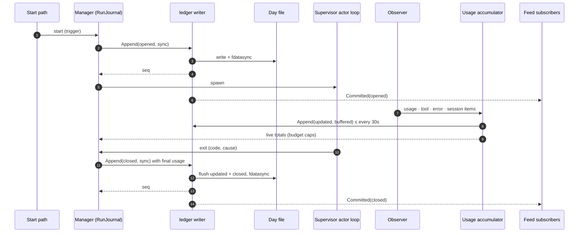
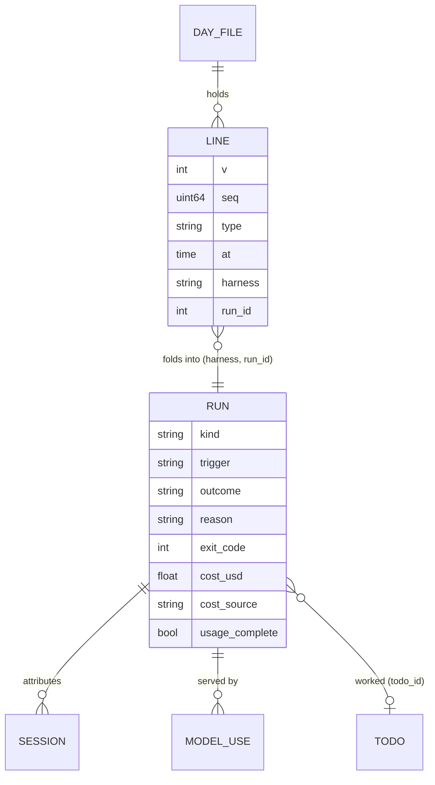

# Design: Run History Ledger

## Context

ADR-0028 decides that every run of every harness gets one durable record in an
append-only ledger, and that metrics, budgets and the CLI all read that one
stream. SPEC-0022 states the requirements. This document says where the pieces
live and how they fit the machinery that already exists:

* **Run records** (SPEC-0008): `internal/supervisor/runs.go` opens and closes a
  record at every way a one-shot run ends, through one `finishRun`;
  `manager_runs.go` implements `RunJournal` (`OpenRun`, `CloseRun`, `AppendRun`),
  allocates run ids, bounds history to `keep_runs`, prunes run logs, and saves
  `state.json` synchronously.
- **Resident exits** (SPEC-0003): `supervisor.go` handles every exit on the actor
  loop and logs `exited code=N`; nothing records it structurally.
* **The lifecycle bus** (`supervisor/event.go`): lossy fan-out. #407's metrics
  collector counts `EventRunFinished` from it.
* **The observer** (`internal/observe`, #416): agent activity attributed to a
  harness, non-blocking fan-out with per-subscriber drop counts.
* **The protocol** (`internal/protocol/messages.go`): `OpRuns`, `RunInfo`,
  `RunsData`, `JobInfo`.

## Goals / Non-Goals

### Goals

- Extend `RunJournal` into the single writer of a ledger covering residents and
  one-shots, and make the ledger the only run history: `state.json` stops
  carrying run records in the same change. `harness runs NAME`, `jobs`,
  `trigger --wait` and `logs --run` keep their behaviour, read from the ledger.
- A post-commit feed and a replay, so consumers never need the lossy bus for run
  facts.
- A usage accumulator that turns observer activity into per-run usage.
- A query path that serves the CLI from memory for recent records and from files
  for older ones, and works offline.

### Non-Goals

- A database. The access pattern does not need one (ADR-0028).
- Per-run log files for residents.

## Decisions

### A new `internal/ledger` package; the Manager stays the only caller

**Choice**: `internal/ledger` owns the file format, the writer goroutine, the
fold, the in-memory index, pruning, replay and the offline reader. The Manager's
`RunJournal` methods call it. The CLI's offline path uses its reader directly.

```go
package ledger

type Type string // opened | updated | closed | decided

type Line struct {
    V       int       `json:"v"`
    Seq     uint64    `json:"seq"`
    Type    Type      `json:"type"`
    At      time.Time `json:"at"`
    Harness string    `json:"harness"`
    RunID   int       `json:"run_id"`
    Fields  Record    `json:"-"` // flattened into the object on write
}

type Record struct {
    Kind          string            `json:"kind,omitempty"`     // oneshot | resident
    Trigger       string            `json:"trigger,omitempty"`
    Source        string            `json:"source,omitempty"`
    EventID       string            `json:"event_id,omitempty"`
    TodoID        string            `json:"todo_id,omitempty"`
    Attempt       int               `json:"attempt,omitempty"`
    StartedAt     *time.Time        `json:"started_at,omitempty"`
    EndedAt       *time.Time        `json:"ended_at,omitempty"`
    ExitCode      *int              `json:"exit_code,omitempty"`
    Outcome       string            `json:"outcome,omitempty"`
    Reason        string            `json:"reason,omitempty"`
    Model         string            `json:"model,omitempty"`
    Models        []ModelUse        `json:"models,omitempty"`
    Tokens        *Tokens           `json:"tokens,omitempty"`
    CostUSD       *float64          `json:"cost_usd,omitempty"`
    CostSource    string            `json:"cost_source,omitempty"`
    ModelCalls    int               `json:"model_calls,omitempty"`
    Errors        map[string]int    `json:"errors,omitempty"`
    UsageComplete *bool             `json:"usage_complete,omitempty"`
    Sessions      []Session         `json:"sessions,omitempty"`
    TraceURL      string            `json:"trace_url,omitempty"`
    Log           string            `json:"log,omitempty"`
    Override      bool              `json:"override,omitempty"`
    Mismatch      *Mismatch         `json:"mismatch,omitempty"` // SPEC-0020
    Imported      bool              `json:"imported,omitempty"`
    // SPEC-0008 / SPEC-0014 fields
    Window, FirstWindow *time.Time
    Windows, Coalesced  int
}

type Journal interface {
    Append(l Line, sync bool) (seq uint64, err error) // sync=true waits ≤2s
    Subscribe(name string, buf int) (<-chan Committed, func())
    Since(seq uint64) iter.Seq2[Line, error]
    Query(q Query) ([]Folded, uint64, error)
    Stats() Stats
}
```

**Rationale**: the same split as `internal/observe` and `internal/hours`: a
package with no supervisor dependency, tested on its own with temp directories
and a fake clock, wired by the Manager.

### One writer goroutine, synchronous for facts, buffered for checkpoints

The writer owns the open day file, the next `seq`, and a FIFO of pending lines.
`Append(sync=true)` enqueues the line and waits for the writer to `write` and
`fdatasync` it, up to 2 seconds. `Append(sync=false)` enqueues and returns; the
writer syncs buffered `updated` lines at least every 30 seconds and always before
a `closed` line for the same run.

On a failed or timed-out sync the line stays queued and is retried in order with
backoff; the caller gets `ErrLedgerUnavailable` and decides what to do
(SPEC-0021 REQ-4 refuses budgeted admission; everything else proceeds). Because
the queue is ordered and `seq` is assigned at enqueue, a recovered disk receives
the lines in exactly the order the facts happened.

Day files are opened with `O_APPEND|O_CREATE|O_WRONLY`, mode 0600. At a UTC
rollover the writer closes one file and opens the next; the `seq` does not reset.
At boot, the writer reads the last complete line of the newest file to recover
`seq`, and truncates nothing: a torn tail is left in place, skipped by readers,
and the next append starts with a `\n` if the file does not end in one.

**Alternatives considered**:
- Writing from the actor loop directly: rejected. A slow disk would stall every
  harness's supervision, not just the one being recorded.
- `fsync` per `updated` line: rejected. A busy run produces a usage item every
  few seconds, and 30 seconds of usage is an acceptable loss on a crash; an
  outcome is not, which is why `closed` is synced.

### Hooking residents into `RunJournal`

Residents already pass through the actor loop's spawn and exit paths. The change
is to call `OpenRun` at spawn (with `kind = resident` and the trigger the start
path knows) and `CloseRun` in the same place that logs `exited`. The trigger is
threaded through the start request, which the hold/release and restart paths
already construct:

| Start path | Trigger |
| --- | --- |
| `Manager.Autostart` | `autostart` |
| supervisor restart after an exit | `restart` |
| gate `Release` (hours open, park expired, budget day rolled) | `release` |
| `StartFor` (after-hours or over-budget lease) | `lease` |
| `harness start` / `restart` / TUI / MCP `harness_start` | `manual` |

`manager_runs.go` today allocates run ids only for scheduled harnesses; the
allocator is generalized to every harness, keeping the floor-at-logs rule for
one-shots. Residents do not create `jobs/<harness>/<id>.log` files; their
record's `log` is the durable log path.

### `state.json` keeps only the run id counter

The `RunJournal` methods stop writing run records to `state.json`. Each
harness's entry keeps `last_run_id`, the id allocator, and nothing else from
SPEC-0008 run history: the record list and its `keep_runs` bound go. The
consumers that read the list today move to the ledger's index in the same
change:

| Consumer | Today | After |
| --- | --- | --- |
| `runs` op / `harness runs NAME` | `state.json` history | ledger index, then day files (REQ-15) |
| `jobs` (last run, last outcome) | `state.json` history | ledger index: the harness's newest folded record |
| `trigger --wait` | polls the `runs` op, which reads `state.json` | polls the same op, now served from the ledger |
| `logs --run N` | `state.json` history for the log path | ledger record's `log` and `log_pruned` |
| boot reconciliation | `state.json` open records | ledger open records (REQ-7) |

`keep_runs` bounds only per-run log files. There is no projection, no dual
write and no rollback path: a daemon downgraded past this change finds no run
history in `state.json`. The implementing PR's upgrade note says so.

### The fold and the in-memory index

The journal keeps an index of folded records for the last 7 days (by `at` of
the `opened` line), keyed by `(harness, run_id)`, plus a per-harness ordered
list of run ids. A day of a busy host is thousands of records, a few MB at most.
Queries within 7 days are answered from the index; older ranges read the
relevant day files through the same fold. The index is rebuilt at boot by
reading the last 7 days of files, which is also when crash reconciliation
(REQ-7) finds open records and budget totals (SPEC-0021 REQ-7) are summed.

### The run feed and replay

`Subscribe` mirrors `observe.Observer.Subscribe`: a buffered channel per
subscriber and a drop counter. The writer publishes a `Committed{Seq, Folded}`
after a synced `opened`, `closed` or `decided` line. `Since(seq)` streams lines
from the in-memory ring (the last 10,000 lines) or, for older `seq`, by locating
the day file whose first `seq` is at most the target (each file's first `seq` is
cached at boot) and scanning forward.

Consumers:

| Consumer | Uses | Buffer |
| --- | --- | --- |
| metrics collector | `Subscribe("metrics", 8192)` | sized to the acceptance load |
| telemetry export (after #408) | `Subscribe("telemetry", 1024)` | lossy by design |
| budget totals | synchronous, inside `RunJournal` under the Manager lock | none |
| ADR-0025 lease completion | `Since(lastSeq)` on start, then `Subscribe` with a replay on any drop | lossless |

### The usage accumulator

`internal/ledger/usage.go` subscribes to the observer
(`Subscribe("ledger-usage", 4096)`). For each event it finds the harness's open
run through the Manager (a short snapshot read), folds the item as SPEC-0022
REQ-8 describes, and every 30 seconds emits one `updated` line per run whose
totals changed. Crush totals are differenced per session: the accumulator keeps
`lastTotals[sessionID]`, seeded from the first item seen after the run opened, so
a resident's run counts only what it spent. It exposes live totals to the
budget enforcer (SPEC-0021 REQ-9) through a callback on every fold, so a cap is
checked on the item that crosses it, not at the next checkpoint.

Until stump.wtf/agent-trace#105 lands there are no usage items; the accumulator
still folds tool events, error marks and sessions.

### Metrics wiring

After #407 merges, `internal/metrics` gains a `runs` input fed by the ledger
subscription, and its `lifecycle()` handler stops counting `EventRunFinished`.
`harness_scheduled_runs_total` keeps its name, labels and values; only its source
moves. The new series in REQ-11 are added in the same collector. The histogram
uses buckets `1s, 10s, 30s, 1m, 5m, 15m, 30m, 1h, 3h, 12h, 24h`, which spans a
failing spawn and a day-long resident.

### Query protocol

`OpRuns` keeps `{name, limit}` and gains optional fields:

```json
{
  "op": "runs",
  "names": ["pr-review", "nightly"],
  "since": "2026-09-21T00:00:00Z",
  "until": "",
  "outcomes": ["failed", "timed_out"],
  "triggers": ["webhook"],
  "limit": 1000,
  "before_seq": 0
}
```

The response `RunsData` keeps `name` and `runs` (a `RunInfo` list, which gains
the REQ-4 fields as `omitempty`) and adds `oldest_seq` for paging. `RunInfo`'s
existing fields keep their meaning, so an old client reading a new daemon sees
only additions.

### CLI

`newRunsCmd` makes NAME optional and adds the flags. Resolution:

1. Build the query from flags. A single NAME and no other filter keeps the
   SPEC-0008 default limit of 20; otherwise 50 and `--since 24h`.
2. Ask the daemon. If the socket is unreachable, open `internal/ledger`'s
   read-only reader on the ledger directory, print
   `harness: daemon not running; read the ledger from disk` to stderr, and run
   the same query. Open records render as `running?`.
3. Render the table (80 columns) or `--wide`, or `--json` as the record list.

### Retention

The prune runs in the writer goroutine at boot and at each UTC rollover:

1. For each file whose day ended before `now - retention`, oldest first: if any
   run whose `opened` line is in it is still open, append a fresh `opened`
   snapshot (the folded record so far) to today's file, then delete the file.
2. Then, while the total exceeds `max_mb`, do the same to the oldest file,
   never today's.
3. Update the cached first-`seq` table.

### First-boot import

If `ledger/` does not exist and `state.json` has run history, the Manager writes
each record as a `decided` line (for no-process outcomes) or an `opened` plus
`closed` pair, with `imported: true` and `at` set to the record's own start or
end, into the day file of that time, before admitting anything. A marker file,
`ledger/.imported`, makes it idempotent.

## Architecture





## Risks / Trade-offs

- **A synced append per resident start and exit** → one `fdatasync` on a
  dedicated goroutine, bounded to 2 seconds, never on the actor loop for an
  unbudgeted harness.
- **No downgrade path for run history** → `state.json` stops carrying run
  records in the same change, so a downgraded daemon starts with none. Harness
  is pre-1.0; the release notes carry an upgrade note rather than a projection
  kept for rollback.
- **Clock jumps** → day files are chosen by the line's UTC `at`; a backwards jump
  can append an earlier `at` to a later file, which readers tolerate because they
  fold by `seq`, not by file.
- **The index's memory** → bounded to 7 days and dominated by resident crash
  loops; a crash loop of one restart per second for a day is 86,400 small
  records, which the retention sizing and the doctor size report surface.
- **Usage depends on agent-trace#105** → records are useful without it (outcomes,
  codes, sessions, error counts), and the fields appear when it lands.

## Migration Plan

1. The ledger is created on first boot; `state.json` history is imported once,
   and the run record list is dropped from `state.json` in the same boot. Only
   `last_run_id` stays.
2. `jobs`, `trigger --wait`, `logs --run` and the `runs` op read the ledger from
   the first release that writes it. Resident records appear immediately.
3. After #407 merges, the metrics collector moves `harness_scheduled_runs_total`
   to the feed and adds the REQ-11 series.
4. Upgrade note (release notes of the version that ships it): run history now
   lives only in `ledger/`; `state.json` no longer carries it, and `keep_runs`
   bounds only per-run logs. Downgrading loses the view of run history.

## Open Questions

- Should the in-memory window be configurable, or is 7 days always enough for
  the CLI's default queries?
- Should `harness runs` default to 24 hours or to "since the last daemon start"
  when no NAME is given?
- Should the first-boot import also parse `exited code=` lines out of the
  durable logs to backfill resident history? It is best-effort text parsing,
  which this ADR exists to retire, so the default answer is no.
