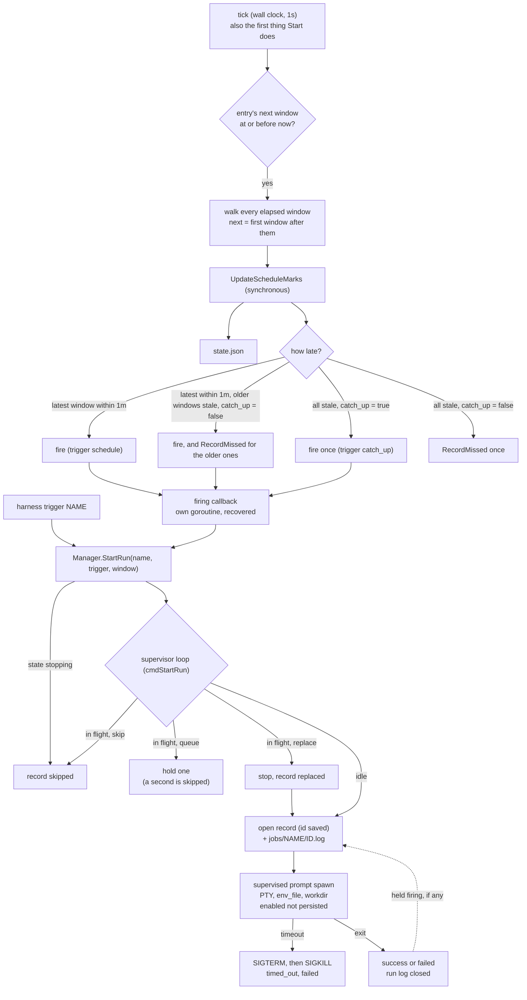
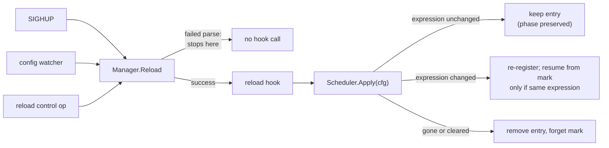

# Design: Scheduled One-Shot Runs

## Context

Harness supervises resident processes: SPEC-0003 respawns a harness on exit,
including a clean one, while its restart policy permits, because agents and
watchers are meant to be long-lived. The other half of the workload is the exact
inverse: nightly sweeps, weekly grooming, daily syncs that are *supposed* to
finish. Without scheduling in the daemon, that work lives in launchd plists and
ad-hoc scheduled tasks.

ADR-0013 puts the clock inside the daemon and expresses a scheduled unit as a
`schedule` key on `[harness.*]`, fired against an ADR-0011 prompt one-shot.
Governing spec: SPEC-0008. Related: SPEC-0002 (control plane and attach),
SPEC-0003 (the lifecycle machine, reused unchanged), SPEC-0004 (project-scoped
registration), ADR-0003 (owned PTY), ADR-0006 (config of record), ADR-0007
(state and logs), ADR-0008 (secrets and file modes), ADR-0011 (prompt harness).

## Goals / Non-Goals

### Goals

- A supervised unit whose exits are **terminal**, reusing the existing harness
  path rather than special-casing it.
- One init unit still (ADR-0005): no systemd `.timer`s, no launchd calendar
  plists, no `systemctl` against `launchctl` branching.
- The smallest schema change that lets a `[harness.*]` block replace a launchd
  plist: one scheduling key, plus the run keys that shape each run.
- Every ambiguous combination of that key with the existing schema is a located
  parse error, not a silently ignored setting.
- Schedules keep their phase when a dotfiles manager rewrites `harness.toml`
  without changing it.
- Attaching to an in-flight run (the "hop" applied to scheduled work) falls out
  of reusing the PTY path rather than being built twice.
- A laptop that sleeps through a window reaches a deliberate, recorded decision
  on wake.
- Every run, and every decision not to run, leaves a record a client can read.

### Non-Goals

- **Notification delivery.** No Signal, no webhooks, no `on_failure` exec hook.
  The daemon knowing how to reach an external service contradicts the one thing
  it is designed not to know. Events are the seam; a notifier is a client. (This
  is about *outbound* delivery. Inbound webhooks and MCP channel notifications
  that *fire* a run are SPEC-0014, which keeps this non-goal.)
- **Retry within a window.** A failed run is a failed run; the next firing is
  the next attempt.
- **Backoff between firings.** The schedule *is* the rate limiter.
- **Agent awareness.** The daemon does not know a sweep from a `sleep`.
- **Distributed or multi-host scheduling.** One daemon, one host, one clock.

## Decisions

### Terminal runs use the existing restart policy

**Choice**: No job-versus-harness restart axis. A scheduled harness uses the
existing `restart` key, whose prompt-harness default is `no`.

**Why**: `restart` is a user-facing key (`no`, `always`, `unless-stopped`,
`on-failure`), and ADR-0011's prompt harness defaults it to `no`. "Terminal by
design" is therefore already expressible, and SPEC-0003 REQ "Restart On Exit" is
conditional on policy, so SPEC-0003 needs no change.

The residue is a validation rule rather than a type: `schedule` rejects `always`
and `unless-stopped`, because either would respawn the one-shot after a clean
exit and make the schedule meaningless.

### `schedule` is a key on `[harness.*]`, not a table kind

**Choice**: One key on the existing table, with its exclusions enforced at parse
time.

**Why**: See ADR-0013, "Why a key rather than a table kind". A separate `[job.*]`
table would carry a lifecycle distinction that `restart` and the prompt harness
already supply, and its ability to reject nonsense is achieved by validation on
one table at a fraction of the downstream cost. What a table kind would still
buy is type-based dispatch in consumers; that is the accepted cost (#160).

The exclusions are the load-bearing part of this choice and are enumerated in
SPEC-0008 REQ "Schedule Exclusions". `enabled` is **not** redefined to mean
"armed": it keeps its SPEC-0003 meaning and is forbidden alongside `schedule`,
which keeps the two intents apart.

### Validate the cron expression with the scheduler's own parser

**Choice**: `internal/config` parses the expression at load time with
`cron.ParseStandard`, the same parser the scheduler registers entries with.

**Why**: A typo must fail the load with a located error rather than silently
never firing. Sharing one parser means config and scheduler cannot disagree
about what is valid: a config that loads is a config every entry can register.
The scheduler still handles a registration error defensively, but it is
unreachable through the config path.

### Reconcile incrementally; never rebuild

**Choice**: One long-lived entry set. `Apply(cfg)` diffs the desired set against
the registered set: unchanged expressions keep their entry and its next window,
changed ones are removed and re-added, vanished ones are removed and their marks
forgotten. A change to `catch_up` alone updates the entry in place.

**Why**: This is a correctness requirement, not an optimization. An `@every`
schedule's next window is `armed-at + interval`, so rebuilding entries restarts
that countdown. A dotfiles manager can rewrite `harness.toml` on a timer whether
or not its contents changed, and each rewrite triggers the fsnotify watcher. A
rebuild-on-reload scheduler would let an `@every 6h` sweep reset its countdown
more often than it fires, so it would never fire at all. The test asserts entry
identity and an unchanged next window across a no-change re-apply precisely to
pin this.

### Evaluate on a wall-clock tick; never arm a timer to a window

**Choice**: A one-second ticker (`TickInterval`) drives `evaluate`, which
compares the wall clock against each entry's cached next window and does cron
arithmetic only for entries that are due. `robfig/cron` is the parser, not the
runner. All clock reads and the ticker go through an injectable `Clock`
(`clock.go`), and a source-scan test forbids the time package's clock and timers
anywhere else in the package.

**Why**: A timer armed across a laptop suspend fires on the platform's terms
(Go's runtime timers and monotonic clock do not advance during sleep on darwin
or Linux), so a machine asleep at 03:00 would reach an OS-dependent outcome on
wake. A tick that asks "is anything due?" against the wall clock reaches a
deliberate one, and boot is simply the first tick, so there is no separate
"daemon was down" path to keep in step. The monotonic reading is stripped from
every clock read (`Round(0)`); otherwise Go compares two readings on the very
clock that stopped. One second because it is the finest resolution an expression
can ask for (`@every` rounds to seconds); the cost is one daemon wakeup per
second regardless of how many entries are armed.

### A missed window is decided, never dropped

**Choice**: A window first evaluated more than `LateGrace` (one minute) late is
missed. `catch_up = true` runs once for all of them; `catch_up = false` runs
nothing and hands one `MissedWindow` to the `Recorder` seam. If the latest
elapsed window is inside the grace it fires on time and only the older ones are
missed. The daemon's recorder (`runHistoryRecorder`) writes a durable `missed`
run record and a warn-level log line.

**Why**: A laptop cron that silently skips is indistinguishable from one that
ran and passed. One run (or one record) per wake rather than per window keeps a
weekend asleep from spawning 48 hourly sweeps back to back. A minute of grace
absorbs a tick delayed by load or a fast daemon restart without calling it a
miss, while any real suspend or outage lands well outside it.

### The mark is written before the run starts

**Choice**: Each scheduled harness has a mark (the expression and the last
window decided) held by `Manager` and persisted in `state.json` beside everything
else ADR-0007 keeps there. `UpdateScheduleMarks` saves synchronously, bypassing
the 50 ms debounce, and `evaluate` calls it before dispatching any firing.
`Manager.Save` is serialized, since it has more than one writer.

**Why**: The mark is what lets a daemon that boots at 06:30 know the 03:00
window elapsed while it was down rather than never having existed. Writing it
before the start makes a window at-most-once across a crash: a daemon that dies
10 ms after firing and restarts within the grace would otherwise see the window
as due, and on time, and run it again. A mark taken under a different expression
is discarded, because the old expression's windows say nothing about the new
one's. The two mark types (`supervisor.ScheduleMark`, `scheduler.Mark`) are
converted in `cmd/harness/daemon.go`, so neither package imports the other.

### A firing never persists `enabled`

**Choice**: A firing starts the harness transiently: the process comes up
without `enabled` being set or persisted (#159). At restore and autostart, a
triggered harness's persisted `enabled = true` (left by a manual `harness start`,
or by an older daemon) is ignored: for a scheduled harness the schedule is the
intent.

**Why**: If a firing persisted `enabled = true`, an unclean daemon exit mid-run
would leave that intent behind, the next boot's autostart would fire the
one-shot off-schedule and persist `true` again, and it would fire on every
boot. The parser forbids `enabled = true` with `schedule`; the runtime must not
reintroduce it.

### Time zones live in the expression; DST splits cadence from time of day

**Choice**: Zones are robfig/cron's `CRON_TZ=` or `TZ=` prefix, evaluated
regardless of the daemon's zone; unprefixed expressions use the daemon's local
zone. An expression that fires every hour (or `@every`) uses robfig's
instant-based `Next`. An hour-restricted expression is resolved by `window.go`:
it walks wall-clock labels in a DST-free copy of the schedule, then maps each
label to an instant (first occurrence for a repeated label, the pre-transition
offset for a label in a gap). The binary embeds `time/tzdata`.

**Why**: A prefix the validating parser already understands cannot drift from a
separate `timezone` key, because there is none. robfig's `Next` walks instants
hour by hour, which is right for a cadence but skips `30 2 * * *` on
spring-forward day and runs `30 1 * * *` twice on fall-back day. The split is
ISC cron's, and `time.Date` is deliberately not trusted for gap labels: Go
resolves a gap backwards, to before the jump. Embedding the zone database keeps
a config that loads on a laptop from failing in a container without zoneinfo.

### One reload choke point

**Choice**: `Manager.SetReloadHook` registers a single callback invoked after
every successful `Reload`. The daemon sets it once at boot, before any reload
source exists.

**Why**: There are three reload paths (SIGHUP, the fsnotify config watcher, and
the `reload` control op), and all funnel through `Manager.Reload`. Hooking the
individual sources instead lets a path be missed: wiring SIGHUP and the watcher
but not the control op would leave stale entries firing after `harness reload`
with `watch_config = false`. Hooking the choke point makes that class of miss
impossible.

Registering the hook before `srv.Listen`, `watcher.Start`, `go srv.Serve` and
`signal.Notify` is what makes the unsynchronized write safe: every reader
goroutine is created after the write, so goroutine creation supplies the
happens-before edge. The hook is documented as set-once and is not safe to
replace later.

### Overlap is a policy, decided on the actor loop

**Choice**: `on_overlap` is `skip` (default), `queue` or `replace`. The firing
travels to the harness's supervisor as a `cmdStartRun`, and the loop decides:
idle starts a run; a run in flight is skipped, held (at most one), or replaced.
The one check outside the loop is `stopping`, in `Manager.StartRun`.

**Why**: Reading the harness's state from a snapshot and then calling start is
two steps another start can land between. On the loop, the check and the start
are one step. `skip` is the default because it is right for a nightly job that
occasionally runs long. `queue` holds one firing, not a backlog, for the same
reason catch-up runs once: a slow week must not turn into a burst of
back-to-back runs. `stopping` is decided outside the loop because the loop is
blocked in the stop; a firing sent to it would only be seen once the stop
finished, and would then start the harness an operator just stopped.

### Runs are recorded by the supervisor, stored by the Manager

**Choice**: `internal/supervisor/runs.go` opens a record when a scheduled
harness's process starts, and closes it at every way a run ends (natural exit,
spawn failure, timeout, replace, stop, restart, shutdown) through one
`finishRun`, which is also the only place a run log is closed. The Manager
(`manager_runs.go`) implements `RunJournal`: it assigns ids, bounds the history,
prunes logs, and saves synchronously. Run logs carry the same sanitized history
the rotating log gets (ADR-0007), plus the lifecycle lines.

**Why**: The actor loop is the only place that sees a spawn, an exit, a timeout
and a stop in a guaranteed order; lifecycle events on the bus are dropped for a
slow subscriber and so cannot carry history. Saving the id before the run starts
means a crash cannot hand the same id to two runs. Pruning never drops the run
in flight, so an aggressive `keep_runs` cannot delete a log that is still being
written, and a log is only ever deleted up to the id the pruning call saw, so a
concurrent append cannot have its fresh log pruned from under it.

### A timed-out run is failed, not stopped

**Choice**: On timeout the loop kills the process group (SIGTERM, SIGKILL after
the stop grace) without the graceful-stop transition, logs and publishes the
exit, and moves the harness through `degraded` to `failed`.

**Why**: A run that had to be killed did not succeed, and `harness list` should
say so, as it does for a run that exits non-zero. A graceful stop lands in
`stopped`, and `stopped` has no legal edge to `failed`.

### Run ids floor at the logs on disk

**Choice**: The first allocation for a harness in each process raises its last
id to the highest `<id>.log` present.

**Why**: The history persists the last id, but a history can be lost: a
malformed state file, or a harness briefly dropped from the config taking its
history with it. The logs survive those, and reissuing an id would append a new
run to an old run's log.

### Panic recovery is mandatory

**Choice**: Every firing runs on its own goroutine under a `recover`, and so does
each call into the missed-window `Recorder`.

**Why**: A panic in a callback would otherwise take down the whole daemon and
every harness it supervises.

## Architecture

### Where the pieces live

| Concern | Location |
| --- | --- |
| `Schedule` field | `internal/core.Harness` |
| Parse, validate, exclusions | `internal/config/config.go` (`registerHarness`), `internal/config/project.go` (project rejection) |
| Profile-membership exclusion | `internal/config/config.go` (`Parse`, after harness registration) |
| Reconciliation, tick, missed-window decisions | `internal/scheduler/scheduler.go` |
| Clock seam | `internal/scheduler/clock.go` |
| Zone and DST window resolution | `internal/scheduler/window.go` |
| Schedule marks in `state.json` | `internal/supervisor` (`LoadScheduleMark`, `UpdateScheduleMarks`), adapted in `cmd/harness/daemon.go` |
| Transient start and the stale-intent clamp | `internal/supervisor` (`StartTransient`, restore and autostart) |
| Embedded zone database | `cmd/harness/tzdata.go` |
| Run lifecycle, timeout, overlap decisions | `internal/supervisor/runs.go` |
| Run history store, pruning, crash reconciliation | `internal/supervisor/manager_runs.go` |
| Missed windows into run history | `cmd/harness/daemon.go` (`runHistoryRecorder`) |
| `jobs`, `runs`, `trigger` verbs and exit codes | `cmd/harness/jobs.go` |
| Zone-qualified cadence labels | `internal/schedfmt` |
| Reload choke point | `internal/supervisor.Manager.Reload` + `SetReloadHook` |
| Firing guard and wiring | `cmd/harness/daemon.go` |
| Config round trip through the TUI | `internal/tui/form.go` |

### Firing path

A tick decides each due entry, persists the mark, and either records a miss or
fires. A firing (or a `harness trigger`) enters `Manager.StartRun`, and the
harness's actor loop applies the overlap policy.

### Reconciliation path

### Lifecycle

`scheduler.New` takes the start callback, store and recorder; `Apply` may be
called before or after `Start` and arms each new entry from its mark; `Start`
evaluates once and then on every tick; `Close` stops the ticker and waits for
in-flight firings. The daemon calls `Apply` once at boot, after
`Manager.Restore` has loaded the marks, `Start` immediately after, and `Close`
during shutdown ahead of `srv.Close()` and `mgr.Close()`.

## Risks / Trade-offs

- **Footprint is O(scheduled harnesses × `keep_runs`).** Each run log can be as
  large as the run's output; pruning is exact, but the bound is per harness.
- **A crash leaves an unknown end.** An interrupted run's `ended_at` stays unset
  because the true end is unknown, and a process the crashed daemon had spawned
  may outlive it.
- **The DST semantics are Harness's.** Resolving time-of-day windows in
  `window.go` avoids robfig's spring-forward skip and fall-back double, at the
  price of code whose correctness is pinned by tests against real zones rather
  than delegated.
- **A one-second wakeup, always.** The ticker runs whether or not any harness is
  scheduled. Negligible, but not zero.
- **A failed mark write weakens at-most-once.** If `state.json` cannot be
  written the run still starts (running matters more), and the failure is
  logged; a crash before the next successful write could then repeat or lose a
  window.
- **Consumers branch on a key.** Every surface that renders a scheduled harness
  distinctly (`ls`, `describe`, the cockpit) tests `Schedule != ""` itself
  (#160, #205). `internal/schedfmt` shares the phrasing; SPEC-0008 REQ "Schedule
  Visibility" holds them to one answer.
- **Config writers must carry every key.** The TUI form rewrites a whole
  `[harness.*]` table, so any schema key it does not carry would be deleted on
  save (#161). A census test walks every `core.Harness` field and a round-trip
  test asserts each survives an edit, so adding a field fails the suite until
  someone decides whether the form carries it.

## Migration Plan

No migration. `schedule` and the run keys are additive and optional; every
existing config parses and behaves identically, and a `state.json` written
before schedules or run history loads unchanged. Adopting scheduling means moving
a launchd plist or systemd timer into a `[harness.*]` block and deleting the OS
unit.

## Open Questions

- Is the asymmetry where a `degraded` harness skips a firing and a `restarting`
  one fires it worth resolving, and in which direction?
