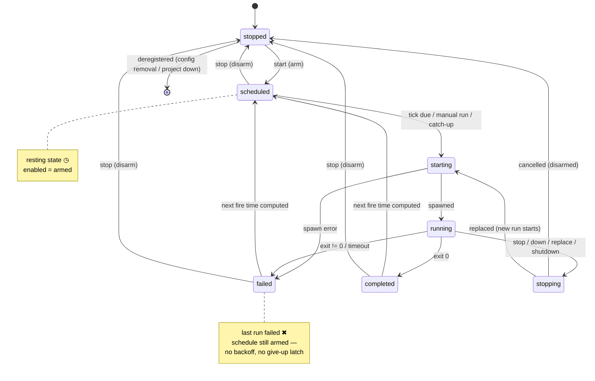

# Design: Scheduled One-Shot Jobs

## Context

Harness supervises resident processes: SPEC-0003 makes every exit — including a
clean one — a reason to respawn, because "agents and watchers are meant to be
long-lived." The other half of the workload is the exact inverse: nightly
sweeps, weekly grooming, daily syncs that are *supposed* to finish. That work
currently lives outside Harness in launchd plists and ad-hoc scheduled tasks,
which is why the cockpit cannot answer the one question that matters at 9am —
*did the 3am run fire, and did it pass?*

ADR-0013 puts the clock inside the daemon and gives jobs their own table kind.
Governing spec: SPEC-0008. Related: SPEC-0002 (control plane and attach),
SPEC-0003 (the machine this extends), SPEC-0004 (project-scoped registration),
ADR-0003 (owned PTY), ADR-0006 (config-of-record), ADR-0007 (state and logs),
ADR-0008 (secrets and file modes).

## Goals / Non-Goals

### Goals

- A supervised unit whose exits are **terminal**, without special-casing the
  existing harness path.
- One init unit still (ADR-0005) — no systemd `.timer`s, no launchd calendar
  plists, no `systemctl`-versus-`launchctl` branching returning to the codebase.
- Correct behavior on a **laptop**: suspend across a fire time, wake hours
  later, and reach a decision that is ours rather than the OS's.
- Answerability after the fact: per-run outcome, duration, exit code, and log.
- Attaching to an in-flight run — the "hop" interaction applied to scheduled
  work — falls out of reusing the PTY path rather than being built twice.

### Non-Goals

- **Notification delivery.** No Signal, no webhooks, no `on_failure` exec hook.
  The daemon knowing how to reach an external service contradicts the one thing
  it is designed not to know. Events are the seam; a notifier is a client.
- **Retry within a window.** A failed run is a failed run; the next tick is the
  next attempt. Retry-on-failure is a distinct policy, deferred.
- **Backoff for jobs.** The schedule *is* the rate limiter.
- **Agent-awareness.** A job is `cmd`/`args`/`workdir`, same as a harness. The
  daemon does not know a sweep from a `sleep`.
- **Distributed or multi-host scheduling.** One daemon, one host, one clock.

## Decisions

### Restart policy is the axis, not a special case

**Choice**: Introduce `always` (harnesses) versus `never` (jobs) as a property
of a supervised unit, and narrow SPEC-0003 REQ "Restart On Exit" to policy
`always`.

**Rationale**: The alternative is an `if isJob` branch inside the supervisor's
exit handler, which is the same distinction wearing worse clothes. Naming the
axis keeps the supervisor a single mechanism parameterized by policy, and
leaves an obvious slot for `on-failure` later without another spec amendment.

**Alternatives considered**:
- *Special-case jobs in the exit handler*: rejected — hides a real domain
  distinction in control flow, and every future lifecycle change has to be
  reasoned about twice in one function.
- *A separate job executor beside the supervisor*: rejected — duplicates PTY
  ownership, `env_file` loading, graceful stop, and scrollback, and would make
  attach-to-a-running-job a second implementation.

### `[job.*]` is a table kind, not a key on `[harness.*]`

**Choice**: Jobs get their own table, sharing field vocabulary and the
underlying Go types with `core.Harness`.

**Rationale**: The parser can reject `restart_delay` outright instead of
silently ignoring it; job-appropriate defaults (never restart, 1h timeout,
`keep_runs`) are natural on their own table rather than conditional on the
presence of a key; and `enabled` gets one unambiguous meaning per table kind
(*up* for a harness, *armed* for a job) instead of two meanings on one field.

**Alternatives considered**:
- *`schedule` key on `[harness.*]`*: rejected — makes `enabled` and
  `restart_delay` ambiguous with nowhere clean to reject them, and turns a type
  distinction into a `schedule != ""` check duplicated across every consumer.
- *`[schedule.*]` referencing a harness (systemd `.timer`/`.service`)*: rejected
  — splits one job across two tables and requires defining a harness that must
  never autostart, breaking the "a harness is a thing that runs" invariant.

### The scheduler polls the wall clock; it does not arm long timers

**Choice**: A single scheduler goroutine wakes on a bounded interval, recomputes
each armed job's next fire time from the wall clock, and starts whatever is due.

**Rationale**: This is the laptop decision. A `time.Timer` armed for six hours
across a suspend behaves differently on macOS and Linux, and differently again
depending on whether the sleep was idle or lid-close. Recomputing from wall
clock makes "we slept through 03:00" an observation rather than an accident, and
it is what makes `catch_up` implementable at all — the same code path that
notices a job is due notices that its window elapsed while nobody was watching.
The cost is a periodic tick; the tick is cheap and the failure mode it removes
is the one that silently eats a nightly job.

**Alternatives considered**:
- *One armed timer per job*: rejected — correctness across suspend becomes
  OS-dependent, and every reload has to cancel and re-arm N timers.
- *Rely on an OS scheduler to wake us*: rejected — that is option 1B in
  ADR-0013, which reintroduces per-unit sprawl.

### A run is an ordinary supervised spawn

**Choice**: Runs go through the existing spawn path — owned PTY, `workdir`,
`env_file`, graceful stop — with restart policy `never`.

**Rationale**: Attach-to-a-running-job, scrollback, secret handling, and
SIGTERM/SIGKILL escalation are then not features of the job subsystem; they are
properties it inherits. A PTY does not make a job interactive — it gives it a
terminal, which agent CLIs generally expect and often render differently
without.

### Timeout defaults to bounded

**Choice**: `timeout` defaults to 1h; `"0"` opts into unlimited.

**Rationale**: The characteristic failure of an agent CLI is not crashing, it is
waiting forever for input nobody will give it. Defaulting to unbounded would
make "one stuck run silently owns its schedule" the out-of-the-box behavior. An
explicit `"0"` keeps the escape hatch honest and visible in config.

### Catch-up is opt-in, but a miss is always recorded

**Choice**: `catch_up` defaults to `false`; either way, an elapsed window writes
a `missed` run-history entry.

**Rationale**: Firing a job at an arbitrary wake-up hour is disruptive for some
work and wrong for some (anything time-of-day sensitive), so opt-in is the safe
default. But the *silent* no-op is the actual laptop-cron failure mode — you
discover in a week that nothing has run since the last reboot. Recording the
miss regardless separates "it ran and passed" from "it never fired" without
running anything you did not ask for.

### One queued run, not a backlog

**Choice**: `on_overlap = "queue"` holds exactly one pending run; further ticks
are recorded `skipped`.

**Rationale**: An unbounded queue converts a slow job into a growing backlog
that eventually runs continuously — the worst possible response to "this is
taking longer than expected." Depth one preserves the useful property (do not
lose the tick that arrived one second early) without the pathology.

### `failed` means something different for jobs, deliberately

**Choice**: For a harness, `failed` means the daemon gave up and needs a human.
For a job, `failed` means the last run failed, and the schedule stays armed.

**Rationale**: The states are rendered in the same list, so overloading the word
is a real cost — but the alternative is a distinct state name that means "red"
in a second vocabulary. Jobs are their own table kind and render their own
columns (next run, last outcome), which is where the disambiguation lives. There
is no give-up latch for jobs because there is no backoff for jobs.

## Architecture

### Job state machine



`degraded` and `restarting` are absent by design: both are crash-loop states
that only have meaning under restart policy `always`.

### Scheduler loop and run path

```mermaid
sequenceDiagram
    autonumber
    participant S as scheduler (1 goroutine)
    participant R as job registry
    participant X as run executor
    participant P as PTY / process
    participant St as state.json + run logs
    participant C as subscribed clients

    loop bounded tick (injectable clock)
        S->>R: for each armed job, next fire from wall clock + tz
        alt window elapsed while down/suspended
            S->>S: catch_up? once : record missed
        end
        alt due
            S->>X: start run (trigger=schedule)
        end
    end

    Note over X: manual trigger enters here —<br/>same path, trigger=manual

    X->>X: apply on_overlap (skip / queue≤1 / replace)
    X->>P: spawn under PTY in workdir, env_file loaded
    X->>St: append run record (run_id, started_at, trigger)
    X-->>C: job_run_started
    P-->>St: output → jobs/<job>/<run_id>.log

    Note over C,P: attach works here —<br/>SPEC-0002 attach session over the live PTY

    alt exceeds timeout
        X->>P: SIGTERM → grace → SIGKILL
        X->>St: outcome=timed_out
    else exits
        X->>St: outcome=success | failed (exit_code)
    end
    X-->>C: job_run_finished { outcome, exit_code, duration }
    X->>S: state → scheduled; recompute next fire
```

### Storage layout

```
$XDG_STATE_HOME/harness/          0700
├── state.json                    0600   jobs[]: enabled, last_run_at,
│                                        next_run_id, consecutive_failures,
│                                        runs[] (bounded by keep_runs)
└── jobs/                         0700
    └── <job>/                    0700
        ├── 41.log                0600   ← pruned oldest-first by keep_runs
        ├── 42.log                0600
        └── 43.log                0600   ← most recent; served by default
```

Run history rides in the existing ADR-0007 state file rather than a new store:
it is small, bounded by `keep_runs`, and needs the same atomic-write and
restore-on-start treatment `enabled` already gets. Only the *logs* are per-run
files, because those are the unbounded part.

## Risks / Trade-offs

- **The daemon is now a scheduler, so clock bugs are our bugs** — DST, timezone
  database drift, wall-clock jumps, suspend/resume. → Wall-clock re-evaluation
  instead of armed timers; an injectable clock so every temporal scenario is a
  fast unit test; explicit spec scenarios for both DST transitions.
- **A daemon that is down at 03:00 misses the window; system cron would not** →
  Partly mitigated by the daemon's own `Restart=on-failure` supervision
  (ADR-0005) and by `catch_up`. Not fully mitigable — it is the honest cost of
  ADR-0013's option 1A, and it is why misses are recorded rather than silent.
- **Two unit kinds with different state vocabularies** → Every surface that
  enumerates units (TUI, `ps`, protocol `list`) must decide whether it shows
  harnesses, jobs, or both. Mitigation: `jobs` is a distinct operation with
  job-shaped columns, and `harness_state_changed` still covers both so one
  subscription suffices.
- **Disk growth from O(jobs × keep_runs) log files** → `keep_runs` is a
  first-class config key with a conservative default (20), pruned oldest-first
  in step with history.
- **Project jobs vanish on daemon restart** (ADR-0009 runtime-only
  registration) — sharper for a cron than a harness, because a nightly job just
  stops firing with no error. → Documented guidance that durable crons belong in
  the global config; strengthens the case for ADR-0009's deferred project
  autostart persistence.
- **Secrets in a long-lived per-run log** → Runs load `env_file` through the
  same ADR-0008 path; logs are `0600` in `0700` directories, and run *records*
  carry only metadata (ids, timestamps, exit code, outcome), never environment.

## Migration Plan

Greenfield — no existing job definitions exist to migrate, and no harness
behavior changes. Deployment is additive in three independent steps:

1. **Config and validation** — parse `[job.*]`, reject harness-only keys, land
   restart policy as a unit property with `always` for every existing harness.
   Observable behavior is unchanged at this point.
2. **Scheduler and run executor** — the tick loop, overlap policy, timeout,
   catch-up, run history, per-run logs.
3. **Surfaces** — `jobs`/`run`/`runs` control ops, the `logs` run selector, the
   new events, CLI verbs, and TUI rendering.

Rollback is per-step and clean: a daemon without step 2 registers jobs and never
fires them; a config containing `[job.*]` read by a daemon without step 1 fails
validation loudly rather than silently ignoring the tables — which is the
correct failure, since silently not scheduling a cron is the outcome this whole
capability exists to prevent.

## Open Questions

- Should `harness list` include jobs by default, or stay harness-only with
  `harness jobs` as the separate view? Leaning harness-only for legibility, but
  the TUI dashboard almost certainly wants a unified list with a kind column.
- Is a `tty = false` option worth adding for jobs whose logs would read better
  without ANSI, or does the attach-a-running-job benefit always dominate?
  Deferred in ADR-0013, but per-run logs make the ANSI noise more visible than
  it is for a resident harness.
- Should `keep_runs` also bound total on-disk bytes, not just run count? A job
  that produces 500MB of agent transcript per run makes a count-based bound a
  poor proxy.
- Does a daemon-wide concurrent-run cap belong here, or is per-job overlap
  policy sufficient? Ten jobs at `0 3 * * *` all firing agent CLIs at once is a
  plausible configuration on a laptop.
- Should `catch_up` distinguish "missed because the daemon was down" from
  "missed because the host was asleep"? They are the same to the scheduler today
  but may warrant different defaults.
