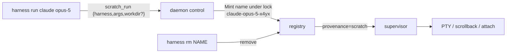

# Ephemeral Scratchpad Harnesses — Design

**Status**: Draft
**Last Updated**: 2026-08-19
**Implements**: ADR-0017

## Executive Summary

`harness run` is a thin client verb over one new control op, `scratch_run`. The
daemon reuses the entire supervisor stack: it validates the definition with the
same rules `project_up` applies, mints a collision-free name under the registry
lock, registers the supervisor with a third provenance value (`scratch`), and
starts it. Ephemerality is structural: provenance `scratch` is excluded from
`Save` and `Restore` by construction, so no scratchpad can ever reach
state.json. Teardown is the existing `remove` op.

## Architecture

## Components

### Protocol (`internal/protocol`)

- `OpScratchRun Op = "scratch_run"`.
- Request fields reuse the project payload vocabulary: `Harness` (kind), `Args`,
  `Workdir`, `Name` (optional slug override).
- Response: `ScratchRunData { Name string; Info HarnessInfo }`.
- Validation failures reuse the `invalid_project` code (same validation layer);
  no new error code is needed.

### Supervisor (`internal/supervisor`)

- `Manager.ScratchRun(h core.Harness, slug string) (name string, err error)`:
  validates via the shared `validateProjectDefs`-style rules (refactored to a
  definition-scoped helper), mints `<slug>-<suffix>` retrying on collision
  **under `m.mu`**, calls `addSupervisorLocked` with an OnChange of `nil`
  (scratchpads never dirty state.json), records `provenance[name] = "scratch"`,
  appends order, unlocks, starts.
- Name slug: sanitize(invocation words) — lowercase, non-alphanumerics to `-`,
  collapse repeats, trim, cap at 40 chars. Suffix: 4 random base36 chars from
  `crypto/rand`.
- `Save` skips names whose provenance is `scratch` (like the pre-2026-08-19
  project exclusion, but for the scratch class only). Because the sentinel
  lives in the same string-keyed map as project ownership, the project name
  `scratch` is reserved — `project_up` refuses it — so `Save` can never
  silently drop a real project's harnesses.
- `Restore` never re-registers scratchpads (nothing persisted to read).
- Restart policy forced to `no` (session semantics) unless the definition says
  otherwise via the wire `restart` field.

### Daemon (`internal/daemon`)

- `opScratchRun` mirrors `opProjectUp`: wire→core conversion (reuse
  `harnessFromWire`), `mgr.ScratchRun`, broadcast `config_reloaded` on success,
  reply with name + `infoFor(snapshot)`.

### Client / CLI (`cmd/harness`)

- Cobra command `run`: `Args: cobra.MinimumNArgs(1)`, flags `--workdir`,
  `--kind`, `--name`. First positional dispatch: known kind (via a small
  alias table — `claude` → `claude-code`) → kind + rest as args; otherwise
  `generic` with all positionals as one `sh -c` command (`--kind` overrides).
- Prints the minted name (JSON mode prints `ScratchRunData`).
- `rm` and `attach`/`logs`/`describe` need no changes — scratchpads are
  ordinary supervisors.

## Data Model

No new durable state. Provenance map gains the value `scratch` for scratchpad
names; the `HarnessInfo.Project` projection carries it so `list`/TUI can badge
scratchpads without a protocol change.

## Testing

- Supervisor: minting (slug shape, suffix entropy, collision retry under
  concurrency), no-persistence invariant (Save with live scratchpad), restart
  policy default, `RemoveHarness` on a scratchpad.
- Daemon: `scratch_run` round-trip over a real socket, empty-argv validation
  error, list projection shows provenance `scratch`.
- CLI: positional dispatch matrix (kind vs. generic vs. `--kind`).

## Alternatives Considered

- **Synthetic `scratch` project** — rejected (ADR-0017 Option 1): inherits the
  persistence and scoping semantics projects now carry.
- **Client-side temp harness.toml** — rejected (ADR-0017 Option 3): writes
  files, leaks crash residue, and ephemerality becomes unenforceable.
