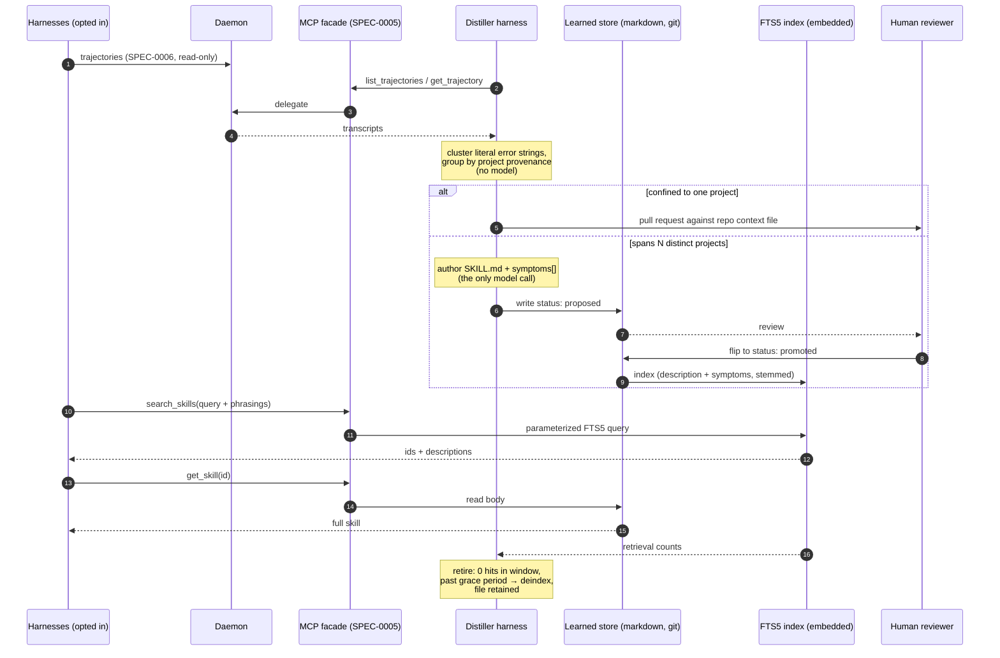

# Design: Cross-Harness Skill Distillation

## Context

Once Harness can read every harness's trajectory (SPEC-0006) and serve tools to
every harness (SPEC-0005), a fleet-level fact becomes visible that no individual
agent can see: **several independent harnesses hitting the same wall.** One
agent rediscovering SSE reconnection in Go is normal; six agents in six
unrelated repos rediscovering it is a missing shared artifact.

**ADR-0012** decided to detect that by counting repetition rather than judging
quality, to gate promotion on *cross-project* recurrence, to do the authoring in
a supervised harness rather than the daemon, and to deliver the results by
search rather than projection.

This spec (SPEC-0007) formalizes that pipeline. It requires SPEC-0006 for
trajectory access and SPEC-0005 for both the read tools it consumes and the
search tools it publishes.

## Goals / Non-Goals

### Goals

- Turn fleet-wide repetition into a durable, reviewable artifact.
- Keep the daemon free of model credentials and repository writes.
- Deliver a growing corpus at constant context cost.
- Ship retrieval inside the single Go binary.

### Non-Goals

- **Judging session quality.** Explicitly rejected in favor of counting.
- **Neural embeddings.** See the retrieval decision below.
- **Automatic merge.** Project findings become pull requests a human merges;
  learned skills require a human status flip. Nothing lands unattended.
- **Replacing hand-written skills.** The learned tier sits below them and is
  never projected; a hand-written skill always wins.
- **Distilling from harnesses that have not opted in.** Inherited from
  SPEC-0006.

## Decisions

### Count repetition, do not judge quality

**Choice**: Cluster literal error strings and repeated failed tool calls.

**Rationale**: "Was this session good?" requires a model over a transcript
corpus already measured at ~1.1 GB across 1,738 files, and yields a subjective
verdict that cannot be audited. "Did six harnesses emit this string?" is a
count — cheap, deterministic, explainable, and re-derivable from the evidence.

**Alternatives considered**:

- *LLM judge over trajectories*: expensive, unbounded, unauditable, and unable to
  distinguish project knowledge from stack knowledge — which is the distinction
  that decides where the artifact goes.
- *Manual capture*: puts the operator back in the tightest loop, and a human
  inside one session cannot see the cross-fleet pattern at all.

### Scope is the promotion gate

**Choice**: One project → pull request. Several projects → learned tier.

**Rationale**: This is not a heuristic; it is the definition of the thing being
captured. A pattern confined to one repo *is* project knowledge and belongs in
that repo's context file, where git provides the audit log and review. A pattern
crossing unrelated repos is stack knowledge with no natural home — which is
exactly the gap the learned tier fills. Provenance is already tracked per
harness, so the classifier needs no new data.

### The distiller is a harness

**Choice**: Authoring runs in an ordinary supervised process.

**Rationale**: Authoring needs a model; the daemon must not have one. ADR-0008
deliberately fences the daemon away from the secret backend, and a supervisor
holding model credentials would breach that for a feature that does not need to
live there. As a harness, the distiller is supervised, restartable, and
observable by the machinery that already exists.

### Storage and delivery are orthogonal

**Choice**: Markdown on disk as substrate; search as the only delivery path.

**Rationale**: These feel coupled only because SPEC-0006 made "on disk" and
"discovered from disk" the same act. They are separable, and separating them
gets both properties:

- *Disk* buys git history — which matters **more** for machine-written content,
  not less — plus human and agent editability, reviewable diffs, grep, and a
  rebuildable index. The files are truth; the index is a cache.
- *Search* buys constant context cost. Projection puts every description
  permanently in context: correct at 15 skills, fatal at 200. A distilled corpus
  grows by construction, so projection was never viable for it.

**Alternatives considered**:

- *Project learned skills like hand-written ones*: fails on context budget as the
  corpus grows, which is the one thing guaranteed to happen.
- *Index-only, no files*: loses history, human review, and recoverability — the
  void stops being legible, which defeats collaboration on it.

### `status` gates both channels at once

**Choice**: A single frontmatter field controls projection eligibility and
indexing.

**Rationale**: One mechanism, one place to look, no way for the two channels to
disagree. An unreviewed skill is inert everywhere until a human flips a field —
and that flip is itself a commit, so promotion has an author and a timestamp for
free.

### FTS5 over embeddings

**Choice**: `modernc.org/sqlite` FTS5 with `bm25()` — pure Go, verified against
v1.54.0.

**Rationale**: The requirement is semantic search with no external dependency,
and neural embeddings cannot satisfy it. ONNX via CGo needs a shared library at
runtime — an external dependency by another name. Embedded weights would take an
**11 MB** binary to 34–100 MB against a Homebrew formula that builds from
source. Production-grade pure-Go transformer inference does not exist.

Embeddings buy exactly one thing — closing vocabulary mismatch — and this corpus
closes it three cheaper ways:

1. **The vocabulary was already harvested.** Detection clusters on literal error
   text, so at authoring time the exact strings agents emit are in hand. Written
   into `symptoms` and indexed, the match becomes *literal*. General semantic
   search needs embeddings because query vocabulary is unpredictable; here it
   was observed and recorded.
2. **The caller is a frontier model.** The search tool instructs callers to
   supply several phrasings including literal error text — better expansion than
   a small embedding model, performed outside the daemon.
3. **Stemming is free** via the FTS5 porter tokenizer.

**Alternatives considered**:

- *LSA/SVD over the local corpus* (`gonum`, no CGo, no pretrained weights): real
  semantic similarity derived from the documents themselves. Held in reserve —
  correct upgrade if recall demonstrably misses, wrong first move before there
  is a miss to point at.

### Retirement by retrieval count, with a grace period

**Choice**: Retire on zero retrievals in a window, but only after a grace period
measured from promotion.

**Rationale**: Serving rather than projecting makes retrievals countable, which
is the only usage signal available. But a freshly promoted skill has zero
retrievals *by definition*, so a naive counter would evict everything new and
the corpus would shrink faster than distillation fills it. Retirement removes
from the index only — the markdown stays, so the decision is reversible.

## Architecture

## Risks / Trade-offs

- **Reinforcement loop.** A distilled skill is model output fed back as
  instruction. A wrong or stale one reaches every agent, and their repetitions
  become further evidence for the pattern. → Provenance frontmatter records the
  evidence; human review gates promotion; retrieval-based retirement removes
  what stops earning its place. None of these is a proof, and this remains the
  most serious weakness of the design.
- **Trajectory exposure.** Persisted transcripts are a larger secret exposure
  than a bounded ring. → Opt-in per harness (SPEC-0006), read-only, never
  written.
- **Homogeneity dependence.** Cross-project signal is real only when projects
  share a stack; a heterogeneous fleet produces mush. → A known limit of the
  mechanism. The configurable threshold lets an operator tighten the gate rather
  than accept noise.
- **FTS5 is weaker than embeddings in general.** → The corpus-specific
  mitigations (harvested `symptoms`, caller-side expansion, stemming) are what
  make it sufficient; LSA is the documented upgrade path if they prove not to
  be.
- **Blind to lessons that left no error trail.** Counting cannot see a hard
  thing done well on the first try. → Accepted; the alternative is the judge
  model, rejected above.

## Migration Plan

Greenfield and inert by default. With no distiller harness configured, nothing
runs: no clusters, no learned skills, no index. Enabling it is configuring one
harness. The learned directory is a plain git repository, so adoption and
abandonment are both `git` operations, and the index can be deleted at any time
without data loss.

## Open Questions

- Should the learned tier gain a derived claims ledger (provenance, retrieval
  counts, supersession edges) in a queryable store rather than frontmatter?
  Candidates surveyed are experimental with no migration guarantees — survivable
  only because such a ledger is rebuildable from the markdown.
- Can the harvester detect whether a *retrieved* skill's guidance actually
  influenced what the agent did next, giving a stronger usage signal than
  retrieval count?
- What is the right default for the cross-project threshold, and should it scale
  with fleet size rather than being a fixed count?
- Should superseded skills remain retrievable under an explicit "history" query
  for auditing, or is index removal sufficient?
