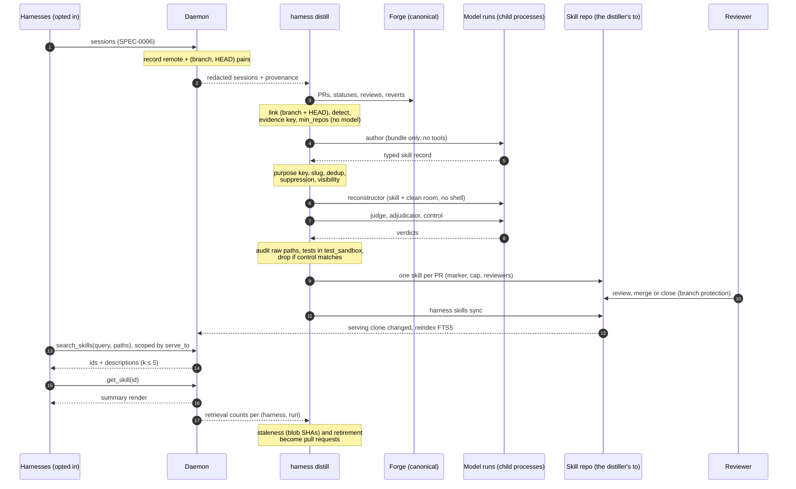

# Design: Cross-Harness Skill Distillation

> **Not yet implemented.** Design stage. No distiller, distill ledger or skill
> repo support exists today. Tracked by the SPEC-0007 epic in the Harness issue
> tracker.

## Context

Harness is the only thing watching every agent at once, so it is the only thing
that can see the fleet relearning the same lesson. **ADR-0012** decided that
distilled skills are searched rather than projected. **ADR-0030** decided what a
skill is grounded in and how it reaches review, and made two things operator
configuration: where skills live, and who distills them.

The main influence is Code2Skill
([arXiv 2609.05571](https://arxiv.org/abs/2609.05571)). It grounds skills in
source spans, verifies them by source-blind reconstruction, stores typed records
with anti-goals, and found that compact summaries, retrieved at planning or
review time, carry most of their value.

## Goals / Non-Goals

### Goals

- Turn a lesson the fleet keeps relearning into a reviewed, durable artifact.
- Ground every skill in code that CI passed, that merged, and that stayed merged.
- Filter out unfaithful and useless candidates before they cost a reviewer any
  time.
- Keep the daemon free of model credentials, forge credentials and repository
  writes.
- Keep a growing corpus at constant, small context cost.

### Non-Goals

- **Learning from work that never merged.** Exploratory sessions and operations
  work leave no grounding evidence. This is accepted.
- **Judging session quality with a model.** Candidates are found by counting,
  and models only author and verify.
- **Enforcing who merges.** That is the skill repo's branch protection.
- **A local-only skill repo.** Promotion is a merge, so a forge remote is
  required.
- **Editing `AGENTS.md` or `CLAUDE.md`.** Harness writes skills only.
- **Importing third-party skill banks.** Deferred (ADR-0030).
- **Neural embeddings.** See the retrieval decision below.

## Decisions

### Trajectories find the candidates; mature merged pull requests ground them

**Choice**: Three signals find candidates: review corrections, red-to-green
fixes, and struggle-then-resolution in a linked session. Only a pull request
that merged green, and has gone `revert_window_days` without a revert, can
ground a skill.

**Rationale**: Code2Skill's trajectory-derived baselines lost because their
content can be no better than the agent that produced it. Grounding on the merged
fix gets around that, and grounding on a reviewer's correction captures knowledge
beyond what the agent had. Trajectories still earn their place, because they
show where agents actually struggle. A static code miner has no idea which of
its million records matter. The maturity window exists because a pull request
merged an hour ago cannot yet be known to be unreverted.

**Alternatives considered**: *Trajectories alone* (ADR-0012 as written): capped
by the agent's competence, and the literal error text it clusters on is not in
agent-trace's output. *Code mining* (Code2Skill): it does not know which tasks
come up, and in the agent's own repositories it restates code the agent can
already read.

### Git provenance is recorded at harvest, not reconstructed at link time

**Choice**: The daemon's observer records each harvested session's remote and
every (branch, HEAD) pair it sees. `harness distill` links from that record,
requiring a branch and a HEAD to agree, or a HEAD alone for squash-merged work.

**Rationale**: The transcript's `gitBranch` is first-seen and only two adapters
set it. By the nightly pass the working directory is usually a deleted worktree.
Recording at harvest costs a few local git reads, needs no credentials, and makes
linking work for every adapter. Requiring a HEAD in the pull request's commit
list means a session that merely started on someone else's branch cannot claim
their pull request.

**Alternatives considered**: *Linking by the transcript's branch and a commit time
window*, as the first draft did: it links to the wrong pull request when a
session starts on another branch, and fails outright once the directory is gone.

### Skill repos and distillers are configuration

**Choice**: Declare any number of `[skill_repo.*]` tables (remote, path,
`serve_to`). Make each distiller a `command` one-shot (ADR-0023) with a `distill`
table naming `from`, `to`, `evidence_repos` and `min_repos`.

**Rationale**: No single threshold suits both a one-project operator and a large
fleet, so ADR-0012's fixed cross-project gate becomes a per-distiller
`min_repos`. The project tier and the stack tier are two distillers. Serving by
search, scoped by `serve_to`, frees delivery from any adapter's skill directory.
`evidence_repos` stops a cloned repository from naming itself into a `from` glob
and feeding its own pull requests in as evidence. Requiring the `command` kind
keeps the forge token and the webhook payload out of any agent.

**Alternatives considered**: *One learned store with a single global
distillation table* (the first draft of ADR-0030): one threshold for every
fleet, and single-repository skills written into each adapter's native
directory. *A prompt harness that runs the command*: an agent holding the forge
token is exactly option 4B.

### Every change to a skill is a pull request

**Choice**: Every proposal is a pull request to the distiller's `to` skill repo.
The daemon indexes only the serving clone's default branch. Revisions and
retirements are pull requests too.

**Rationale**: It supplies a reviewer, a notification, a diff, history, CI, a
record of rejections and rate control, all from machinery the fleet already
runs. Promotion becomes a merge. Who may merge is branch protection's job,
because a token scope cannot stop a merge on most forges.

**Alternatives considered**: *A local `status` field* (ADR-0012 as written): no
reviewer, and an unreviewed proposal is one edit away from promotion. *A Cairn
artifact or Switchboard todo*: reaches the operator, but approval would still
need a second mechanism to change the store.

### Model runs are child processes of `harness distill`, with nothing inherited

**Choice**: `harness distill` starts every model run directly, running the
verifier adapter's prompt command. Each run gets an allowlisted environment
(`PATH`, locale, `TMPDIR`, a fresh `HOME`, and `verifier_env_file`) and a new
temporary working directory holding only its inputs. Each role gets only the
tools it needs: none for the author, judge and adjudicator, and file read and
write without a shell for the reconstructor and control. The MCP bridge is
never wired.

**Rationale**: The daemon builds a harness's environment from its own plus
`env_file`, so a daemon-spawned run would inherit whatever the daemon holds.
It would also be able to reach the facade's `get_trajectory` and `harness_logs`,
which return the original session and its answer. A scratchpad harness has no
prompt, wait or result contract. A child process gets all three for free, and
every input is placed there by code.

**Alternatives considered**: *Scratchpad harnesses (ADR-0017)*, as the first
draft proposed: they inherit the daemon's environment, reach the facade, and
have no result contract. *One agent doing every step*: once it has seen the
diff, it cannot be blind.

### Verify by rebuilding without seeing the answer, and test only in a sandbox

**Choice**: Reconstructor, judge, adjudicator and control, with the clean room
from `git archive` and an audit over the raw paths in the reconstructor's tool
calls. `make test` on a reconstruction runs only under `test_sandbox`.

**Rationale**: The paper's round trip catches omitted steps and invented
constraints. A judge's disagreement goes to an adjudicator, because 84% of the
paper's adjudicated records were worth keeping despite a failed rebuild. The
audit resolves raw paths because agent-trace's `OutsideTouch` drops relative
`..` paths. Tests run model-written code, so they need isolation that a
same-user child process does not give. A control that matches drops the
candidate for the pass, but suppression needs two matches on different
evidence, because one sample is noise.

### Invariants live in code, not prompts

**Choice**: `harness distill propose` owns the idempotency marker, the cap, the
visibility check, and the rules against self-review, force-pushing and merging.

**Rationale**: These are the rules agents most often break when they follow a
prompt, and each break has a precedent in the house rules. As code, each one has
a test.

### Summary rendering, small k, and review-time placement

**Choice**: `get_skill` returns a summary capped at 1,000 characters by default.
`search_skills` returns 3 results by default and 5 at most, and accepts `paths`.
The tool descriptions steer use toward planning and reviewing.

**Rationale**: In the paper, summaries cut rendered skill text by 88.9% with no
loss, raising the retrieval depth from 1 to 10 grew context 8.5× for little
gain, and review after a draft exists was the most consistent placement (38% vs
24% resolve rate in its coding-RL experiment).

### FTS5 over embeddings

**Choice**: `modernc.org/sqlite` FTS5 with `bm25()`, pure Go (already a
dependency at v1.59.0), with columns for `name`, `description`, `symptoms`,
`tags` and `applies_to`.

**Rationale**: Unchanged from ADR-0012. Embeddings would add a runtime library
or grow the binary several-fold, and vocabulary mismatch is closed more cheaply
here. The `symptoms` are observed literal strings, callers are frontier models
that can supply several phrasings, and the porter tokenizer stems for free.
`applies_to` adds a lexical match on file paths, the query a reviewer already
has in hand.

### Retirement by disuse and by staleness, both through a pull request

**Choice**: Retire on zero retrievals in a window after a grace period.
Re-verify when a cited file's blob changes on the default branch, at most
`max_reverify` per pass. Either outcome becomes a pull request.

**Rationale**: Retrieval counts only see disuse, while blob staleness catches rot
while the skill is still being used. The per-pass cap stops a hot file from
triggering a storm of model runs.

## Configuration

```toml
# ~/.config/harness/harness.toml. Global only; rejected in project files.

[skills]                            # serving, owned by the daemon
summary_max_chars  = 1000
retire_grace_days  = 30
retire_window_days = 60

[skill_repo.go-stack]
remote   = "https://git.example.com/your-org/go-skills.git"
path     = "skills"
serve_to = ["*"]                    # the bare star matches every harness

[skill_repo.reduit]
remote   = "https://git.example.com/your-org/reduit.git"
path     = ".harness/skills"       # outside every adapter's native skill path
serve_to = ["reduit/*"]

[harness.distill-go]
harness  = "command"               # ADR-0023; a prompt harness cannot distill
argv     = ["harness", "distill", "run", "distill-go"]
schedule = "0 3 * * *"
timeout  = "2h"

[harness.distill-go.distill]
credential_file    = "~/.config/harness/forge/go-stack.token"   # read by harness distill; never in any env
from               = ["reduit/*", "spotter/*", "pr-review"]
to                 = "go-stack"
evidence_repos     = ["your-org/*"]
min_repos          = 2
reviewers          = ["your-reviewer"]   # must not be the token's own login
max_open           = 3
max_candidates     = 5
max_reverify       = 2
replay_max_lines   = 400
revert_window_days = 7
labels             = ["toil"]
branch_prefix      = "toil/distill-"
verifier           = "claude-code"
verifier_env_file  = "~/.config/harness/env/verifier.env"   # model credentials only
test_sandbox       = ["docker", "run", "--rm", "-v", "{clean_room}:/src", "-w", "/src", "golang:1.26"]

[harness.distill-reduit]
harness  = "command"
argv     = ["harness", "distill", "run", "distill-reduit"]
schedule = "30 3 * * *"

[harness.distill-reduit.distill]
credential_file = "~/.config/harness/forge/reduit.token"
from      = ["reduit/*"]
to        = "reduit"
min_repos = 1
reviewers = ["your-reviewer"]

[harness.skills-sync]               # a hand-curated repo with no distiller still needs sync
harness  = "command"
argv     = ["harness", "skills", "sync"]
schedule = "@every 1h"
```

## Architecture



## Risks / Trade-offs

- **Reinforcement loop.** A skill is model output fed back to agents as
  instruction. → Grounding requires a mature, merged, green, unreverted pull
  request. Sessions that retrieved a skill, or reviewed its proposal, cannot
  count as evidence for its key. Every change is a pull request. Staleness
  re-verifies. None of these is a proof.
- **Prompt injection through evidence.** Review comments and transcripts can be
  written by an attacker. → Only model runs read them, and those runs hold no
  forge credential, have no shell, and have no MCP bridge. The dossier a
  reviewer sees quotes the evidence it was built from.
- **Same-user execution.** Model runs and the test step run as the operator. →
  An allowlisted environment and a fresh `HOME` remove the easy paths to
  credentials, and tests run only in `test_sandbox`. The audit catches the
  absolute-path reads it can see. A real sandbox for model runs is deferred.
- **Agents as mergers.** Reviewers in this fleet are often agents. → Branch
  protection on each skill repo is the gate, and the pass summary flags any
  self-merge by the token's login.
- **Private code in public repos.** → The visibility check holds any candidate
  whose evidence is more private than its target.
- **Cost.** Up to five model runs per candidate. → `max_candidates`,
  `max_reverify`, `replay_max_lines`, dedup before verification, and ADR-0027's
  run budgets once they land.
- **Narrower reach than ADR-0012.** Work that never merged teaches nothing. →
  Accepted, since that is the cost of grounding.
- **Misconfigured sources.** A `from` glob can match the wrong harnesses. → Every
  pass summary lists what each selector matched, and `evidence_repos` bounds the
  damage.

## Migration Plan

Greenfield, and inert without a skill repo. Rollout in slices, each useful on
its own:

1. **Git provenance recording**, plus linking with `harness distill scan
   --json`, which reports links and candidates and opens nothing. This measures
   link rate and signal volume before any model spend.
2. **Skill repos, `harness skills sync`, the index and the tools**, served from a
   hand-curated repo first, with `harness skills lint` as its CI. These need
   SPEC-0005's caller identity and bridge.
3. **Distillers with fidelity verification**, starting with one
   `min_repos = 1` distiller against a single project's skill repo. This needs
   ADR-0023's `command` kind.
4. **Control runs, tests in a sandbox, staleness and retirement.**

agent-trace's `ErrorExcerpt` can land at any point. Until it does, `symptoms`
come from check names and review text.

## Open Questions

- **Should a distiller also fire when a `from` harness's run closes?** Schedule
  and the merged-pull-request webhook cover it today. A run-closed trigger fed
  by ADR-0028's run ledger would react faster, at the cost of a new trigger
  kind.
- **Should `harness distill` share a proposal format with stet's skills epic**,
  so that one reviewer workflow covers both products?
- **Can one distiller target more than one skill repo?** One `to` per distiller
  keeps routing obvious.
- **Should retrieval efficacy ever act on its own?** It is correlation today. A
  controlled A/B, serving a skill to half of matching sessions, would make it
  causal, at the cost of deliberately withholding a skill the reviewer believed
  useful.
- **How is `test_sandbox` templated?** The example assumes a `{clean_room}`
  placeholder. That should reuse ADR-0023's placeholder grammar once it lands,
  rather than invent a second one.

### Resolved

- *Task statement for replay* (2026-09-22): the linked issue's body, otherwise
  the session's first user message, with a verbatim-leak flag that also skips
  the control.
- *Where a single-repository skill lands when Crush and Claude Code share a
  repository* (2026-09-22): in a skill repo, served by search to both. No
  adapter-native path is written.
- *The cross-project threshold* (2026-09-22): per distiller, as `min_repos`,
  default 1.
- *How a session is linked when its worktree is gone* (2026-09-22, in review of
  the ADR-0030 pull request): git provenance recorded at harvest.
