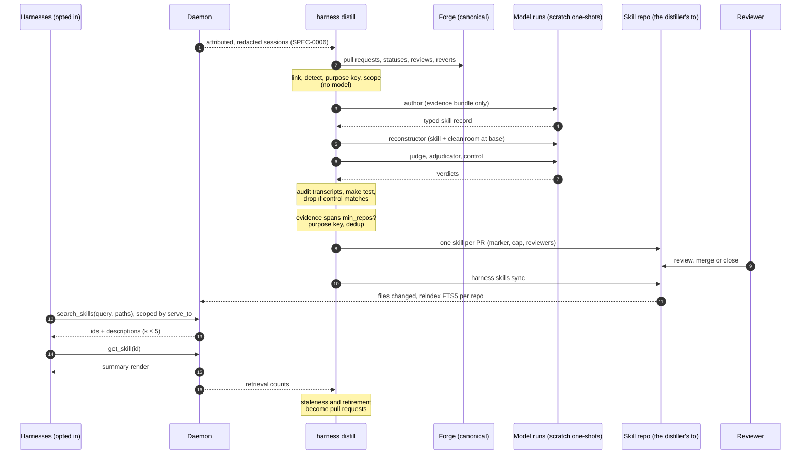

# Design: Cross-Harness Skill Distillation

> **Not yet implemented.** Design stage. No distiller, distill ledger or skill
> repo support exists today. Tracked by the SPEC-0007 epic, harness#69.

## Context

Harness is the only thing watching every agent at once, so it is the only thing
that can see the fleet relearning the same lesson. **ADR-0012** decided that
distilled skills are searched rather than projected. **ADR-0030** decided what a
skill is grounded in, how it reaches a human, and that the operator configures
where skills live and who distills them. Sessions locate
the lesson. The merged pull request that ended the struggle proves it. A model
that never saw that pull request rebuilds the change from the skill. A pull
request proposes it.

The main influence is Code2Skill
([arXiv 2609.05571](https://arxiv.org/abs/2609.05571)). It grounds skills in
source spans, verifies them by source-blind reconstruction, stores typed records
with anti-goals, and found that compact summaries, retrieved at planning or
review time, carry most of their value.

## Goals / Non-Goals

### Goals

- Turn a lesson the fleet keeps relearning into a reviewed, durable artifact.
- Ground every skill in code that a reviewer merged and that CI passed.
- Filter out unfaithful and useless candidates before they cost a reviewer any
  time.
- Keep the daemon free of model credentials, forge credentials and repository
  writes.
- Keep a growing corpus at constant, small context cost.

### Non-Goals

- **Learning from work that never merged.** Exploratory sessions and operations
  work leave no grounding evidence. This is accepted.
- **Judging session quality with a model.** Candidates are found by counting,
  and models only author and verify.
- **Automatic merge.** Nothing reaches an agent's context without a human merge.
- **A local-only skill repo.** Promotion is a merge, so a forge remote is
  required.
- **Editing `AGENTS.md` or `CLAUDE.md`.** Harness writes skills only.
- **Importing third-party skill banks.** Deferred (ADR-0030).
- **Neural embeddings.** See the retrieval decision below.

## Decisions

### Trajectories find the candidates; merged pull requests ground them

**Choice**: Three signals find candidates: review corrections, red-to-green
fixes, and struggle-then-resolution in a linked session. Only a merged, green,
unreverted pull request can ground a skill.

**Rationale**: Code2Skill's trajectory-derived baselines lost because their
content can be no better than the agent that produced it. Grounding on the merged
fix gets around that, and grounding on a reviewer's correction captures knowledge
beyond what the agent had. Trajectories still earn their place, because they
show where agents actually struggle. A static code miner has no idea which of
its million records matter.

**Alternatives considered**: *Trajectories alone* (ADR-0012 as written): capped
by the agent's competence, and the literal error text it clusters on is not in
agent-trace's output. *Code mining* (Code2Skill): it does not know which tasks
come up, and in the agent's own repositories it restates code the agent can
already read.

### Skill repos and distillers are configuration

**Choice**: Declare any number of `[skill_repo.*]` tables (remote, path,
`serve_to`), and make distillers ordinary triggered harnesses with a `distill`
table naming `from`, `to` and `min_repos`.

**Rationale**: No single threshold suits both a one-project operator and a large
fleet, so ADR-0012's fixed cross-project gate becomes a per-distiller
`min_repos`. The project tier and the stack tier are two distillers. Serving by
search, scoped by `serve_to`, makes delivery independent of the adapter: a
repository worked by Crush and Claude Code harnesses gets each skill once. And
because a distiller is an ordinary harness, it inherits run records, logs,
timeouts and budgets.

**Alternatives considered**: *One learned store and a global `[distill]` table*
(the first draft of ADR-0030): one threshold for every fleet, and
single-repository skills written into each adapter's native directory.

### Linking needs a token, so it lives in `harness distill`

**Choice**: Join sessions to pull requests by `(repo, branch)` where the
transcript records a branch (Claude Code, Codex), and by committer-time commit
windows otherwise (Crush, OpenCode, Pi). Ambiguous matches fail closed.

**Rationale**: Branch matching is a free join. Crush records no branch, so it
needs the commit fallback. Either way, reading the forge needs credentials the
daemon must not hold. The ledger is a cache that can be rebuilt from transcripts
and the forge, and it keys on ADR-0028's `(harness, run_id)` once that ledger
exists.

### Verify by rebuilding without seeing the answer

**Choice**: Author, reconstructor, judge, adjudicator and control are separate
one-shot scratch runs. `harness distill` assembles each run's inputs, the
reconstructor works in a `git archive` clean room, and its transcript is audited
through agent-trace.

**Rationale**: In the paper, the round trip catches omitted steps and invented
constraints. A judge's disagreement goes to an adjudicator, because a failed
rebuild can still come from a faithful skill: 84% of the paper's adjudicated
records were judged worth keeping. We add what the paper lacked: `make test` in
the clean room, and a control run without the skill, which catches the paper's
most common failure, a skill that is accurate and teaches nothing.

**Alternatives considered**: *A model grading the skill text*: it sees the skill
and the evidence together, so it can only judge plausibility. *One agent doing
everything*: once it has seen the diff, it cannot be blind.

### Every change to a skill is a pull request

**Choice**: Every proposal is a pull request to the distiller's `to` skill repo,
which the daemon indexes only on its default branch. Revisions, supersessions and
retirements are pull requests too.

**Rationale**: It supplies a reviewer, a notification, a diff, history, CI, a
record of rejections and rate control, all from machinery the fleet already
runs. Promotion becomes a merge, which is unambiguous, has an author, and cannot
be done by accident with an editor.

**Alternatives considered**: *A local `status` field* (ADR-0012 as written): no
reviewer, and an unreviewed proposal is one edit away from promotion. *A Cairn
artifact or Switchboard todo*: reaches the operator, but approval would still
need a second mechanism to change the store.

### Invariants live in code, not prompts

**Choice**: `harness distill propose` owns branch naming, the idempotency
marker, the open pull request cap, the reviewer request and the ban on
force-pushing and merging.

**Rationale**: These are the rules agents most often break when they follow a
prompt, and each break has a precedent in the house rules. As code, each one has
a test.

### The runs that read untrusted text hold no forge credentials

**Choice**: `harness distill` holds the forge token, read from the distill
table's `credential_file` (a path that never enters the wrapper harness's
environment), and parses text without following it. Model runs are spawned with
an allowlisted environment assembled from `verifier_env_file` — never the
daemon's inherited environment or `env_file`, and no forge credential in any
variable — with `mcp_bridge = false` and no path to the daemon socket. Author,
judge and adjudicator run with tools disabled; the reconstructor and control get
file tools confined to the clean room and restricted exec. Any build or test a
verification step runs uses the same allowlist. The same residual risk applies
to every one of them: the filesystem is shared, so a run with a shell can reach
the operator's own credential files — Consequences records it, and a real
sandbox is the eventual answer.

**Rationale**: Transcripts and review comments can be written by an attacker.
Only the runs that read them can be steered by them; spawning them with an
allowlisted environment, closed surfaces and audited tools is what keeps a
steered run from reaching the forge, not trust in the prompt.

### Summary rendering, small k, and review-time placement

**Choice**: `get_skill` returns a summary capped at 1,000 characters by default.
`search_skills` returns 3 results by default and 5 at most, and accepts `paths`.
The tool descriptions steer use toward planning and reviewing.

**Rationale**: In the paper, summaries cut rendered skill text by 88.9% with no
loss, raising the retrieval depth from 1 to 10 grew context 8.5× for little
gain, and review after a draft exists was the most consistent placement (38% vs
24% resolve rate in its coding-RL experiment).

### FTS5 over embeddings

**Choice**: `modernc.org/sqlite` FTS5 with `bm25()`, pure Go (already a
dependency at v1.59.0), with columns for `name`, `description`, `symptoms`,
`tags` and `applies_to`.

**Rationale**: Unchanged from ADR-0012. Embeddings would add a runtime library
or grow the binary several-fold, and vocabulary mismatch is closed more cheaply
here. The `symptoms` are observed literal strings, callers are frontier models
that can supply several phrasings, and the porter tokenizer stems for free.
`applies_to` adds a lexical match on file paths, the query a reviewer already
has in hand. LSA over the local corpus is held in reserve.

### Retirement by disuse and by staleness, both through a pull request

**Choice**: Retire on zero retrievals in a window after a grace period, and
re-verify when a cited span changes on the default branch. Either becomes a pull
request.

**Rationale**: Retrieval counts only see disuse, while span staleness catches rot
while the skill is still being used. Counts live outside the index, and losing
them restarts every grace period, which fails safe.

## Configuration

```toml
# ~/.config/harness/harness.toml. Global only; rejected in project files.

[skills]                            # serving, owned by the daemon
summary_max_chars = 1000
retire_grace      = "30d"
retire_window     = "60d"

[skill_repo.go-stack]
remote   = "https://git.example.com/your-org/go-skills.git"
path     = "skills"
serve_to = ["*"]

[skill_repo.reduit]
remote   = "https://git.example.com/your-org/reduit.git"
path     = ".harness/skills"       # outside every adapter's native skill path
serve_to = ["reduit/*"]

[harness.distill-go]
harness  = "claude-code"           # "command" with argv once ADR-0023 lands
prompt   = "Run `harness distill run distill-go` and report only that it finished, and the dossier path it printed. Do nothing else."
schedule = "0 3 * * *"
triggers = ["webhook.gitea-pr"]    # ADR-0021: a merged pull request is new evidence
timeout  = "2h"

[harness.distill-go.distill]
from              = ["reduit/*", "spotter/*", "pr-review"]
to                = "go-stack"
min_repos         = 2
max_open          = 3
max_candidates    = 5
replay_max_lines  = 400
revert_window     = "14d"
reviewers         = ["your-reviewer"]
credential_file   = "~/.config/harness/forge/go-stack.token"  # read by `harness distill` itself; never in the wrapper's env
labels            = ["toil"]
branch_prefix     = "toil/distill-"
verifier          = "claude-code"
verifier_env_file = "~/.config/harness/env/verifier.env"   # model credentials only

[harness.distill-reduit]
harness  = "claude-code"
prompt   = "Run `harness distill run distill-reduit` and report only that it finished, and the dossier path it printed. Do nothing else."
schedule = "30 3 * * *"

[harness.distill-reduit.distill]
from      = ["reduit/*"]
to        = "reduit"
min_repos = 1
reviewers = ["your-reviewer"]
```

## Architecture



## Risks / Trade-offs

- **Reinforcement loop.** A skill is model output fed back to agents as
  instruction. → Grounding requires a merged, green, unreverted pull request.
  Sessions that retrieved a skill cannot count as evidence for it. A human merges
  every change. Staleness re-verifies. None of these is a proof.
- **Prompt injection through evidence.** Review comments and transcripts can be
  written by an attacker. → Only model runs read them, and those runs hold no
  forge credential. The dossier a reviewer sees quotes the evidence it was built
  from.
- **The clean room is not a sandbox.** Runs share the user's filesystem. → The
  audit catches reads and fetches it can see. A real sandbox is deferred.
- **Cost.** Up to five model runs per candidate. → `max_candidates`,
  `replay_max_lines`, and ADR-0027's run budgets once they land.
- **Linking gaps.** Crush records no branch. → Commit-window matching fails
  closed, and the unlinked rate is reported so the gap stays visible.
- **Narrower reach than ADR-0012.** Work that never merged teaches nothing. →
  Accepted, since that is the cost of grounding.
- **Homogeneity.** Cross-repository signal is only real when the repositories
  share a stack. → Distillers are scoped by `from`, so a Go distiller reads Go
  harnesses. `min_repos` is per distiller.
- **Misconfigured sources.** A `from` glob can match the wrong harnesses. → Every
  pass summary lists the harnesses each selector resolved to, and exact names
  are validated at load.

## Migration Plan

Greenfield: a harness with no `distill` table is untouched by any of this. Rollout in slices, each of
which is useful on its own:

1. **Linking and the ledger**, with `harness distill scan --json`, which reports
   candidates and opens nothing. This measures the link rate and signal volume
   before any model spend.
2. **Skill repos, `harness skills sync`, the index and the tools**, served from a
   hand-curated repo first, with `harness skills lint` as its CI.
3. **Distillers with fidelity verification**, starting with one
   `min_repos = 1` distiller against a single project's skill repo, the
   lowest-risk surface.
4. **Control runs, staleness and retirement.**

agent-trace's `ErrorExcerpt` can land at any point, and until it does `symptoms`
come from check names and review text.

## Open Questions

- **Should a distiller also fire when a `from` harness's run closes?** Schedule
  and the merged-pull-request webhook cover it today. A run-closed trigger fed
  by ADR-0028's run ledger would react faster, at the cost of a new trigger
  kind.
- **Should `harness distill` share a proposal format with stet's skills epic**,
  so that one reviewer workflow covers both products?
- **Can one distiller target more than one skill repo?** One `to` per distiller
  keeps routing obvious. Routing by scope inside one distiller would save a
  config table, at the cost of a rule the operator has to predict.
- **Should retrieval efficacy ever act on its own?** It is correlation today. A
  controlled A/B, serving a skill to half of matching sessions, would make it
  causal, at the cost of deliberately withholding a skill the reviewer believed
  useful.

### Resolved

- *Task statement for replay* (2026-09-22): the linked issue's body, otherwise
  the session's first user message, with a verbatim-leak flag in the dossier.
- *Where a single-repository skill lands when Crush and Claude Code share a
  repository* (2026-09-22): in a skill repo, served by search to both. No
  adapter-native path is written.
- *The cross-project threshold* (2026-09-22): per distiller, as `min_repos`,
  default 1.
