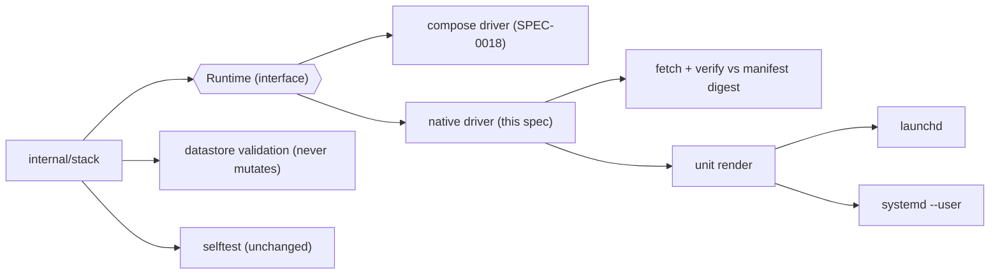
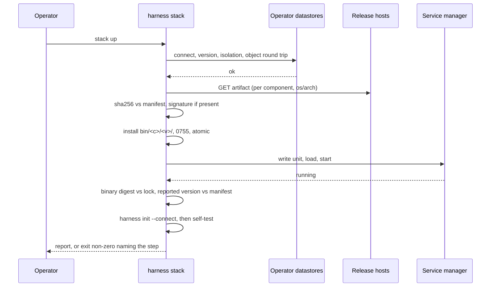

# Design: Native Runtime for the Stack Installer

## Context

SPEC-0018 specifies `harness stack` over a Docker Compose bundle. A
self-hosting customer runs Switchboard and Cairn as native binaries on a single
Mac with no Docker, against a Postgres they already operate, and is therefore
excluded from the installer entirely — the manifest, the version reporting, the
upgrade path and the self-test all assume containers.

ADR-0031 adds a second runtime rather than a fallback. What makes that cheap is
what is already true on `origin/main` of the three repositories:

* Switchboard's release binary **is** the server. `cmd/switchboard/main.go`
  documents itself as "the single switchboard binary: the server AND the
  operator CLI", with `serve` as the default command, and its `.goreleaser.yaml`
  publishes linux and darwin archives on amd64 and arm64 with a `checksums.txt`.
* Cairn's does not. Its `.goreleaser.yaml` declares one build, `./cmd/cairn`,
  and a post hook, `scripts/verify-cli-artifact.sh`, aborts the release if the
  archive contains `cairnd`. `cmd/cairnd` exists and is published only as a
  container image. A `cairnd` release build is therefore a prerequisite of this
  spec, and must be a **separate** build — the hook stays.
* No repository carries a goreleaser `signs:` block, so today verification is a
  digest. The manifest has a place for a signature, unpopulated, and the build
  gate refuses an entry that promises one without a key.
* Harness already generates service units for its own daemon
  (ADR-0005 and the
  [run-as-a-service guide](https://stump-wtf.github.io/harness/guides/run-as-a-service)), so the launchd and
  `systemd --user` shapes are known and documented rather than invented here.

## Goals / Non-Goals

### Goals

* One `runtime` switch at `stack init`, and an otherwise unchanged command
  surface: `up`, `down`, `status`, `upgrade`, `doctor` behave the same and
  report the same fields.
* Binaries pinned by the same embedded, Renovate-bumped, CI-gated manifest that
  pins images, verified against a digest the manifest carries.
* Service units the OS supervises, user-scoped, carrying no secret.
* The operator's Postgres and object store required, verified deeply enough that
  a misconfiguration fails at `init` rather than at first use.
* The SPEC-0018 REQ-25 self-test, unchanged, as the proof of parity.
* An upgrade that verifies before it stops anything and rolls a service back to
  its previous binary when it fails.

### Non-Goals

* Installing, starting, supervising, backing up on Harness's initiative, or
  removing a database or an object store. Not under a flag, not on any platform.
* Supervising the services from the Harness daemon.
* Windows support.
* A reverse proxy. The native path generates no Caddyfile; an operator who
  terminates TLS uses their own, and `doctor` checks the streaming behaviour
  Switchboard's `/mcp/*` routes need.
* Mixed runtimes inside one bundle.
* Changing `harness init`. It talks to an instance over HTTP and does not know
  how that instance was started.

## Decisions

### `runtime` is a bundle property, fixed at `init`

It lives in `stack.lock.json` and in the answers file; no other subcommand takes
`--runtime`. The two runtimes disagree about what a running service *is* — a
container with an image digest, or a process with a unit and a binary on disk —
so a subcommand that could switch would leave the other set running,
unmanaged, still holding the port. Running both against the same datastores is
supported by pointing a second `stack init --dir` at them; running both at once
is the operator's problem and the port collision surfaces immediately.

### The digest comes from the manifest, not from a checksum file

A `checksums.txt` served from the same origin as the artifact proves transport
integrity and nothing about provenance. The manifest is what Harness's own
release tested, so the SHA-256 lives there, per component and per `os/arch`.

```json
{
  "manifest_version": "2026.09.3",
  "components": {
    "switchboard": {
      "version": "v0.3.1",
      "min_version": "v0.3.0",
      "image": "ghcr.io/stump-wtf/switchboard:v0.3.1@sha256:…",
      "native": {
        "darwin/arm64": {
          "url": "https://github.com/stump-wtf/switchboard/releases/download/v0.3.1/switchboard_0.3.1_darwin_arm64.tar.gz",
          "sha256": "…",
          "size": 14221312,
          "binary": "switchboard",
          "signature": null,
          "key_id": null
        },
        "linux/amd64": { "…": "…" }
      }
    },
    "cairn": { "…": "…" },
    "postgres": { "min_version": "16", "image": "…", "native": null },
    "objectstore": { "image": "…", "native": null }
  }
}
```

`postgres` and `objectstore` carry `"native": null` **by construction**: there
is no native artifact because Harness does not install them. A build check
asserts that, so a future manifest edit cannot quietly add one.

The build gate extends the one SPEC-0018 REQ-16 already has. It fails when: a
component marked native-capable is missing an `os/arch`; a native entry has no
`sha256`; a `url` does not resolve to an immutable tagged release path; a
`signature` is set with no `key_id`; or a `native` block appears on a datastore
component.

### Layout

```text
$XDG_CONFIG_HOME/harness/stack/          0700
  stack.lock.json                         runtime, versions, urls, digests
  units/
    rocks.stump.switchboard.plist         macOS; no secrets
    rocks.stump.cairnd.plist
    harness-switchboard.service           Linux; no secrets
    harness-cairnd.service
  bin/
    switchboard/v0.3.1/switchboard        0755
    cairnd/v0.4.0/cairnd                  0755
  logs/
    switchboard.log  cairnd.log
  secrets/                                0700
    switchboard.env    SWITCHBOARD_DATABASE_URL, SWITCHBOARD_SECRET_ENCRYPTION_KEY,
                       SWITCHBOARD_METRICS_TOKEN, SWITCHBOARD_OIDC_* | SWITCHBOARD_GITHUB_*,
                       SWITCHBOARD_ENROLLMENT_MODE
    cairn.env          CAIRN_DATABASE_URL, CAIRN_S3_*, CAIRN_OIDC_* | CAIRN_GITHUB_*,
                       CAIRN_ENROLLMENT_MODE
$XDG_STATE_HOME/harness/stack/backups/<timestamp>/   0700, pg_dump output 0600
```

There is no `compose.yaml`, no `postgres-init.sql`, no `garage.toml` and no
`Caddyfile`. The connection URLs the operator supplies are written into
`secrets/*.env` — they carry a password, so they are secrets, are `0600`, are
fingerprinted rather than printed, and never appear in a unit file or the lock.

Binaries are installed under a **version** directory so the previous one
survives an upgrade and a rollback is a unit rewrite rather than a re-download.
Installation is write-to-temp-then-`rename` inside the same directory, so a
half-written binary is never executable at the final path.

### Unit files

macOS, `units/rocks.stump.switchboard.plist`, bootstrapped into `gui/<uid>`:

```xml
<key>Label</key>              <string>rocks.stump.switchboard</string>
<key>ProgramArguments</key>   <array>
  <string>/Users/…/harness/stack/bin/switchboard/v0.3.1/switchboard</string>
  <string>serve</string>
</array>
<key>WorkingDirectory</key>   <string>/Users/…/harness/stack</string>
<key>KeepAlive</key>          <dict><key>SuccessfulExit</key><false/></dict>
<key>RunAtLoad</key>          <true/>
<key>StandardOutPath</key>    <string>…/stack/logs/switchboard.log</string>
<key>StandardErrorPath</key>  <string>…/stack/logs/switchboard.log</string>
```

launchd has no `EnvironmentFile`, so the generated `ProgramArguments` are
wrapped by a small generated launcher script per component
(`units/rocks.stump.switchboard.sh`, `0700`) that `set -a`-sources
`secrets/<component>.env` and `exec`s the versioned binary. The script is
generated, contains no secret, and exists only because of that launchd gap;
`systemd --user` uses `EnvironmentFile=` directly and needs no wrapper.

Linux, `units/harness-switchboard.service`, linked into
`~/.config/systemd/user/`:

```ini
[Service]
Type=simple
WorkingDirectory=%h/.config/harness/stack
EnvironmentFile=%h/.config/harness/stack/secrets/switchboard.env
ExecStart=%h/.config/harness/stack/bin/switchboard/v0.3.1/switchboard serve
Restart=on-failure
RestartSec=5
```

`KeepAlive SuccessfulExit=false` and `Restart=on-failure` are the same
contract: restart a crash, never restart a clean `stack down`. Following
the run-as-a-service guide's own warning, the units declare no `Requires=` or
`After=` edge on anything that restarts — notably not on a local Postgres,
whose routine restart would otherwise propagate a stop into both services.

### Datastore validation

Per service, before any file is written:

| Check | How |
|---|---|
| Reachable | connect with the supplied URL |
| Version | `SHOW server_version_num`, compared to the manifest minimum |
| Distinct role | `SELECT current_user` on each, compared |
| Distinct database | `SELECT current_database()` on each, compared |
| Owns its own | `CREATE TABLE`/`DROP TABLE` of a temporary object in its own schema |
| No cross-read | attempt to connect as role A to database B; the check passes when it is **refused** |

The cross-read check is the one that must be able to fail: a check that passes
because the connection errored for an unrelated reason (wrong host, no network)
proves nothing, so it distinguishes a permission refusal from a transport
failure and reports the second as `fail`, not `ok`.

The object store gets a put–get–compare–delete of a nonce under
`.harness-stack-selftest/<nonce>`, for the same reason: a reachable endpoint and
valid-looking credentials are a proxy, and a write that cannot happen is the
failure operators actually hit.

None of these checks mutate the operator's cluster beyond a temporary object
they also remove. `CREATE ROLE`, `CREATE DATABASE`, `GRANT` and `REVOKE` are
printed on failure and never executed.

### Up, upgrade and rollback

`stack up`:

1. Validate datastores (above). Failure here writes nothing and starts nothing.
2. For each component, fetch and verify, or skip when the installed digest
   matches the lock.
3. Write units and wrappers; show a diff and confirm if either drifted.
4. Load and start each service; wait for its health check.
5. Verify each installed binary's SHA-256 against the lock, and each service's
   reported version against the manifest.
6. `harness init --connect` (unless `--no-init`), then the self-test (unless
   `--no-selftest`).

`stack upgrade` moves step 2 entirely before step 3 — **every** new binary is
downloaded and verified before any service is stopped. Then, per service:
`pg_dump` that service's database to the timestamped backup directory; rewrite
its unit to the new versioned path; restart; wait for health. On failure, the
unit is rewritten back to the previous installed version, restarted, and the
command stops with the backup path; services later in the order are not
touched. The previous version stays on disk until the next successful upgrade
supersedes it, and removal of a superseded binary that fails is a warning, never
a swallowed error.

`pg_dump` is the host's. `doctor` checks it is present and not older than the
server, because an older `pg_dump` against a newer server produces a dump that
will not restore — a backup that looks taken and is not.

### Status and parity

`stack status --json` emits the same field names in both runtimes; the
per-service identity fields carry a digest either way (an image digest, or the
binary's SHA-256) and a `source` naming which.

```json
{
  "runtime": "native",
  "services": [
    {"name": "switchboard", "state": "running", "url": "http://127.0.0.1:8080",
     "pinned_digest": "sha256:…", "running_digest": "sha256:…",
     "source": "bin/switchboard/v0.3.1/switchboard",
     "reported_version": "v0.3.1", "unit": "rocks.stump.switchboard"}
  ],
  "datastores": [
    {"kind": "postgres", "host": "db.internal", "database": "switchboard",
     "server_version": "16.4", "managed_by": "operator"},
    {"kind": "objectstore", "endpoint": "s3.internal", "bucket": "cairn",
     "managed_by": "operator"}
  ],
  "secrets": [{"file": "secrets/switchboard.env", "fingerprint": "7cdbdb2b6b73"}],
  "selftest": {"result": "pass", "at": "2026-09-22T18:04:11Z"}
}
```

`managed_by: "operator"` is not decoration: it is what `stack down --volumes`
reads to produce its refusal, naming the datastore rather than ignoring the
flag.

### Exit codes

Unchanged from SPEC-0018.

| Code | Meaning |
| --- | --- |
| 0 | success |
| 1 | a runtime failure (a service, a datastore, a verification, a self-test step) |
| 2 | a usage error, including a missing required answer or an unsupported platform |
| 3 | stopped for the operator: a file it will not rewrite, a breaking upgrade step |

## Architecture

### Where the pieces live

| Package | Responsibility |
| --- | --- |
| `internal/stack` | Runtime selection, manifest, lock, status, upgrade, doctor — gains a `Runtime` interface the Compose driver and the native driver both satisfy |
| `internal/stack/native` | Artifact fetch and verification, install prefix, unit rendering, service-manager driver |
| `internal/stack/native/launchd` | plist rendering, wrapper script, `launchctl bootstrap`/`bootout`/`kickstart` |
| `internal/stack/native/systemduser` | unit rendering, `systemctl --user` |
| `internal/stack/datastore` | Postgres and object-store validation, `pg_dump` invocation |
| `internal/selftest` | Unchanged; takes URLs, not a runtime |
| `cmd/harness` | `--runtime` on `stack init` only |

### Component view



### Native `stack up`



## Risks / Trade-offs

* **Two runtimes, two CI matrices.** Native must be exercised on macOS and
  Linux, or "first-class" is a claim. The self-test is the gate: a native CI job
  that stands the stack up against a throwaway Postgres and a MinIO-compatible
  store and runs the REQ-25 loop.
* **Cairn's server artifact is a hard dependency.** Until Cairn publishes
  `cairnd` as its own release build, `--runtime native` refuses Cairn by name.
  Implementing it by relaxing `verify-cli-artifact.sh` would reintroduce the
  packaging defect that hook catches.
* **Verified isolation can rot.** A grant made after `init` passes install and
  fails `doctor`. That is the right place, and it is still later than a cluster
  Harness built.
* **launchd's missing `EnvironmentFile`** costs a generated wrapper script per
  component — a moving part the systemd path does not have, and one more file
  that must be proven to contain no secret.
* **Platform drift in restart semantics.** `KeepAlive` and `Restart=on-failure`
  agree on the contract but not on the details (throttling, start limits). The
  unit generator needs real per-platform tests rather than one template.

## Migration Plan

Nothing exists yet, so there is no migration. The order that matters:

1. Cairn publishes a `cairnd` release build for linux and darwin, amd64 and
   arm64, with checksums, as a separate build from the `cairn` CLI.
2. The manifest gains `native` blocks and the build gate that gates them.
3. Fetch, verify and install; then unit generation per platform; then datastore
   validation.
4. `up` / `down` / `status`, then the self-test on the native path, then
   `upgrade` / rollback, then `doctor`.
5. Docs, with the path-selection page.

An operator already running Switchboard and Cairn natively by hand adopts this
by pointing `stack init --runtime native` at their existing datastores; the
validation is a real check of what they built, and `init` writes units beside
their processes rather than adopting them. Stopping the hand-started processes
is theirs to do, and `stack up` fails loudly on the port collision if they do
not.

## Open Questions

* **Does Harness verify the operator's Postgres backups exist?** Currently no —
  `doctor` checks `pg_dump` is usable and that the upgrade dump lands, and says
  nothing about the operator's own backup regime. Warning about an unbacked
  datastore risks becoming advice Harness cannot keep current.
* **Should `status` report the datastore's disk headroom?** It is useful and it
  needs privileges on the operator's cluster that the service roles may not
  have.
* **Adopting an already-running process.** Deliberately out of scope here: a
  process Harness did not start has no unit, no verified binary and no lock
  entry, and adopting one would make every later verification a guess.
