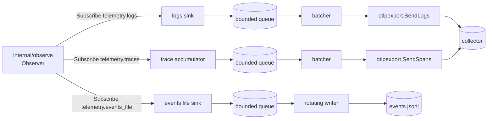

# Design: Telemetry Export

## Shape

A new package, `internal/telemetry`, owns everything right of the observer.
`cmd/harness/daemon.go` constructs it after the Manager and the observer, only
when `[telemetry]` names a destination, and stops it before the observer on
shutdown. With no destination the constructor is never called, which is how the
laptop case stays at zero cost: there is no "disabled" pipeline to reason about.

Each signal is a sink with the same three stages — **convert** (gate, redact,
cap, map to the signal's unit), **queue** (bounded, drop-oldest), **deliver**
(batch, send, retry) — and its own observer subscription, so one stalled
destination cannot hold another's items.

## The gate is applied first

The per-harness opt-in (SPEC-0014 REQ-1) is checked at the top of convert,
against `Source.HarnessDef(name)` at that moment. Checking first means a
non-contributing harness's text is never redacted, copied or counted; checking
per item rather than caching means `harness reload` changes take effect for the
next item with no invalidation logic.

A small `Gate` function resolves the tri-state (`*bool` per harness, `bool`
fleet-wide) and is the one place the precedence table lives. It is table-tested
directly, and the daemon wiring test (below) proves the daemon passes the real
config to it.

## Conversion is one function per signal over one record

`convert.go` builds a signal-neutral `Record` once per item: the REQ-5 field
set, redacted and capped, plus trace ID, item ID and optional span ID. The logs
sink turns a `Record` into an OTLP LogRecord; the events file sink marshals the
same `Record` to a line. Sharing the `Record` is what guarantees the JSONL keys
and the log attributes never drift apart — a test marshals one `Record` both
ways and compares the key sets.

Redaction runs inside `Record` construction, so nothing downstream can hold an
unredacted string. `omit_prompts` is applied in the same place.

## Traces: accumulate, build, filter, send

The trace accumulator keeps, per session key:

* the items not yet exported (bounded at 2048 by the early-export trigger);
* the current turn's `user-message` item, kept after it is sent, as parenting
  context;
* the set of span IDs already sent (small: bounded by the same limits);
* the time of the last item, for the idle trigger.

On a trigger it calls `otel.BuildTrace` over context plus unsent items, re-keys
span IDs to item IDs (SPEC-0014 REQ-7), drops spans whose IDs are in the sent
set, and queues the rest. Timestamps are filled from the observer's `Time`
before the build.

Re-keying depends on agent-trace producing exactly one span per mapped item in
timeline order. That is true at the pinned version and is pinned by a test that
builds a mixed timeline — including an `error` mark and an unknown mark type,
which produce no span — and asserts the correspondence. The better fix is
upstream: agent-trace deriving span IDs from item sequence. When that lands, the
re-keying step and its test are deleted, and Cairn traces gain the same IDs.

The idle trigger runs off a ticker at `batch_interval`, not a timer per session,
so a thousand quiet sessions cost one wakeup.

## otlpexport grows a transport

`internal/otlpexport` today has a one-shot `Export(ctx, trace, cfg)`. It gains:

* `SendLogs` and `SendSpans(ctx, endpoint, resource, scope, units)` alongside
  `Export`, sharing one `post` helper (`Export` keeps its contract for one-shot
  callers);
* a full-URL mode for the signal-specific endpoint variables, which are used
  as-is where the base endpoint gets `/v1/<signal>` appended;
* gzip, and a timeout taken from config rather than the 30s constant;
* a typed result — delivered count, rejected count from `partialSuccess`, and a
  retryable/permanent classification of any failure, including `Retry-After`.

Retry, backoff and batching live in `internal/telemetry`, not `otlpexport`:
the exporter stays a pure "send this request, tell me what happened" function
that is trivial to test against `httptest`, and the policy that needs a clock
lives where the clock is injected.

## Item IDs are a function of the item

Each signal takes its own observer subscription, so under pressure the logs
sink may lose an item the traces sink kept, and the observer does not replay
history across a restart. Any ID built from a count of items seen — per sink or
per daemon — would therefore disagree between sinks or between lifetimes, and
the second is not hypothetical: during a provider outage every retry's marks
share one `seq`, so a restart mid-outage would hand new marks old IDs. The item
ID is instead hashed from a content key (tool, summary and timestamp; or mark
type, timestamp and note), which every sink and every lifetime compute alike
with no shared state. SPEC-0014 REQ-7 defines it. An earlier draft used a
shared first-seen ordinal registry; review replaced it because it restarted at
zero with the daemon.

## Configuration resolution

`internal/config` parses `[telemetry]` into `core.TelemetryConfig` and validates
everything static (REQ-2). Environment resolution happens in the daemon at
startup, not in config parsing, because `env_file` and the process environment
belong to the running daemon, not to a file a TUI edit form round-trips. A
`telemetry.Resolve(cfg, env)` function (`env` bundles the injected `Getenv`,
`ReadEnvFile`, `Hostname` and build version) produces the per-signal
endpoint, headers, compression and timeout with the source of each, which feeds
both the startup log line and `harness doctor`. Injected `getenv` makes the
precedence table directly testable.

`[daemon] otel_endpoint` moves into the removed-keys block beside `cmd` and
`agent`.

## Why the defaults are what they are

* `queue_size = 2048` at the REQ-4 caps is at most a few tens of MiB per signal
  in the worst case and far less in practice; a queue that large holds several
  minutes of a busy fleet, which covers a collector restart without loss.
* `batch_interval = 5s` keeps log latency low enough to watch an outage unfold
  and requests infrequent enough not to matter.
* `idle_flush = 5m` matches how long an agent turn typically goes without a tool
  call while thinking; shorter splits live turns across exports for no benefit.
* Five minutes of retry per batch spans a collector rolling restart; beyond that,
  holding the batch only delays newer, more useful data behind it.

## Testing

Tests must fail if the property silently did not happen — each of these has a
named failure it guards against.

* **The wiring.** A daemon-level test, in the manner of
  `TestDaemonManagerOptionsEnableGiveUp`, that builds the daemon's telemetry from
  a real parsed `harness.toml` and asserts the pipeline exists with the
  configured signals — and a companion asserting that with no `[telemetry]` table
  it is never constructed and no subscription is registered on the observer.
  Every sink test builds its own pipeline; only this proves `daemon.go` does.
* **Consent.** Env vars set, no `[telemetry]`: zero requests to an `httptest`
  server that fails the test on any hit. `export_all = true` plus a per-harness
  `false`: that harness's items reach no sink. Project file with
  `export_telemetry = true`: config error.
* **Redaction reaches the wire.** An item whose summary contains a token shape
  from `redact`'s own table: the captured request body, the JSONL line and the
  span name contain `[REDACTED]` and not the token. Assert on the bytes sent, not
  on the `Record`.
* **The outage shape.** A stream of Crush `error` marks with no tool events
  produces `ERROR` records immediately — not after a tool call arrives.
* **Severity.** An `is_error` tool event is `WARN`, never `ERROR`.
* **Correlation.** A log record's `traceId` equals `BuildTrace`'s `TraceID`, and
  its `spanId` equals the exported span's ID for the same item.
* **No duplicate spans.** Export, feed one more item into the same turn, export
  again: the second request holds exactly one span, parented to the first
  request's turn span. Then a simulated restart (new accumulator, items resuming
  at a later `seq`): no span ID overlaps the first lifetime's.
* **Bounded memory under outage.** With a server returning 503 and a fake clock,
  push ten times `queue_size`: queue length never exceeds `queue_size`,
  `dropped_queue` equals the overflow exactly, and the oldest units are the ones
  gone.
* **Retry policy.** 429 with `Retry-After: 7` waits 7s on the fake clock; 400 is
  not retried; a batch is given up at five minutes; `partialSuccess` counts as
  `rejected`.
* **Never blocks.** A server that never responds: observer delivery and a
  Manager snapshot read complete promptly while the export is stuck.
* **Rotation.** Writing past `events_file_max_mb` renames to `.1`, shifts up to
  `events_file_keep`, deletes beyond it, and every line in every file parses as
  one JSON object. File mode is `0600`.
* **Shutdown.** Shutdown with an unreachable collector returns within
  `shutdown_timeout`, and the lost counts are reported.
* **Removed key.** A config with `[daemon] otel_endpoint` fails to load with the
  migration message.
