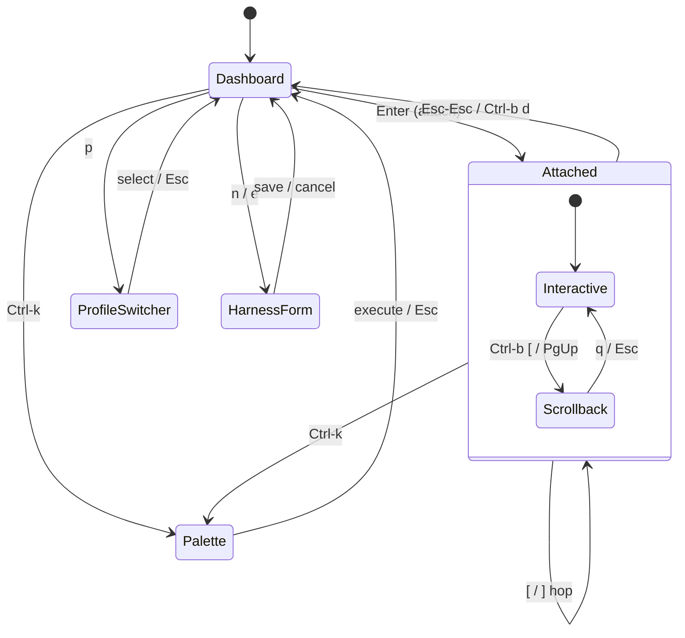

# Design: The TUI

## Context

The client surface of Harness: a keyboard-driven ops cockpit for autonomous
agents with scary permissions — it must feel *trustworthy and clear about
state*. Governing spec: SPEC-0001. Related ADRs: ADR-0001 (Charm stack),
ADR-0002 (thin client), ADR-0003 (embedded `x/vt` terminal pane), ADR-0006
(profiles), ADR-0007 (scrollback). The full visual exploration (screenshots,
design system, themes) lives in `docs/design/` — open
`docs/design/Harness.dc.html` in a browser.

## Goals / Non-Goals

### Goals

- A glance answers "which of my agents are healthy, which need me."
- The **hop** between harnesses is instant and physical — the signature moment.
- `k9s`/`lazygit` restraint with Charm's warmth; dense but legible.

### Non-Goals

- Tiled multi-pane in v1 (single-attach + fast hop).
- Mouse-first interaction.
- Web/HTML surfaces — this design language is the terminal dialect only.

## Decisions

### Split cockpit as the canonical dashboard layout

**Choice**: Left: Bubbles `list` of harnesses. Right: live read-only peek pane
+ config summary for the selection. Header: app · profile · daemon identity.
Footer: key bar.
**Rationale**: "Glance before you hop" — the peek pane lets you confirm state
without committing attention (see `docs/design/screenshots/day.png`).

### Attach chrome: thin ribbon, bleed to edge

**Choice**: In attached mode the terminal takes the full body; only a thin
status ribbon (harness, state, detach hint) frames it.
**Rationale**: You're driving a live agent — chrome competes with the PTY.
The ribbon exists so you never forget *which* agent you're inside.

### Motion via spring physics

**Choice**: The hop animates with `harmonica` springs (slide + ribbon flash),
respecting reduced-motion sensibilities and degrading to instant swap.
**Rationale**: Linear easing feels mechanical; the hop should feel physical
because it is the product's whole promise.

## Architecture

## Visual direction

From the Claude Design exploration (`docs/design/`):

- **Palette**: ANSI neon on blue-black void — Charm purple `#7D56F4`, hot pink
  `#FF5FA2`, cyan `#4EE6FF`, mint `#00F0A8`; amber/coral for
  degraded/failed. Day theme: lavender-paper with the same hues deepened.
  Both themes degrade via `colorprofile` (256/16/mono), and color never
  carries meaning without its glyph.
- **State rows**: degraded rows expand in place (last exit + backoff
  countdown); "needs you" harnesses escalate visually (see
  `docs/design/screenshots/01-g_and_c.png` fleet view).
- **Type discipline**: one glyph size; hierarchy from weight and color;
  box-drawing borders (`╭ ╮ ╰ ╯`) as the Lip Gloss signature.
- **Deliverables pending from design**: final palette tokens for Lip Gloss
  adaptive colors, degraded/flapping row treatment, `vhs` demo tape of the
  hop, `freeze` stills for docs.

## Key files

Greenfield. Expected home: a `tui` package (Bubble Tea model per mode,
overlays as nested models), a `theme` package (Lip Gloss adaptive styles +
colorprofile degradation), and the client half of the protocol package
(SPEC-0002).
